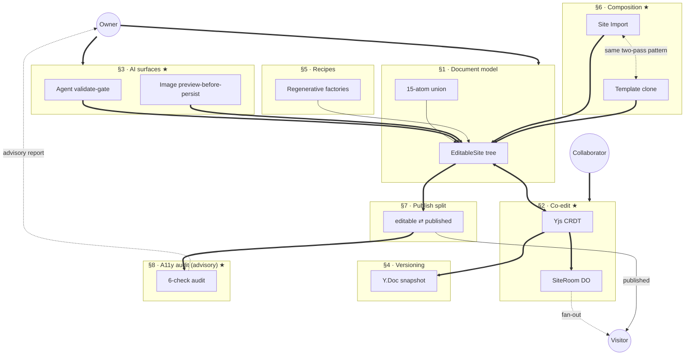

# Open Canvas

> A desktop canvas site builder where an Owner starts from one Template Seed, edits positioned design primitives with AI help, switches deterministic Style Kits, and publishes to a real Published Address that updates open Visitor tabs immediately.

[](https://github.com/aayushman-singh/open-canvas/actions/workflows/deploy-worker.yml)
[](LICENSE)
[](https://opencanvas.aayushman.dev)

## Demo

▶️ **[Watch the full walkthrough →](https://youtu.be/VIDEO_ID)**  _(replace `VIDEO_ID` with your YouTube video id)_

<!--
  Hero clip: add a short (~10s) optimized GIF or a GitHub-hosted .mp4 under
  docs/media/, then uncomment one of these for an inline preview:
  
  [](https://youtu.be/VIDEO_ID)
-->
## Architecture at a glance

One Cloudflare Worker. Three kinds of human (Owner, Collaborator, Visitor) converge on a single document model; AI mutates it through a validate-gate; publish is a column split, audited on every write by a six-check a11y pass that reports to the Owner (advisory — a deliberate ship-fast call, not a hard gate).



Bold arrows carry primary data flow; dotted arrows are cross-cutting relationships. ★ marks the four subsystems that carry the non-obvious decisions. Full contributor tour: [`docs/key-architecture.md`](docs/key-architecture.md) · canonical decisions: [`docs/adr/`](docs/adr/README.md).

## By the numbers

Engineering substance over vanity metrics — every figure below is sourced from the repo or the production database, not estimated.

- **61** architecture decision records · **103** colocated `*.smoke.ts` tests + **4** Playwright e2e journeys · **21** schema migrations
- **495** TypeScript modules — one Cloudflare Worker plus its separately-built editor and dashboard client bundles
- Document model exercised in production: **1,090** design primitives across **124** sections / **33** pages, **31** deterministic version snapshots, **3** sites published live
- Every publish runs a **six-check** accessibility audit (advisory — reports to the dashboard, deliberately non-blocking); an audit crash surfaces as an explicit issue, never a silent skip

## What it is

Open the dashboard, name a site, and drop into a canvas pre-populated from one Template Seed. Drag positioned design primitives, ask the AI agent for a previewed edit, swap deterministic Style Kits live, and click Publish — the Published Address (`<subdomain>.opencanvas.aayushman.dev`) updates in every open Visitor tab within a few hundred milliseconds. One Cloudflare Worker hosts the dashboard, the editor, the canvas API, the AI agent endpoint, the publish snapshot store, and the public host that serves Visitors.

## Demo

The product is live — the demo is the real thing, not a recording:

- **Try it:** [opencanvas.aayushman.dev](https://opencanvas.aayushman.dev) — sign in, start from a Template Seed, edit on the canvas, publish.
- **Guided walkthrough:** [`docs/demo/act-1-script.md`](docs/demo/act-1-script.md) scripts the flagship beat — an indie founder rebrands the *Apogee* template into *Briar* and publishes it to a live address.
- **Engineering tour:** [`docs/key-architecture.md`](docs/key-architecture.md) walks the five non-obvious decisions behind it, diagram by diagram.

## Stack

- Cloudflare Workers + Hono JSX (single bundle)
- Drizzle ORM + Neon serverless Postgres (HTTP driver)
- Clerk auth (single origin, no token handoff)
- Durable Object: `SiteRoom` — publish broadcasts + presence
- Gemini adapter for previewed AI edits
- Vanilla browser JS in the editor (no client framework)

## How it compares

Most site builders are *template hosts*: you pick a layout, fill predefined slots, pay for hosting, and republish to push a change live. Open Canvas is built on a different premise — a free-form canvas, an agent at the cursor, and a live document the whole team shares. The table below maps the differences axis by axis.

| Axis | The familiar template-host approach | Open Canvas |
|---|---|---|
| **Editing model** | Fill predefined slots in a fixed template | Free-form 2D canvas — 14 positioned design primitives, dragged, resized, and rotated anywhere |
| **AI** | None, or a copy-writing box bolted on | A 15-operation canvas agent plus multi-turn chat — every edit is previewed before it lands |
| **Collaboration** | One editor at a time | Real-time co-editing over a Yjs CRDT with Figma-style presence cursors — conflict-free by construction |
| **Publishing** | Republish, then reload to see it | Publish broadcasts to every open Visitor tab over a Durable Object socket — updates land in a few hundred milliseconds, no refresh |
| **Theming** | Token panel that can drift from the live site | Deterministic Style Kits — one 12-token OKLCH grammar renders identically in the editor and in published output, with pre-computed dark variants |
| **Content** | Static fields; "no CMS" | First-class Collections — manual or page-bound entries, field binding, per-entry OG images, all rendered to static HTML |
| **Reuse** | Template variants | Section Library with lineage, asset manifests, and cross-template import |
| **History** | A single backup, if any | Full snapshot timeline (Yjs binary), preview + one-click restore, automatic pre-restore safety snapshot |
| **Accessibility** | Not addressed | Six-category audit that *blocks* publish on serious issues, with element-level remediation hints |
| **Forms** | A block that collects fields | Turnstile bot protection, per-IP and per-form rate limits, HMAC-signed webhooks, CSV export, AJAX with a no-JS fallback |
| **Media** | Manual upload | Content-addressed dedup pipeline, magic-byte probing, slot history, and text-to-image generation |
| **Reach** | English, LTR | Per-page locale, localized routing, and RTL coordinate mirroring at render time |
| **Output** | Framework-rendered pages | Pure HTML — interactive runtime injected only when a section needs it; zero client-framework weight otherwise |
| **Security** | Edit sessions + headers | Timing-safe crypto, SVG-upload block, `nosniff`, embed-aware CSP, fail-closed rate limiters, atomic custom-domain rollback |
| **Runtime** | A multi-service stack to operate | One Cloudflare Worker — dashboard, editor, canvas API, agent, snapshot store, and public host in a single deploy unit |
| **Discipline** | Roadmap docs | 66 architecture decision records, 40+ hermetic smoke tests, 71-area E2E suite, and a single canvas validation write-gate |

The throughline: the previous generation lets you *fill in a layout*. Open Canvas lets you, an agent, and your whole team *design on one live canvas* — and ships the result as clean, accessible, framework-free HTML.

## Develop

```bash
bun install
bun.cmd run dev            # wrangler dev — http://localhost:8787
```

`/` renders the Post-Aero landing. `/health` returns a JSON heartbeat. `/dashboard` is gated by Clerk.

## Verify

```bash
bun.cmd run typecheck       # tsc --noEmit
bun.cmd run lint            # eslint .
bun.cmd run canvas:smoke    # canvas schema + validator + renderer round-trip
bun.cmd run canvas-agent:smoke   # canvas-agent tool surface + op application
bun.cmd run review:smoke    # publish + visitor-update integration
bun.cmd run build           # wrangler deploy --dry-run
```

## Status

Live at **[opencanvas.aayushman.dev](https://opencanvas.aayushman.dev)** and under active development. Issues and PRs welcome.

## Documentation

- [FEATURES.md](FEATURES.md) — exhaustive feature reference
- [docs/adr/](docs/adr/) — 66 architecture decision records (the reasoning behind every major choice)
- [CONTEXT.md](CONTEXT.md) — domain language and core concepts

## Contributing

Pull requests welcome. See [CONTRIBUTING.md](CONTRIBUTING.md) for the dev loop and PR checklist, plus [CODE_OF_CONDUCT.md](CODE_OF_CONDUCT.md) and [SECURITY.md](SECURITY.md) for reporting vulnerabilities.

## License

[MIT](LICENSE) (c) 2026 Aayushman Singh
