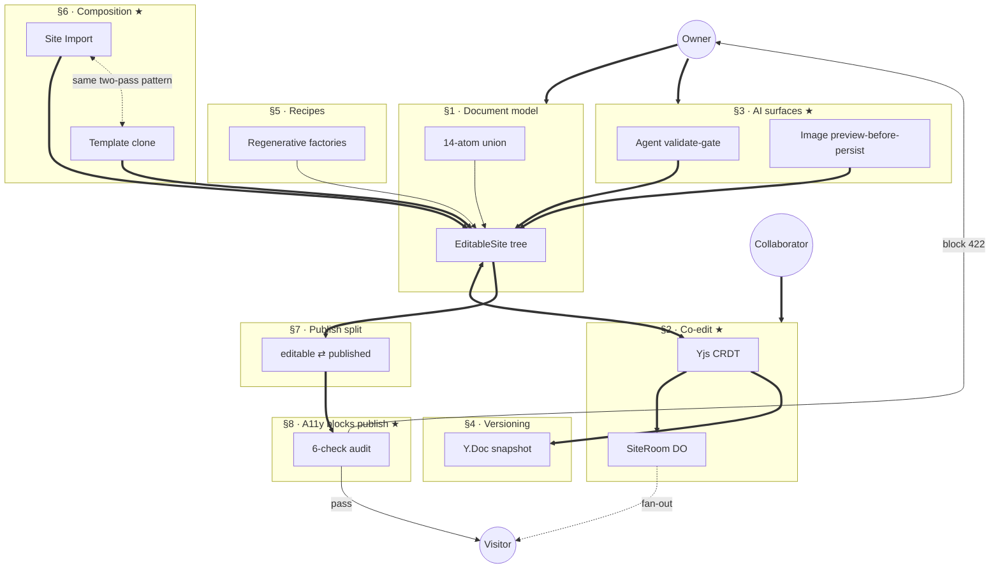

# Open Canvas

> A desktop canvas site builder where an Owner starts from one Template Seed, edits positioned design primitives with AI help, switches deterministic Style Kits, and publishes to a real Published Address that updates open Visitor tabs immediately.

[](https://github.com/aayushman-singh/open-canvas)
[](LICENSE)
[](https://opencanvas.aayushman.dev)

## Architecture at a glance

One Cloudflare Worker. Three kinds of human (Owner, Collaborator, Visitor) converge on a single document model; AI mutates it through a validate-gate; publish is a column split that six parallel a11y checks can block at 422.



Bold arrows carry primary data flow; dotted arrows are cross-cutting relationships. ★ marks the five non-obvious decisions. Full contributor tour: [`docs/key-architecture.md`](docs/key-architecture.md) · canonical decisions: [`docs/adr/`](docs/adr/README.md).

## What it is

Open the dashboard, name a site, and drop into a canvas pre-populated from one Template Seed. Drag positioned design primitives, ask the AI agent for a previewed edit, swap deterministic Style Kits live, and click Publish — the Published Address (`<subdomain>.opencanvas.aayushman.dev`) updates in every open Visitor tab within a few hundred milliseconds. One Cloudflare Worker hosts the dashboard, the editor, the canvas API, the AI agent endpoint, the publish snapshot store, and the public host that serves Visitors.

## Stack

- Cloudflare Workers + Hono JSX (single bundle)
- Drizzle ORM + Neon serverless Postgres (HTTP driver)
- Clerk auth (single origin, no token handoff)
- Durable Object: `SiteRoom` — publish broadcasts + presence
- Gemini adapter for previewed AI edits
- Vanilla browser JS in the editor (no client framework)

## Develop

```bash
bun install
bun.cmd run dev            # wrangler dev — http://localhost:8787
```

`/` renders the Post-Aero landing. `/health` returns a JSON heartbeat. `/dashboard` is gated by Clerk.

## Verify

```bash
bun.cmd run typecheck       # tsc --noEmit
bun.cmd run lint            # eslint .
bun.cmd run canvas:smoke    # canvas schema + validator + renderer round-trip
bun.cmd run canvas-agent:smoke   # canvas-agent tool surface + op application
bun.cmd run review:smoke    # publish + visitor-update integration
bun.cmd run build           # wrangler deploy --dry-run
```

## Status

Launching soon.

## License

[MIT](LICENSE) (c) 2026 Aayushman Singh
