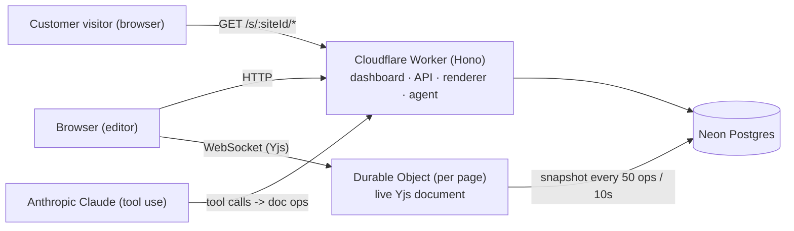

# rev01

> A site builder where you, your collaborators, and a Claude agent edit the same ProseMirror document live over Yjs CRDT — served end-to-end by one Cloudflare Worker.

[](https://github.com/aayushman-singh/rev01)
[](LICENSE)
[](https://rev01.aayushman.dev)

## Demo

> Demo video pending — will land with task #4-final after the multiplayer editor and AI agent ship.

[Live coming-soon page →](https://rev01.aayushman.dev)

## What it is

Pick a template from the dashboard, name your site, and you land in an editor where every paragraph, heading, and section is editable inline. Invite a teammate and you see their cursor next to yours; ask the agent for a hero rewrite and a new collaborator avatar appears, streaming edits into the same page. Publish, and the site is live at a shareable URL — no build step, no deploy queue.

## Architecture



- One edge bundle hosts dashboard, API, customer-site renderer, agent endpoints, and per-page Durable Objects.
- One ProseMirror document per page, edited live via Yjs CRDT.
- Anthropic Claude as a first-class collaborator with a reserved Yjs client id.

See [ADR 0001](docs/architecture/0001-architecture.md) for the full reasoning, decisions 1–14.

## Run locally

```bash
git clone git@github.com:aayushman-singh/rev01.git
cd rev01
bun install
bun run dev            # wrangler dev
```

Open http://localhost:8787. `/` renders the Post-Aero landing; `/health` returns a JSON heartbeat.

## Documents

- [ADR 0001 — Architecture](docs/architecture/0001-architecture.md) — the 14 decisions that pin the stack down.
- [Template schema](docs/specs/template-schema.md) — ProseMirror node and mark vocabulary; template descriptor; seed-to-site flow.
- [Design language — variants](docs/specs/design-variants.md) — four explored variants; **Post-Aero (D)** is selected for v0.
- [RECON.md](RECON.md) — backlog ranked by hire-impact-per-hour; dispatch order; locked decisions.

## Status

Scaffolding. v0 LOC target: under 5,000. See [RECON.md](RECON.md) for the current backlog.

The project is built in public — every backlog row ships as a PR.

## License

[MIT](LICENSE) © 2026 Aayushman Singh
