# Act 2 — Engineering Walkthrough

> **Runtime:** ~28 min · **Voice:** host-narrator (no seam from Act 1) · **Format:** voiceover paired with on-screen diagrams (Mermaid + Excalidraw). Pacing assumes ~150 wpm.
>
> **Stance:** five non-obvious engineering decisions, not a feature tour. Routine plumbing (auth tokens, routing, forms, SEO, search, ops) deliberately cut — the audience came for the architecture, not surface coverage.

---

## Throughline

Maya edits a document model that two clients converge on without a server picking a winner. The AI mutates it through a gate that rejects invalid writes outright and never produces side effects from generation. The whole Y.Doc snapshots deterministically into base64. New sections come from regenerative recipes the AI rewrites rather than slot-binds, and bigger imports — whether scraped or template-cloned — share the same two-pass translation algorithm. Publish is a column copy gated by six parallel a11y checks that block at 422.

**Eight beats. Five non-obvious decisions (★). Nothing else.**

| # | Beat | Diagrams | Runtime | Flagship |
|---|---|---|---|---|
| 1 | Document model | D1 + D2 | 2 min | |
| 2 | Co-edit | D3 + D4 | 5–6 min | ★ |
| 3 | AI surfaces | D5 + D6 | 4–5 min | ★ |
| 4 | Versioning | D7 | 1.5 min | |
| 5 | Recipes | D8 | 2 min | |
| 6 | Composition | D9 + D10 | 4–5 min | ★ |
| 7 | Publish: column split | D11 | 1.5 min | |
| 8 | Publish: a11y gate | D12 | 3–4 min | ★ |

---

## Master map

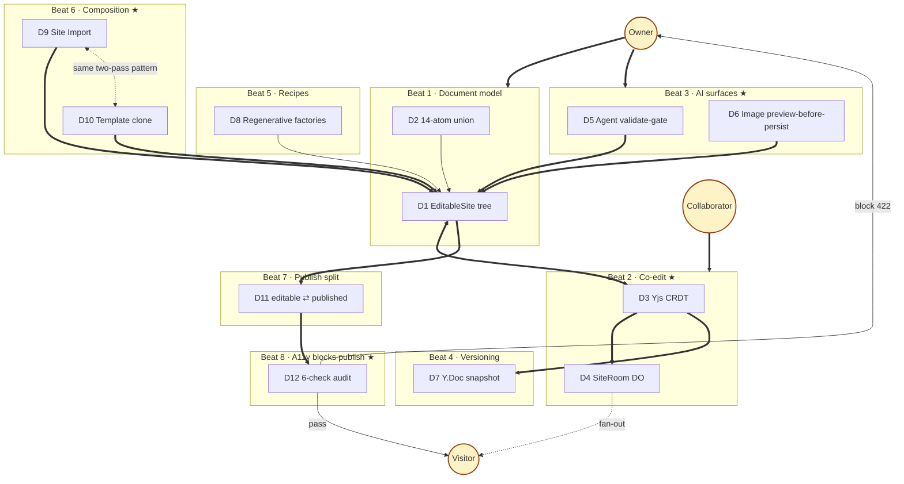

**Read:** bold arrows (`==>`) = primary data flow · dotted (`-.->`) = cross-cutting relationship · dotted between D9 and D10 = the meta-beat (same algorithm, different source shape).

---

## Cold-open (~45s · ~110 words)

[VISUAL: Black, hold one beat.]

> Two people are editing the same site, right now, in two different windows. Maya is on her laptop. Sam is on his. There's no central process picking who wins. Whatever they both type ends up on the page — and so does whatever a visitor watching the published site sees, live, the moment one of them types it.

[VISUAL: Time-lapse of the D3 live-drawn animation (Beat 2), compressed to ~10s — empty Y.Docs → encode arrows → SiteRoom → merged back → projections.]

> No queues. No retries. No "last writer wins." This is a website builder. That's not how website builders are supposed to work. We're going to spend the next half hour explaining how this one does — and four other decisions that look just as weird the first time you see them.

[VISUAL: Pull back to master map; all clusters dim, Beat 1 about to highlight.]

> Eight beats. Five of them are non-obvious engineering decisions. Three of them set up the rest. Beat one is the smallest — the shape of the thing every other beat is going to touch.

---

## Beat 1 — Document model

**Diagrams:** D1 EditableSite tree · D2 14-atom union
**Runtime:** 2 min · **Words:** ~310
**Source:** [`src/canvas/schema.ts`](../../src/canvas/schema.ts), ADR 0011 (Proposed)
**Pitch:** the spine. The schema every other beat operates on.
**Landmines:** header + footer are *site-wide* (not per-page); style kit, locale, dark-mode, favicon all at root; "fourteen, bounded by design" — not infinite types.

### D1 — EditableSite tree

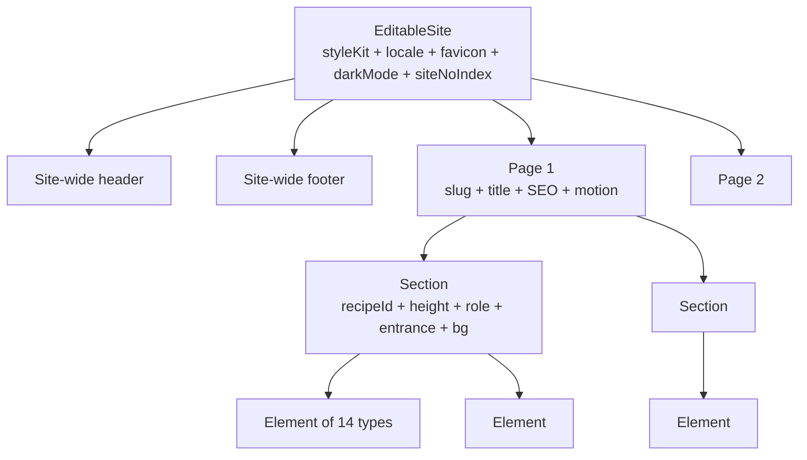

### D2 — Element union (14 atoms)

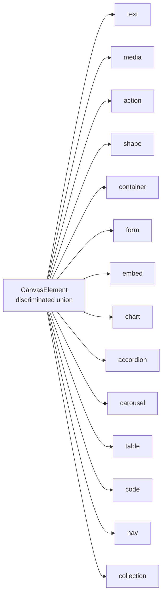

### Voiceover

[VISUAL: Master-map snippet, DOC subgraph highlighted.]

> **Frame (20s):** Before we talk about how two people edit a site at the same time, or how an AI mutates it, or how an a11y audit blocks publish — let's name the thing all of those are operating on. The document model. It's deliberately small. It's the spine of everything else.

[VISUAL: D1 tree appears.]

> **D1 walk (60s):** The root is called `EditableSite`. It carries the style kit, the locale, the favicon, the dark-mode flag, the no-index flag — four or five site-wide settings the renderer needs at the top level. Below that, two single special children: header and footer. Site-wide. Not per-page. If Maya changes the header, every page changes.
>
> Then an array of pages. Each page has a slug, a title, SEO fields, motion settings, and an array of sections. Each section has a recipe ID — we'll come back to that in beat five — a height, a role like header/body/footer, an entrance animation, and an array of elements.
>
> Element is the leaf. Everything else is structure.

[VISUAL: D2 union appears.]

> **D2 walk (50s):** There are fourteen element types. Text. Media. Action. Shape. Container. Form. Embed. Chart. Accordion. Carousel. Table. Code. Nav. Collection. Each is a discriminated branch of one union type. Each has its own variant axes — text has role and font size, action has seven button variants, container has seven surface treatments — and each has its own validator.
>
> Fourteen is the count. It's bounded by design. Two compile-time invariants — `_ELEMENT_TYPES_COVERS_UNION` and `_UNION_COVERS_ELEMENT_TYPES` — force the literal list and the union type to exactly cover each other. Add a new type to one without the other and the build fails.
>
> When the AI proposes a change, when an a11y audit walks the tree, when a section template generates content — they're all producing or consuming this exact shape. Nothing else.

[VISUAL: Dissolve to Beat 2 highlight.]

> **Close (10s):** That's the document. Beat two is two people editing it concurrently without a server picking a winner.

---

## Beat 2 — Co-edit ★

**Diagrams:** D3 Yjs CRDT + D4 SiteRoom DO · **paired**, filmed continuously
**Runtime:** 5–6 min · **Words:** ~825
**Source:** ADR 0007, [`src/live/site-room.ts`](../../src/live/site-room.ts)
**Pitch:** two clients converge on one document without a server picking a winner.
**Landmines:** no "operational transform" framing; no shared Y.Doc; server does not pick a winner; D3 = *what* is sent (Yjs binary), D4 = *how* it's distributed (DO + WS).

### D3 — Yjs CRDT (live-drawn Excalidraw)

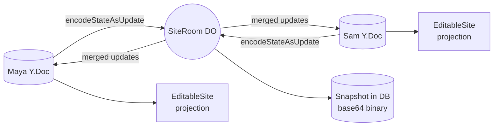

**Excalidraw spec (live-drawn):**
- **Nodes:** Maya Y.Doc (left), Sam Y.Doc (right), encode arrows (centre-top, twice), SiteRoom DO (centre), Snapshot (centre-bottom), EditableSite projection (between Y.Doc and canvas, both sides)
- **Layout:** mirror — Maya left, Sam right, central spine of SiteRoom + Snapshot
- **Animation (5 reveal steps):**
  1. Empty Y.Docs both sides
  2. Maya edits → `encodeStateAsUpdate` arrow → SiteRoom box appears
  3. Sam edits concurrently → his arrow appears
  4. SiteRoom merges → arrows back to both Y.Docs simultaneously
  5. Projection edges drawn last (read-side)
- **Annotations:** "Conflict-free by construction" · "ADR 0007" · "elementStyle preserved through projection"

### D4 — SiteRoom fan-out

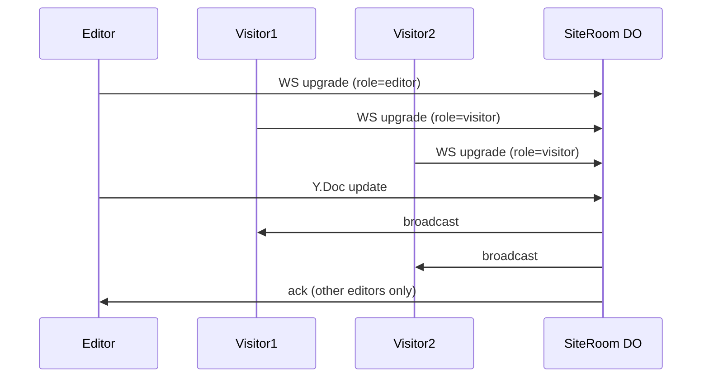

### Voiceover

[VISUAL: Master-map snippet, EDIT subgraph highlighted.]

> **Frame (30s):** Two people open the same site in the editor. They both type. A server has to decide what the document looks like — except we don't have one. There's no central truth. Both editors converge to the same state without any one of them being right. That's beat two. It's the trick the rest of the video sits on top of.

[VISUAL: Excalidraw blank, two outlined Y.Doc boxes appear — "Maya" left, "Sam" right.]

```text
   ┌────────────┐                            ┌────────────┐
   │   Maya     │                            │    Sam     │
   │   Y.Doc    │                            │   Y.Doc    │
   └────────────┘                            └────────────┘
```

> **D3 model (90s):** Each client owns its own Y.Doc. That's the data structure. Not a shared one — every editor has its own. The structure tracks operations, not values, so two edits to the same field don't fight over a single slot. They merge by construction.

[ACTION: Maya's encode arrow upward; SiteRoom DO box appears centre.]

```text
   ┌────────────┐                            ┌────────────┐
   │   Maya     │                            │    Sam     │
   │   Y.Doc    │                            │   Y.Doc    │
   └─────┬──────┘                            └────────────┘
         │  Y.encodeStateAsUpdate
         ▼
         ┌──────────────────────────┐
         │      SiteRoom DO         │
         └──────────────────────────┘
```

> When Maya edits, her Y.Doc encodes the delta as a binary update — `Y.encodeStateAsUpdate` — and ships it to the SiteRoom Durable Object. SiteRoom is one per site. Cloudflare hibernates it between messages; it's not a server in the traditional sense, it's a programmable consistency boundary that wakes up when there's traffic.

[ACTION: Sam's encode arrow added, concurrent with Maya's.]

```text
   ┌────────────┐                            ┌────────────┐
   │   Maya     │                            │    Sam     │
   │   Y.Doc    │                            │   Y.Doc    │
   └─────┬──────┘                            └─────┬──────┘
         │ encodeStateAsUpdate    encodeStateAsUpdate
         ▼                                          ▼
         ┌──────────────────────────────────────────┐
         │              SiteRoom DO                 │
         └──────────────────────────────────────────┘
```

> Sam edits at the same time. His Y.Doc encodes too. Both updates hit SiteRoom — and this is where most people expect a conflict-resolution rule. There isn't one. No "last writer wins," no operational transform, no server picking a winner. Y.js is a CRDT — a conflict-free replicated data type. The merge function is mathematical: any two updates produce the same merged state regardless of the order they arrive. Order doesn't matter. Identity does.

[ACTION: SiteRoom draws arrows back to both Y.Docs ("merged updates").]

```text
   ┌────────────┐                            ┌────────────┐
   │   Maya     │                            │    Sam     │
   │   Y.Doc    │                            │   Y.Doc    │
   └─┬───────▲──┘                            └─▲───────┬──┘
     │       │                                  │       │
   encode  merged                          merged  encode
     ▼       │                                  │       ▼
     ┌───────┴──────────────────────────────────┴───────┐
     │                  SiteRoom DO                     │
     └──────────────────────────────────────────────────┘
```

> SiteRoom broadcasts the merged update back to every connected client. Maya's Y.Doc applies it. Sam's Y.Doc applies it. Both converge. No round-trip, no acknowledgement of "ok the server says this is the truth" — there's no server-side truth to acknowledge.

[ACTION: Projection edges from each Y.Doc to its EditableSite projection box.]

```text
   ┌──────────┐    ┌──────────┐                ┌──────────┐    ┌──────────┐
   │EditSite  │◀── │   Maya   │                │   Sam    │──▶ │EditSite  │
   │projection│ pr │   Y.Doc  │                │   Y.Doc  │ pr │projection│
   └──────────┘    └─┬──────▲─┘                └─▲──────┬─┘    └──────────┘
                     │      │                    │      │
                   encode merged              merged  encode
                     ▼      │                    │      ▼
                     ┌──────┴────────────────────┴──────┐
                     │           SiteRoom DO            │
                     └──────────────────────────────────┘
```

> The renderer never reads the Y.Doc directly. It reads a projection — a typed, flat `EditableSite` view derived from the Y.Doc state. That isolation is deliberate. CRDT machinery is bookkeeping; the canvas, the inspector, the validator — they all read a clean tree. Switch CRDT engines tomorrow and the rest of the editor doesn't notice.

[VISUAL: Hold 2s, dissolve to D4 sequence diagram.]

```text
   Editor      Visitor1    Visitor2    SiteRoom DO
     │             │           │             │
     │── WS upgrade (role=editor) ──────────▶│
     │             │── WS upgrade (visitor) ▶│
     │             │           │── WS upg. ─▶│
     │── Y.Doc update ─────────────────────▶│
     │             │◀── broadcast ───────────│
     │             │           │◀── broadcast│
     │◀── ack (other editors only) ──────────│
```

> **D4 fan-out (90s):** That's what gets sent. Here's how it's distributed.

[ACTION: Highlight the three WS upgrade lines.]

> Every client connects to SiteRoom over WebSocket. The upgrade request carries the role — `editor` or `visitor`. Editors are authenticated by the edit cookie; visitors are anonymous. SiteRoom tags the connection at connect time and never trusts the client to re-state its role afterwards.

[ACTION: Highlight the Y.Doc update → both broadcasts.]

> When an editor pushes an update, SiteRoom does two things in parallel. It broadcasts to every visitor — that's how the published site, while you're looking at it, updates live as Maya types. And it acknowledges back to the other editors — that's Sam seeing Maya's cursor move and her text appear without refreshing.

[ACTION: Hold on visitor branches.]

> The visitor channel is the marketing demo. Open a tab on the published site, open another tab on the editor, change a heading — the published page updates without a redeploy, without a CDN purge. It's the same Durable Object connection a co-editor uses, just with a different role tag.

> SiteRoom hibernates between messages using Cloudflare's WebSocket Hibernation API. It isn't running a process between updates. The state lives in DO storage; the runtime wakes up, processes the update, sends fan-out, sleeps. That's why one DO per site scales — you're not paying for an idle process per active site.

[VISUAL: Quick cut back to D3 with snapshot box added at bottom.]

```text
                     ┌──────────────────────────────────┐
                     │           SiteRoom DO            │
                     └────────────────┬─────────────────┘
                                      │  Y.encodeStateAsUpdate
                                      ▼
                            ┌───────────────────────┐
                            │   siteVersion (DB)    │  ◀ new
                            │   base64 binary       │
                            └───────────────────────┘
```

> **Snapshot bridge (45s):** One more thing before we move on. The Y.Doc itself *is* the version. When the editor goes quiet, SiteRoom snapshots the whole Y.Doc — `Y.encodeStateAsUpdate` again, producing a binary blob — base64-encodes it, and writes it to the `siteVersion` table. Not a diff. Not a JSON dump of `EditableSite`. The whole CRDT state, deterministically encoded, in one row.
>
> That's the thing we restore from. We'll come back to it in beat four.

[VISUAL: Dissolve to Beat 3 highlight.]

> **Close (15s):** So: two people edit at once. Their Y.Docs converge through SiteRoom without a server picking a winner. The Doc projects to a typed tree the renderer reads. The Doc snapshots verbatim into the database. That's co-edit. Beat three is the AI doing the same — without ever producing a side effect.

---

## Beat 3 — AI surfaces ★

**Diagrams:** D5 Agent validate-gate + D6 Image preview-before-persist · **paired**, filmed continuously
**Runtime:** 4–5 min · **Words:** ~740
**Source:** ADR 0012 (validation-write-gate), ADR 0014 (template-literal substitution), ADR 0004 decision 2 (preview-before-persist), [`src/agent/`](../../src/agent/), [`src/canvas/validate.ts`](../../src/canvas/validate.ts), [`src/routes/api/canvas.ts:632-733`](../../src/routes/api/canvas.ts)
**Pitch:** the AI never produces side effects. Owner is the only entity that can commit.
**Landmines:** the AI runs *through* the human gate, not alongside it; "no R2, no DB" until Apply is the senior beat — lead with it; ADR 0004 decision 2 is the citation; aspect ratios snapped to Flux's fixed set, not arbitrary.

### D5 — Agent validate-gate (Excalidraw, strict L→R)

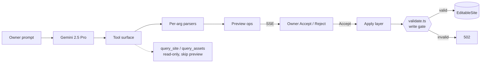

**Excalidraw spec:**
- **Nodes (L→R):** Owner prompt · Gemini 2.5 Pro · Tool surface (15 mutating + 2 read-only) · Per-arg parsers (vertical column: inline marks, media kind, element type, style-kit tokens, page metadata, motion fields, site config) · Preview ops (stack of cards) · Owner Accept/Reject · Apply layer · Validator (gate with lock icon) · EditableSite
- **Layout:** strict left-to-right flow. Validator drawn as a *gate* — anything that fails fails loudly.
- **Annotations:** "ADR 0012" near Validator · "ADR 0014" near Parsers · "Streamed SSE" on edge to Owner · "Read-only: query_site, query_assets" branching off Tool surface

### D6 — Image preview-before-persist (Mermaid sequence)

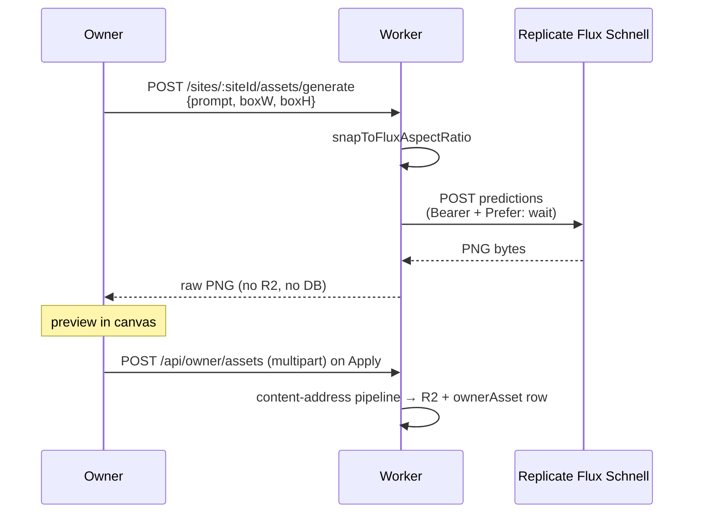

### Voiceover

[VISUAL: Master-map snippet, AI subgraph highlighted.]

> **Frame (25s):** The AI in this editor has two surfaces. A chat agent that mutates the document, and an image generator that produces pixels. Different shapes, different vendors. One principle binds them: neither one produces a side effect on its own. Both treat the owner as the only entity that can commit. That principle is beat three.

[VISUAL: D5 fills screen (strict L→R).]

```text
┌──────┐ ┌──────┐ ┌──────┐ ┌──────┐ ┌──────┐ ┌──────┐ ┌─────┐ ╔═══════╗ ┌──────┐
│Owner │▶│Gemini│▶│Tool  │▶│Per-arg│▶│Preview│▶│Owner │▶│Apply│▶║validate║▶│Edit  │
│prompt│ │ 2.5  │ │surfac│ │parsers│ │  ops  │ │Acc/  │ │layer│ ║  .ts   ║ │Site  │
└──────┘ └──────┘ └──┬───┘ └──────┘ └───┬──┘ │Reject│ └─────┘ ╚═══╤═══╝ └──────┘
                    │                    │   └──────┘             │valid
               read-only             SSE stream         invalid → 502
                    ▼
           ┌────────────────┐
           │ query_site /   │
           │ query_assets   │
           │ (skip preview) │
           └────────────────┘
```

> **D5 walk (2 min):** Start with the chat agent. The owner types a prompt. The worker bundles the prompt with the current site state and the schemas of every tool, and sends it to Gemini 2.5 Pro. Gemini chooses tools.

[ACTION: Highlight Tool surface + read-only branch.]

> The tool surface has two kinds of tools. Read-only ones — `query_site`, `query_assets` — return data and don't change anything; they skip the preview path entirely. The mutating tools, about fifteen of them, go through a per-argument parser.

[ACTION: Highlight Per-arg parsers.]

> Every argument the model proposes is parsed before it becomes a preview. Inline marks, media kind, element type, style-kit tokens, page metadata, motion fields, site config — each one has a parser that knows what shape the canvas expects. If an argument is malformed, the parser rejects it and the tool call never produces a preview. The model has to retry with valid arguments.

[ACTION: Highlight Preview ops + SSE arrow.]

> Valid argument bundles become preview cards. The agent streams them to the owner over server-sent events — each card is a proposed change with enough detail for the owner to evaluate it. "Add a hero section here." "Change the accent token to this OKLCH value." "Replace the headline with this text."

[ACTION: Highlight Owner Accept/Reject → Apply.]

> The owner accepts or rejects each card. Acceptance pushes the change to the apply layer.

[ACTION: Highlight validate.ts gate; both outcomes (valid → state, invalid → 502).]

> The apply layer doesn't write directly. It hands the change to `validate.ts` — the only write gate in the canvas. Per ADR 0012, every mutation that touches `editableState` flows through this function. If the change is valid, `validate.ts` returns the new state and the apply layer commits. If it's invalid — and invalid means *any* schema violation, not just structural ones — the apply layer returns a 502 and nothing changes.
>
> No partial application. No best-effort. The agent gets the same gate the human editor gets. The gate doesn't know which one is calling.

[VISUAL: Dissolve to D6 sequence.]

> **Pivot (10s):** Image generation enforces the same rule from a different end. Same principle, completely different implementation.

[ACTION: Highlight the POST generate line + snapToFluxAspectRatio.]

> **D6 walk (90s):** The owner opens an image inspector, types a prompt, picks a box on the canvas. The browser POSTs to a generate endpoint with the prompt and the box dimensions. The worker has a small helper called `snapToFluxAspectRatio` — Flux Schnell only generates at a fixed set of aspect ratios, so we round the box to the nearest supported ratio before asking.

[ACTION: Highlight Replicate → PNG bytes → raw PNG back to Owner.]

> The worker calls Replicate's Flux Schnell endpoint with a Bearer token and the `Prefer: wait` header — synchronous response, no polling. Replicate returns PNG bytes. The worker hands the bytes straight back to the browser. Raw response. No transformation.

[ACTION: Flash the "no R2, no DB" callout.]

```text
   ╔══════════════════════════════════════╗
   ║  NO R2 PUT.  NO ownerAsset ROW.      ║
   ║  PNG lives in browser memory only.   ║
   ╚══════════════════════════════════════╝
```

> This is the non-obvious decision: the worker does not store the image. No R2 PUT. No `ownerAsset` row. No database transaction. The generated bytes exist only in the browser's memory, displayed in the preview, and they vanish if the owner closes the tab or generates a new image.

[ACTION: Highlight Apply → multipart POST → asset pipeline.]

> Only when the owner clicks Apply does anything persist. The browser does a separate multipart POST to the owner-assets endpoint — and *that* request goes through the same content-addressed pipeline as any other upload. SHA-256 hash, dedupe against R2, write an `ownerAsset` row if it's new. The generated PNG becomes a real asset only at the moment the owner says "yes, I'm using this."
>
> Preview-before-persist. Generation is a proposal, not a side effect. ADR 0004 decision 2 calls this out explicitly — the rule was hard-won, because the obvious implementation is to store everything Replicate gives back and let the owner discover orphans later.

[VISUAL: Dissolve to Beat 4 highlight.]

> **Close (15s):** Both surfaces converge on the same shape. The AI proposes. The owner commits. The system has exactly two write gates — `validate.ts` for the document, and the asset pipeline for binaries — and the AI sits in front of both. Beat four is where those commits become history.

---

## Beat 4 — Versioning

**Diagrams:** D7 Y.Doc deterministic snapshot
**Runtime:** 1.5 min · **Words:** ~240
**Source:** [`src/version/`](../../src/version/)
**Pitch:** a version is the whole Y.Doc encoded as bytes, deterministically.
**Landmines:** whole-Doc snapshot, *not* diff between versions; encoding is deterministic; no cross-version diff UI unless re-verified.

### D7 — Y.Doc deterministic snapshot

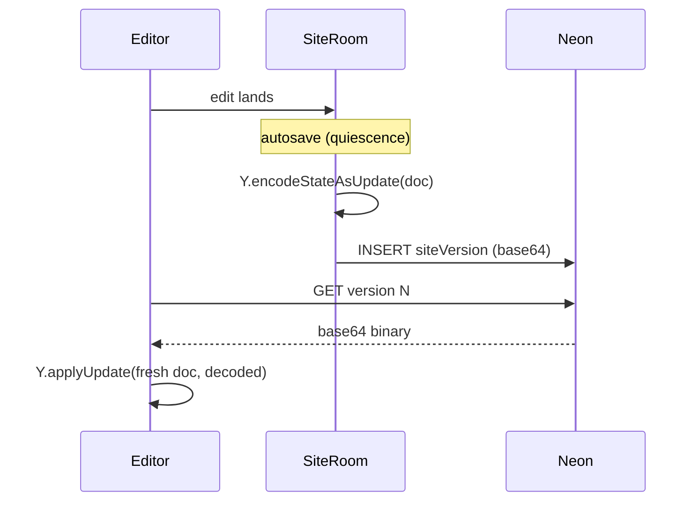

### Voiceover

[VISUAL: Master-map snippet, VER highlighted.]

> **Frame (15s):** In beat two, I mentioned that SiteRoom snapshots the whole Y.Doc into the database on autosave. Beat four is what that actually looks like, and why we made the decision we did.

[VISUAL: D7 sequence appears.]

> **D7 walk (60s):** Quiet editor — autosave fires. SiteRoom takes the whole Y.Doc, runs `Y.encodeStateAsUpdate` again — same function that ships diffs to peers in beat two — and gets back a binary blob. That blob is base64-encoded and written to one row in the `siteVersion` table. Text column. We tried storing it as `bytea` first; base64 in text compressed about the same and the read path was simpler.
>
> Notice what we did *not* do. We did not diff against the previous version. We did not extract JSON from `EditableSite` and store that. We stored the whole CRDT state, in its own native encoding, as a single row.
>
> Restoring a version: fetch the row, base64-decode, `Y.applyUpdate` into a fresh Y.Doc, project to `EditableSite`. Same code path the editor uses for any other state — just bootstrapped from disk instead of from a peer.
>
> Encoding is deterministic. Same Doc, same bytes. That property is load-bearing — it means a version restored from yesterday and a version restored today will be byte-identical, and any later edit will continue from the same logical position. If you ever want a cross-version diff UI, you compute it from the projected `EditableSite` trees, not from the binary blobs.

[VISUAL: Dissolve to Beat 5 highlight.]

> **Close (10s):** That's history. Beat five is how sections — the chunks pages are made of — get into the document in the first place.

---

## Beat 5 — Recipes

**Diagrams:** D8 Regenerative factories + `'custom'` sentinel
**Runtime:** 2 min · **Words:** ~340
**Source:** ADR 0019, [`src/canvas/recipes.ts`](../../src/canvas/recipes.ts), [`src/canvas/schema.ts:102-113`](../../src/canvas/schema.ts)
**Pitch:** recipes are factories, not templates. Slot-binding rejected. AI writes briefs.
**Landmines:** no slot model; no in-place swap handler; pattern is *delete + add new*; AI writes English briefs, not slot-rebind scripts.

### D8 — Recipe factories + `'custom'` sentinel

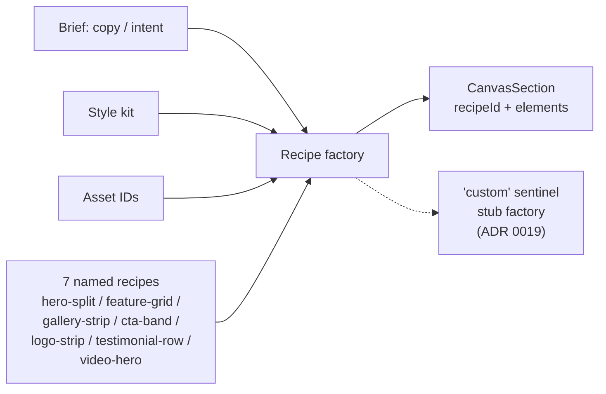

### Voiceover

[VISUAL: Master-map snippet, REC highlighted.]

> **Frame (25s):** Most page builders give you sections with named slots. There's a "hero" component with a "headline" slot, a "subhead" slot, a "background image" slot, and a UI that lets you rebind each one. When the AI changes the hero, it rebinds slots.
>
> We don't do that. Open Canvas has no slot model. The decision is one of the senior takeaways from this whole codebase, so let's spend two minutes on it.

[VISUAL: D8 diagram appears.]

> **D8 walk (70s):** Sections come from recipe factories. A factory takes three inputs: a brief — that's copy and intent — the site's style kit, and a list of asset IDs the owner has access to. It returns one fully-formed `CanvasSection`.
>
> Seven named recipes. Hero-split, feature-grid, gallery-strip, cta-band, logo-strip, testimonial-row, video-hero. Each one is a function. Same brief in, same section out.

[ACTION: Highlight the `'custom'` sentinel branch.]

> Plus one sentinel called `'custom'`. ADR 0019. It's the marker for hand-designed sections — anything imported, anything the AI built freeform, anything the owner directly composed. The `custom` factory is a stub. It exists only so the discriminated-union exhaustiveness check passes.

[VISUAL: Hold on the factory shape; the seven names fade.]

> **Senior takeaway (30s):** Here's the part that matters. When the AI wants to change a hero, it doesn't rebind slots. It writes a new brief, calls the hero-split factory again, and replaces the section. Delete plus add. Two operations the validator already understands.
>
> Regenerative interchangeability beats slot binding for AI authoring. The model writes English, not a slot-rebind script. And the codebase never has to maintain a slot-binding API surface that grows with every element type and every variant axis.

[VISUAL: Dissolve to Beat 6 highlight.]

> **Close (10s):** Beat six is the bigger composition story. Importing whole sites and saving templates — and the unexpectedly identical algorithm both flows use.

---

## Beat 6 — Composition ★

**Diagrams:** D9 Site Import + D10 Template clone-into-owner · **paired**, filmed continuously
**Runtime:** 4–5 min · **Words:** ~720
**Source:** ADR 0008, [`src/routes/api/import.ts`](../../src/routes/api/import.ts), [`src/routes/api/sites.ts`](../../src/routes/api/sites.ts), [`src/db/schema.ts:478-491`](../../src/db/schema.ts)
**Pitch:** two completely different content-source flows use the same two-pass translation algorithm.
**Landmines:** Site Import disabled in public POC (say "feature exists" if drawn at all); templates frozen at save time (no live link to source); **name the rhyme on camera** — viewers won't connect it on their own.

### D9 — Site Import (Excalidraw, three frames)

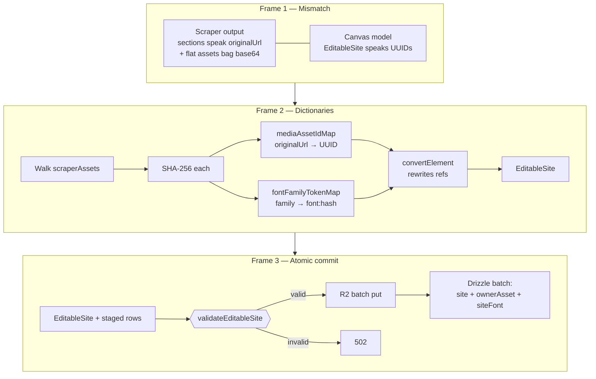

**Excalidraw spec:**
- **Nodes:** Owner Import button (left) · Workers (URL validate + scraper auth) · Scraper service (Playwright, external) · Headless browser (inside scraper) · DOM extractor (inside scraper) · Element mapper · Asset downloader → R2 · Seed color extractor → OKLCH algebra → custom Style Kit · EditableSite with one Canvas Page (far right)
- **Edges:** Owner → Workers → Scraper (Bearer `SCRAPER_API_SECRET`) · Scraper → Headless → DOM → Mapper · Mapper → EditableSite · Mapper → Asset DL → R2 → Owner Assets · Mapper → Seed color → OKLCH → custom Style Kit
- **Annotations:** "ADR 0008" · "Disabled in public POC build" · "Source animations → nearest Motion Preset"

### D10 — Template clone-into-owner

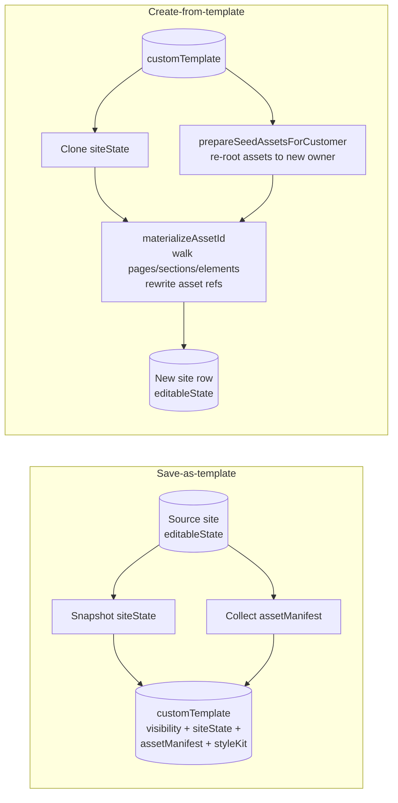

### Voiceover

[VISUAL: Master-map snippet, COMP highlighted, D9 + D10 in focus.]

> **Frame (30s):** Beat six covers two ways content gets into a site from somewhere else. Site Import, where the owner pastes a URL and we scrape an existing website into a new Open Canvas project. And templates — where one site's state becomes a starting point for another site.
>
> They look like different problems. One starts with foreign HTML. The other starts with our own JSONB. We'll go through both — and then I'll show you why they're the same problem.

[VISUAL: D9 Site Import diagram fills screen, three frames stacked.]

> **D9 Frame 1 (50s):** Site Import has three frames. Frame one: the mismatch. Our scraper service — that's a separate Playwright instance, disabled in the public POC, but the import button is in the dashboard — returns a layout where sections reference asset bytes by their original public URL. So a section might say "background-image is at example.com/hero.jpg." Plus, separately, a flat bag of asset bytes, each encoded as base64. Canvas doesn't speak URLs. Canvas speaks UUIDs. Every asset reference is an `ownerAsset` row identified by a content hash. The two models don't line up.

[ACTION: Highlight Frame 2 — the two dictionary passes.]

> **D9 Frame 2 (50s):** Frame two: we build dictionaries. Walk the asset bag. Hash each blob with SHA-256. For every blob, get back a content hash that may or may not already exist in the owner's library. Two maps come out of this pass. `mediaAssetIdMap` — from original URL to a new owner-asset UUID. `fontFamilyTokenMap` — from the family name on the scraped pages to a `font:<hash>` token used elsewhere in the canvas. Then a single walk over the element tree with `convertElement`, which uses both maps to rewrite every reference. What comes out is an `EditableSite` that speaks UUIDs.

[ACTION: Highlight Frame 3 — the atomic commit.]

> **D9 Frame 3 (40s):** Frame three: atomic commit. `validateEditableSite` runs on the rewritten tree — same gate the agent uses in beat three, same gate publish uses in beat seven. If it fails, the whole import returns 502. Nothing persists. No half-imported assets, no stranded site row. If it passes, R2 batch put for the asset bytes, then a single Drizzle batch insert: the site row, the new `ownerAsset` rows, the `siteFont` rows. All-or-nothing. ADR 0008.

[VISUAL: Dissolve to D10 diagram.]

> **D10 walk (110s):** Templates. The other way content arrives. Save-as-template: we take the current site's `editableState` and snapshot it into a `customTemplate` row. JSONB column. Alongside it, we collect an asset manifest — every asset referenced by the snapshot, recorded with its hash. The template carries visibility — global or private — the state, the manifest, and the style kit at save time.
>
> The snapshot is frozen. If Maya edits the source site tomorrow, the template doesn't update. That's intentional — a template that drifted under its consumers would be a worse footgun than an out-of-date one.
>
> Create-from-template: the owner picks a template. The handler clones the `siteState`, then calls `prepareSeedAssetsForCustomer` — that's the function that takes the asset manifest and creates fresh `ownerAsset` rows for the new owner, deduplicating against the customer's existing library by content hash. Then `materializeAssetId` walks pages, sections, elements, and rewrites every asset reference to the new owner's UUIDs.

[VISUAL: Name the rhyme — D9 Frame 2 and D10's two-pass shown side by side.]

```text
   D9 — Site Import                D10 — Template clone
   ─────────────────                ────────────────────

   Build dictionaries:              Build dictionaries:
     mediaAssetIdMap                  prepareSeedAssetsForCustomer
     fontFamilyTokenMap               (asset manifest → new
                                      owner-asset UUIDs)

         │                                  │
         ▼                                  ▼

   convertElement walks               materializeAssetId walks
   the tree, rewrites refs            the tree, rewrites refs

   ────── two-pass translation ──────
   collect refs → build ID map → rewrite tree

         same algorithm, different source shape
```

> **The rhyme (60s):** Stop and look at both flows. Both start with a content blob that speaks a different namespace than the canvas does. Both build a mapping from the old namespace to the new one. Both walk the element tree with that mapping in hand and rewrite every reference in place. Both commit atomically through `validateEditableSite`.
>
> The scraper output starts as HTML and ends in our model. The template starts in our model and ends in our model again, for a different owner. Two completely different problems on the surface. The same two-pass translation algorithm underneath. We didn't plan that — both grew to fit their data, and the third time we wrote it we noticed.
>
> The general shape: any content source that produces a tree whose references don't match our internal namespace can be onboarded by writing that mapper. The algorithm's the same. We can predict what the next one will look like before we write it.

[VISUAL: Dissolve to Beat 7 highlight.]

> **Close (15s):** So content lands in `editableState`. Beat seven is what happens when the owner says "publish this" — and specifically, what stops bad sites from going live.

---

## Beat 7 — Publish: column split

**Diagrams:** D11 editable ⇄ published
**Runtime:** 1.5 min · **Words:** ~260
**Source:** [`src/db/schema.ts:94-96`](../../src/db/schema.ts), [`src/routes/api/publish.ts:144-365`](../../src/routes/api/publish.ts)
**Pitch:** editing never touches what visitors see. Publish is the only path between them.
**Landmines:** editing never touches `publishedSnapshot`; publish is *not* atomic at the row level — it's a sequence with rollback; the column split is the precondition for Beat 8 to be a *gate*, not advice.

### D11 — editable ⇄ published

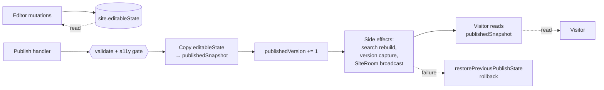

### Voiceover

[VISUAL: Master-map snippet, PUB1 highlighted.]

> **Frame (20s):** Open Canvas separates two things most editors confuse. The state the editor is mutating, and the state visitors are reading. Two columns on the same `site` row. Editing never touches the second one. Publish is the only path between them.

[VISUAL: D11 diagram appears.]

> **D11 walk (80s):** `site.editableState` — that's the working column. Continuous. Every Beat 2 projection, every Beat 3 agent apply, every Beat 6 import, every Beat 6 template clone — they all write here. The editor reads here.
>
> `site.publishedSnapshot` — that's what visitors render. Nothing else writes to this column except the publish handler.
>
> Publish: validate the editable state. Run the a11y audit — that's beat eight. If both pass, copy `editableState` to `publishedSnapshot`, bump `publishedVersion`, and run the side-effect chain — search index rebuild, version capture, broadcast to live visitors. If any of those side effects fails, `restorePreviousPublishState` rolls the published columns back to where they were before this publish started.
>
> The two-column split is the precondition for the next beat. A11y can *block* publish at 422 — without ever affecting what visitors are looking at right now — because the columns are physically separate. If they were the same column, you'd be choosing between rolling back everything the owner just did and shipping a broken site. We don't have that choice. That's the point.

[VISUAL: Dissolve to Beat 8 highlight.]

> **Close (10s):** Beat eight is the gate. Six checks. 422 with a full report on fail. Already live.

---

## Beat 8 — A11y blocks publish ★

**Diagrams:** D12 6-check audit
**Runtime:** 3–4 min · **Words:** ~570
**Source:** [`src/a11y/`](../../src/a11y/), `src/a11y/SUBSYSTEM.md`
**Pitch:** six parallel a11y checks block publish at 422. Already live, not planned.
**Landmines:** speak in **present tense** — this *already* gates, not a planned feature; pure-validator pattern (collect ALL errors, no fail-fast); crash → blocking issue, never silent skip.

### D12 — Six-check audit (Excalidraw)

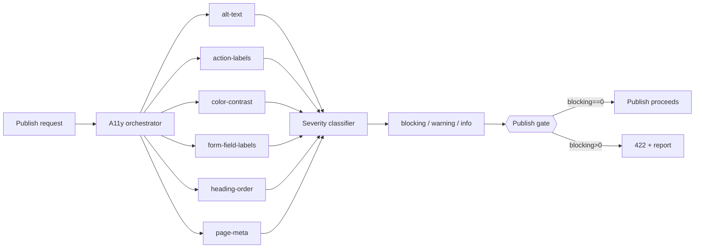

**Excalidraw spec:**
- **Nodes:** Publish request (left) · A11y orchestrator (centre) · 6 check workers (column to the right of orchestrator: alt-text, action-labels, color-contrast, form-field-labels, heading-order, page-meta) · Crash isolation wrapper (around each check — try/catch box) · Severity classifier (bottom-centre) · Issue list (blocking/warning/info, bottom-right) · Publish gate (far right)
- **Edges:** Publish → Orchestrator · Orchestrator → 6 checks (parallel) · Each check → Severity → Issue list · Issue list → Gate · Gate → either Publish proceeds OR Publish blocked + report
- **Annotations:** "Crash → blocking `audit-crash` issue" near wrappers · "Contrast resolved against innermost surface by area, then z-index" beside color-contrast · "H-level from font size via per-kit headingScale" beside heading-order

### Voiceover

[VISUAL: Master-map snippet, PUB2 highlighted.]

> **Frame (30s):** Every site builder has an accessibility tab. You click through it after you've shipped, you see warnings, you ignore most of them. Open Canvas doesn't have that. We have a gate. The audit runs at publish time. If anything is blocking, you can't publish — the handler returns 422 with a full report, and the published state is unchanged.
>
> Present tense. This already gates. It's not on the roadmap. Beat eight is the gate itself.

[VISUAL: D12 diagram appears — orchestrator → 6 checks → severity → gate.]

> **Six checks (70s):** Six checks. They run in parallel. Each one is a pure function over the editable state. Collect every issue — never fail fast. The list flows into a severity classifier.
>
> Alt-text: every media element needs one. Action-labels: every button-equivalent needs accessible text — an `aria-label` or a visible label or both. Color-contrast: every text element resolves its background against the surfaces stacked under it, by area and z-index — not just the immediate parent. We'll come back to that one. Form-field-labels: every input needs an associated label. Heading-order: H1 then H2 then H3, no skipping levels. Page-meta: each page needs a title and description.

[ACTION: Highlight color-contrast + heading-order with subtlety annotations.]

```text
   ┌────────────────────────────────────────────────────┐
   │ color-contrast                                ◀ HL │
   │   resolves against innermost surface by area,      │
   │   then z-index — not just the immediate parent     │
   └────────────────────────────────────────────────────┘
   ┌────────────────────────────────────────────────────┐
   │ heading-order                                 ◀ HL │
   │   H-level derived from font size via per-kit       │
   │   headingScale — checking *visual* hierarchy,      │
   │   not authored H-tags                              │
   └────────────────────────────────────────────────────┘
```

> **The subtle two (60s):** Two of those have hidden subtlety. Color-contrast: when you put white text over a hero image, the relevant background isn't the image — it's whatever is the topmost surface covering the text's bounding box. We compute the dominant surface by area of overlap, ties broken by z-index. Heading order: H-levels in Open Canvas aren't authored directly. The renderer derives them from font size via the style kit's `headingScale`. So when we check heading order, we're checking the *derived* H-level matches the visual hierarchy the author built. Either of those alone would let dozens of subtle a11y bugs through.

[ACTION: Highlight crash-isolation wrappers.]

> **Crash isolation (30s):** Each check runs inside a crash-isolation wrapper. If `color-contrast` throws — bad style kit, weird OKLCH value, whatever — the audit doesn't crash the publish handler. It emits a blocking issue called `audit-crash` and the gate still trips. We don't silently skip checks. A crash is a blocker. The owner sees a real error in the report.

[ACTION: Highlight Severity → Gate, both outcomes.]

> **Gate behaviour (45s):** The classifier tags every issue: blocking, warning, info. The gate is binary on blocking. If `blockingCount > 0`, the publish handler returns 422 — with the whole report attached — and `publishedSnapshot` is untouched. Visitors keep seeing what they were already seeing. Editor session keeps everything in `editableState`. Owner clicks the issue, jumps to the broken element in the canvas, fixes it, re-publishes.
>
> Warnings and info don't block. They show up in the same panel, but they don't trip the gate. We chose to be strict about what counts as blocking — a lot of standard a11y rules ship in our tool as warnings, deliberately. The blockers are the things that actually break the page for a real assistive user.

---

## Closer (~30s · ~100 words)

[VISUAL: All six master-map clusters lit simultaneously, throughline sentence overlaid.]

```text
   ┌─ DOC ─┐  ┌─ EDIT ─┐  ┌─ AI ─┐  ┌─ VER ─┐  ┌─ COMP ─┐  ┌─ PUB ─┐
   │  B1   │  │  B2 ★  │  │ B3 ★ │  │  B4   │  │ B5/B6 ★│  │B7/B8 ★│
   └───────┘  └────────┘  └──────┘  └───────┘  └────────┘  └───────┘

   "Maya edits a document model that two clients converge on without
    a server picking a winner. The AI mutates it through a gate that
    rejects invalid writes outright and never produces side effects
    from generation. The whole Y.Doc snapshots deterministically into
    base64. New sections come from regenerative recipes the AI rewrites
    rather than slot-binds, and bigger imports — whether scraped or
    template-cloned — share the same two-pass translation algorithm.
    Publish is a column copy gated by six parallel a11y checks that
    block at 422."

                Eight beats. Five non-obvious decisions. Nothing else.
```

> Maya edits a document model that two clients converge on without a server picking a winner. The AI mutates it through a gate that rejects invalid writes outright and never produces side effects from generation. The whole Y.Doc snapshots deterministically into base64. New sections come from regenerative recipes the AI rewrites rather than slot-binds, and bigger imports — whether scraped or template-cloned — share the same two-pass translation algorithm. Publish is a column copy gated by six parallel a11y checks that block at 422.
>
> Eight beats. Five non-obvious decisions. Nothing else.

[VISUAL: Fade to black, hold 2s.]
