# Act 2 — Master Canvas (one-doc scroll-through)

> **What this is.** The flagship spine for Act 2 on one page: 9 narrative beats covering 12 diagrams, each one a non-obvious engineering decision worth audience attention. Routine plumbing (auth tokens, routing, forms, SEO, search, ops view) cut entirely — covered elsewhere in the codebase, not in the video.
>
> **How to use during recording.**
> - Open §0 (master map) — "these are the only six things this video is about."
> - Each subsequent §n is one beat (one or two paired diagrams). `← in:` and `→ out:` lines below each block name the cross-flows so the audience knows where each piece slots into the whole.
> - Paired beats (§2 D7+D3, §3 D6+D-aigen, §6 D14+D-template) are filmed as one continuous explanation — the pairing IS the point.
>
> **Stance:** the video is "five non-obvious engineering decisions Open Canvas made," not "a tour of every subsystem." If a viewer wants the operational view (schema, API surface, deploy), point them at the ADRs and CONTEXT.md — those exist for that purpose.

---

## §0 — Master Map

The whole video on one canvas. Six subsystems, twelve diagrams, every cross-edge real.

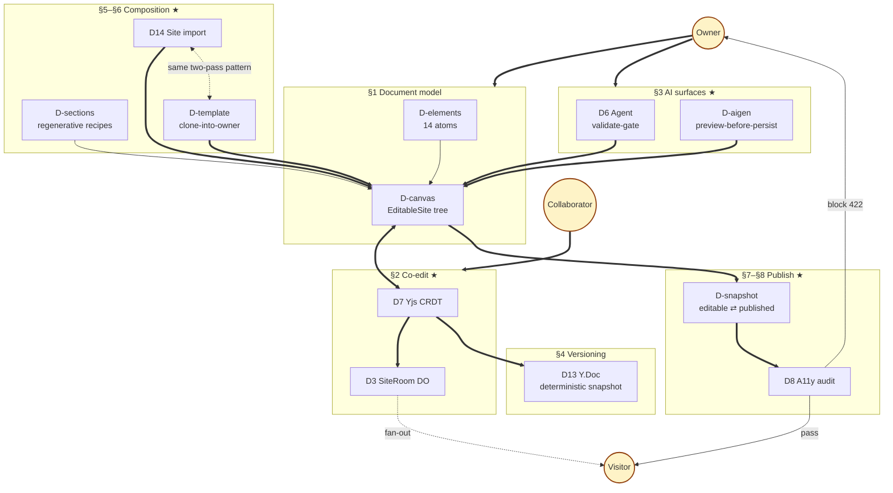

**How to read.** Bold arrows (`==>`) = primary data flow. Dotted (`-.->`) = a relationship worth naming but not a write path. The dotted edge between D14 and D-template is **the meta-beat** — same algorithm, different source.

---

## §1 — Document model (D-canvas + D-elements)

**One tree, fourteen atoms. Every mutation in this video reduces to changing one of these.**

D-canvas — the tree:

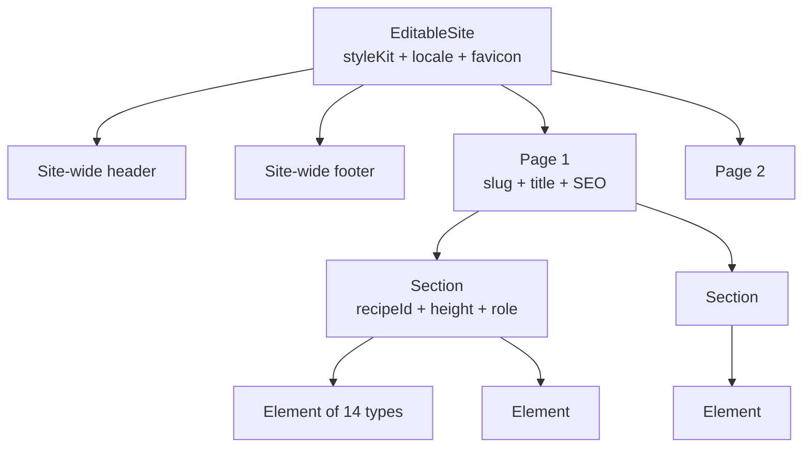

D-elements — the union:

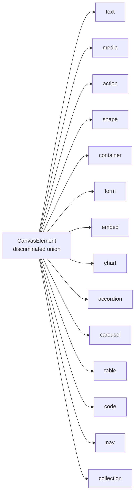

> ← **in:** the schema the entire video operates on; defined in [`src/canvas/schema.ts`](../../../src/canvas/schema.ts) · → **out:** D7 projects to this, D6 mutates through this, D8 audits this, D14/D-template/D-sections produce this, D-snapshot copies this on publish.
> ⚠ Header + footer are *site-wide*, not per-page. Bounded by design — 14 types, not "infinite." `'custom'` recipe (§5) is the open-ended escape hatch, not the element registry.

---

## §2 — Co-edit (D7 + D3) ★ flagship

**The pair is the point.** D7 = *what* is sent (Yjs CRDT binary diffs). D3 = *how* it's distributed (one DO per site, WS hibernation). Filmed continuously, with a live-drawn Excalidraw replay.

D7 — Yjs CRDT model:

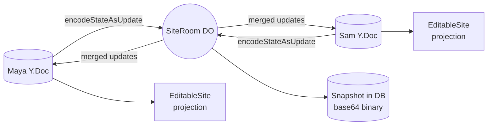

D3 — SiteRoom fan-out:

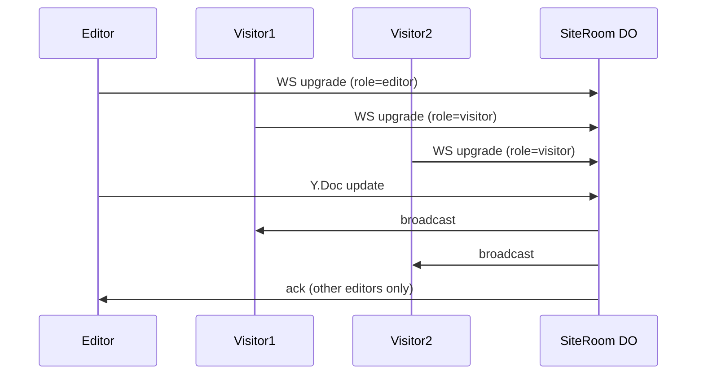

> ← **in:** Owner/Collaborator edits land on their local Y.Doc; D-canvas is the projection target on every client · → **out:** binary snapshot persisted to D13; visitors see broadcast updates in real time.
> ⚠ CRDT, not OT. Server doesn't resolve conflicts — the merge function does. Every client has its own Y.Doc; never draw a shared one. D7 alone hides the broadcast; D3 alone is plumbing — show them together.

---

## §3 — AI surfaces (D6 + D-aigen) ★ flagship

**The argument: the AI never produces side effects.** Both surfaces enforce the same rule from different ends — D6 gates writes to the document, D-aigen gates writes to the asset store. Filmed continuously to land the principle.

D6 — Agent validate-gate:

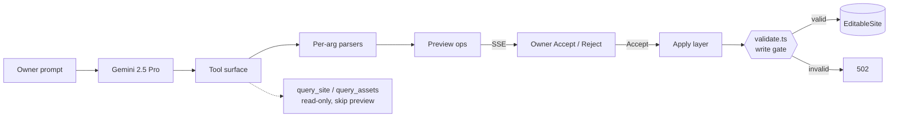

D-aigen — preview-before-persist for AI image generation:

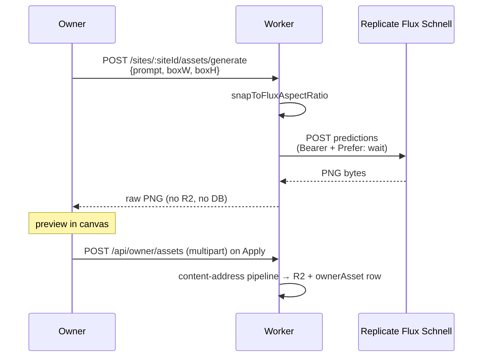

> ← **in:** Owner prompts (chat or image generator); both call sites authenticated by an edit cookie · → **out:** D6 valid ops → D-canvas mutations → propagated via §2; D-aigen Apply → asset rows → referenced by D-canvas elements.
> ⚠ The non-obvious decision in D-aigen: **generation alone does NOT create an asset.** Bytes live in the browser until the Owner applies. Lead with this — it's the senior-engineer "ooh, they didn't store it" beat.

---

## §4 — Versioning (D13)

**A version is the whole Y.Doc encoded as bytes. Restore replays the encoding.**

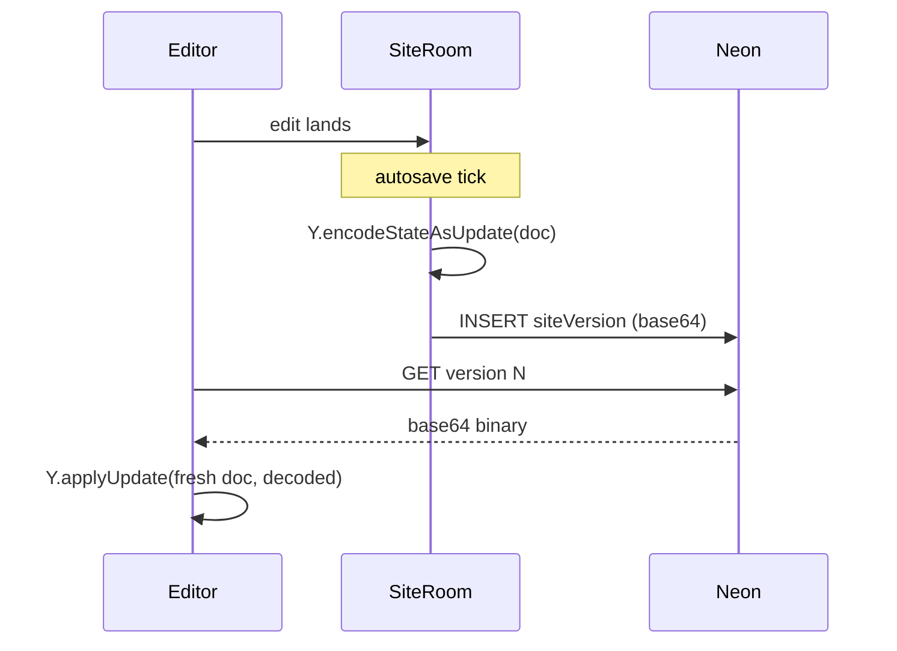

> ← **in:** Y.Doc from §2; SiteRoom is the autosave trigger; §7 publish handler also captures a version · → **out:** restore replays into a fresh Y.Doc, then projects to D-canvas.
> ⚠ Whole-Doc snapshot, not diff between versions. Encoding is deterministic — same Doc, same bytes. Cross-version diff UI doesn't exist unless re-verified.

---

## §5 — Composition: recipes (D-sections)

**Recipes are factories, not templates. Swap = regenerate from a recipe with a new brief.**

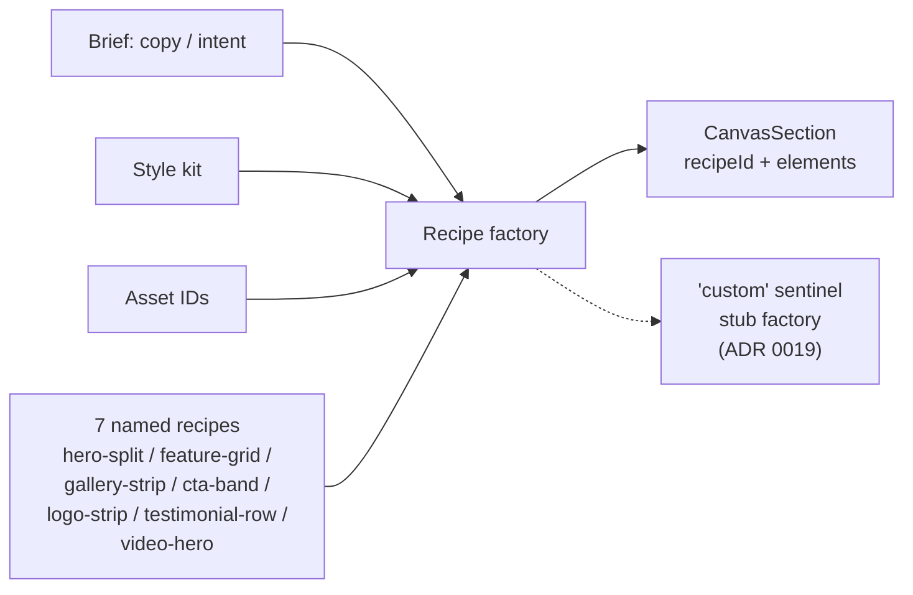

> ← **in:** brief comes from §3 agent or direct editor action; style kit + asset IDs are constants of the site · → **out:** produces a `CanvasSection` for D-canvas; §6 imported sections land as `'custom'`.
> ⚠ **No named-slot model. No in-place swap handler.** Pattern is *delete + add new*. To "change the hero," the AI writes a new brief and replaces — it doesn't rebind slots. That regenerative interchangeability is the senior takeaway: it beats slot-binding for AI-driven authoring because the model writes a brief, not a slot-rebind script.

---

## §6 — Composition: site import + templates (D14 + D-template) ★ flagship

**The meta-beat: two completely different content-source flows use the same two-pass translation algorithm.** Show both, then say it.

D14 — Site Import (scraper output → owned site):

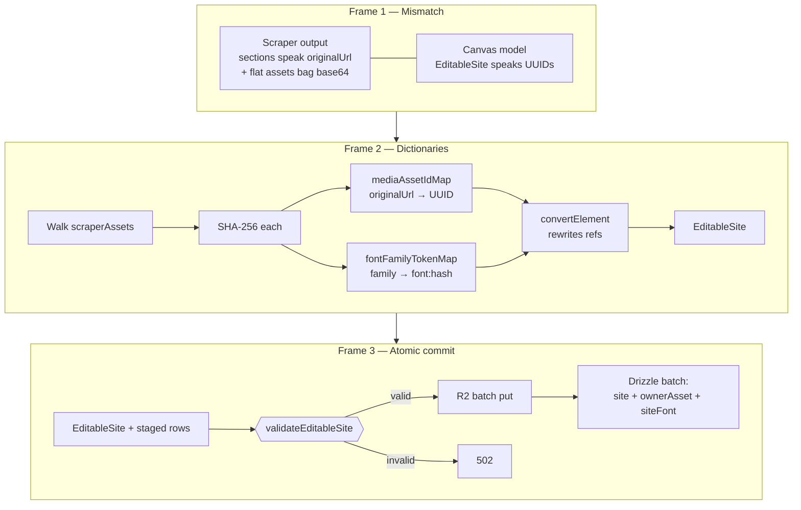

D-template — customTemplate clone-into-owner:

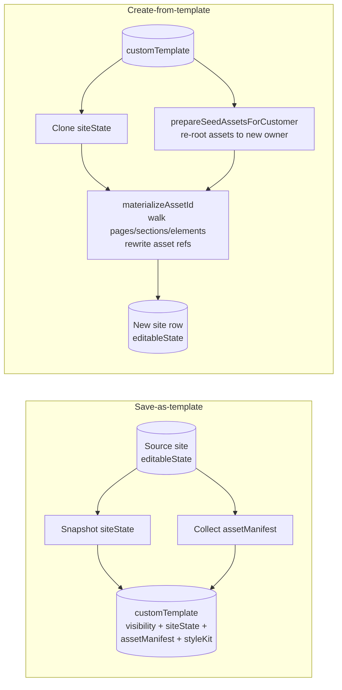

> ← **in:** D14 from scraper output; D-template from another site's `editableState` · → **out:** both produce a fresh D-canvas tree + asset rows; both materialise into the new owner.
> ⚠ **The point:** the algorithm is the same. **Frame 2 in D14** (build dictionaries → rewrite tree) and **`materializeAssetId` in D-template** (walk tree → rewrite refs) are the same two-pass translation. Different source shape, same pattern. That's the "architecture rhymes" beat — call it out explicitly on camera.

---

## §7 — Publish: column split (D-snapshot)

**Two snapshots per site. Edits mutate one; visitors read the other. Publish is the only transition.**

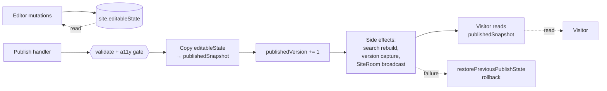

> ← **in:** all edit flows write `editableState` — §2 projection, §3 agent apply, §6 materialisers · → **out:** publish triggers §8 (a11y gate first), then the side-effect chain.
> ⚠ **The precondition for §8 to exist as a gate.** Editing never affects what visitors see — the column separation is the entire guarantee. Publish is *not* atomic at the row level; rollback via `restorePreviousPublishState`. Without this column split, "a11y blocks publish" wouldn't be expressible.

---

## §8 — Publish: a11y blocks publish (D8) ★ flagship

**Six parallel checks. Blocking issues stop publish at 422 with a full report. Already live, not planned.**

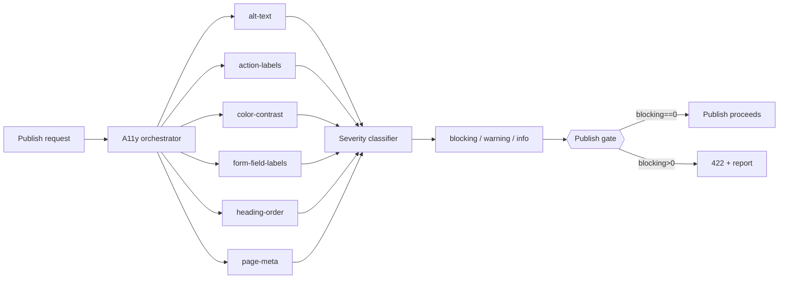

> ← **in:** invoked by §7 publish handler; reads `editableState` + style kit for contrast resolution · → **out:** pass → publish side-effects run; fail → 422 to Owner with full report, nothing committed.
> ⚠ **Speak in present tense.** Audit *already* gates publish. Pure-validator pattern: collect ALL errors, no fail-fast. Contrast resolves against the *innermost surface by area, then z-index* — not just background. Heading H-level derived from font size via per-kit `headingScale`.

---

## Coda

The audience leaves with one sentence:

> "Maya edits a document model (§1) that two clients converge on without a server picking a winner (§2). The AI mutates it through a gate that rejects invalid writes outright and never produces side effects from generation (§3). The whole Y.Doc snapshots deterministically into base64 (§4). New sections come from regenerative recipes the AI rewrites rather than slot-binds (§5), and bigger imports — whether scraped or template-cloned — share the same two-pass translation algorithm (§6). Publish is a column copy gated by six parallel a11y checks that block at 422 (§7–§8). That's the engineering."

Eight beats. Five non-obvious decisions. Nothing else.
