# Live-Draw Reference — Act 2 (34 blocks)

Comments + Mermaid for each block. Freestyle the voiceover.

- ⚠ flags landmines (dead features, common mis-statements).
- Order matches the narrative flow; the 28 numeric `D<n>` IDs are from [act-2-script.md](../act-2-script.md). Six additional blocks (`D-canvas`, `D-elements`, `D-aigen`, `D-sections`, `D-template`, `D-snapshot`) cover product mechanics the original 28 didn't.

---

## Ordering observations (decide before recording)

1. **D5 + D10 (auth tokens) sit *after* D7 + D3 (collab).** Current reading: "show editing, then explain the gate." Alternative: move auth right after D4 so the gate precedes the room.
2. **D26 (rate limiter) is grouped with security** but mechanically pairs with D15 (forms). Consider moving it next to D15.
3. **D27 (CSP)** is per-page-rendered — could live with publish-time (D18/D19) instead of security cluster.

---

## Canvas spatial layout (one canvas, 11 rows)

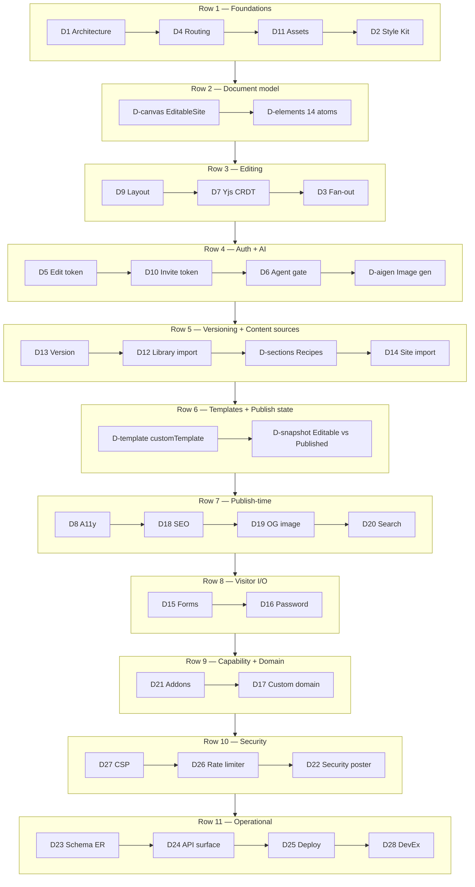

---

## D1 — System architecture overview

Source: [docs/architecture/0001-architecture.md](../../architecture/0001-architecture.md), [wrangler.toml](../../../wrangler.toml)

**One Worker is the hub. Everything else is storage it owns or external services it calls.**

- Hono router on Cloudflare Workers edge runtime. Single binary via `wrangler deploy`.
- Two audiences: visitor + owner, same Worker.
- Storage: Neon (Drizzle), R2 (`rev01-assets`).
- Two Durable Objects: SiteRoom (one per site, WS hub), FormRateLimiter (per-IP throttle).
- External calls: Clerk, Resend, Gemini, Replicate, CF for SaaS, Turnstile, Playwright scraper (dashed, disabled in POC).
- One cron, `*/5 * * * *` — polls custom-hostname status.
- ⚠ Don't mention auto-translate (dead) or Symbols (dead).
- ⚠ Scraper drawn dashed, never solid.

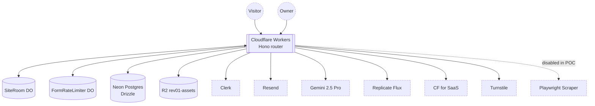

---

## D4 — Published address routing

Source: [ADR 0002](../../adr/0002-published-address.md)

**Three host shapes, one render path.**

- Apex (`opencanvas.aayushman.dev`) → app shell (dashboard / editor / landing).
- Wildcard subdomain → `site.subdomain` lookup.
- Anything else → must match a `customDomain` row.
- Apex is a Workers Custom Domain; wildcard is a Workers *Route* — CF Custom Domains don't support wildcards.
- ⚠ Apex migrated to `opencanvas.aayushman.dev` on 2026-05-29 — don't say `rev01.aayushman.dev`.

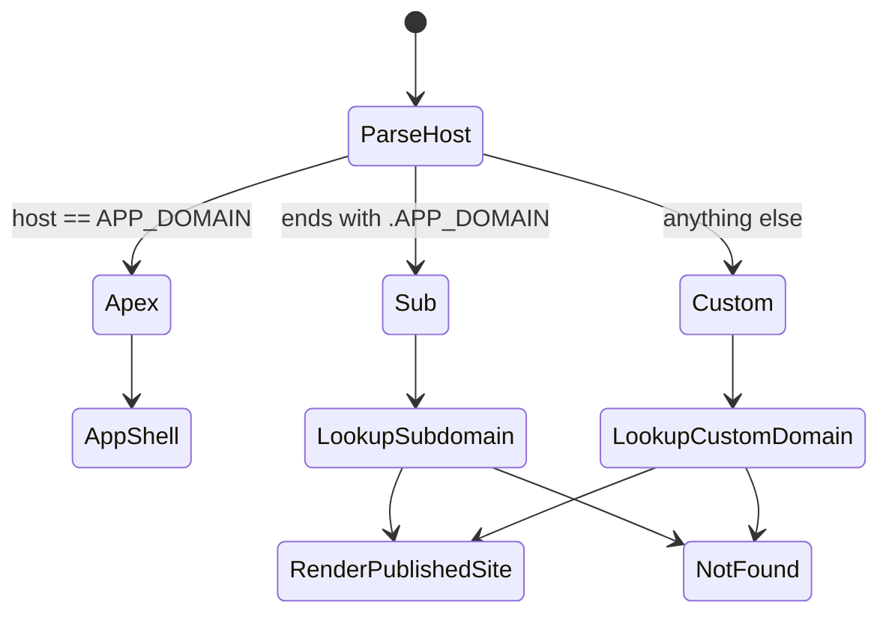

---

## D11 — Owner Asset content-addressed pipeline

Source: [ADR 0004](../../adr/0004-owner-asset.md), [ADR 0006](../../adr/0006-asset-storage-backend.md)

**Same bytes → one R2 object → multiple `ownerAsset` rows.**

- SHA-256 hash is the asset's identity.
- R2 keyed by content hash; existing hash → skip upload.
- `ownerAsset` row carries `customer_id` — R2 doesn't know ownership.
- Magic-byte dimension probing (PNG / JPEG / GIF / WebP) — no full decode.
- Public URL `/assets/<contentHash>`.
- ⚠ Not MD5 — SHA-256.
- ⚠ R2 doesn't enforce ownership; the DB does.

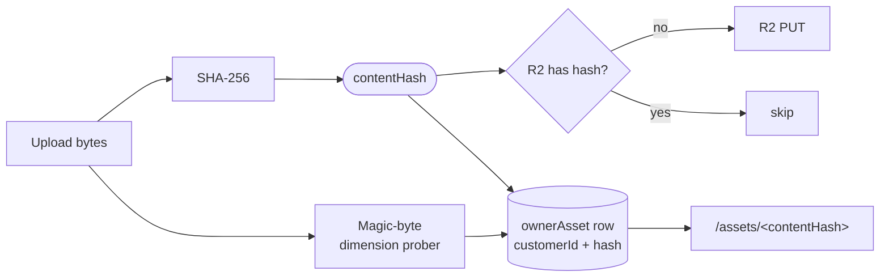

---

## D2 — Style Kit determinism + dark variants

Source: [ADR 0022 (Proposed)](../../adr/0022-twelve-token-oklch-theme-grammar.md), [src/canvas/style-kits.ts](../../../src/canvas/style-kits.ts)

**One seed produces twelve tokens deterministically. Editor and published site cannot drift.**

- OKLCH color space — lightness and chroma shifts are predictable.
- 12 named tokens (bg, panel, text, muted, accent, border, +6 more) computed from the seed.
- Dark variant = another deterministic projection of the same seed.
- Renderer reads tokens; editor uses the same lookup — pixel parity by construction.
- ⚠ ADR 0022 is Proposed — phrase as "the grammar we're consolidating on."
- ⚠ Not a "themes" library — one grammar, not a swap set.

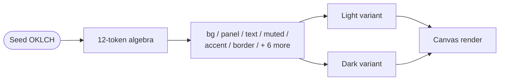

---

## D-canvas — EditableSite tree (the document model)

Source: [src/canvas/schema.ts:393-427](../../../src/canvas/schema.ts) (EditableSite), [src/canvas/schema.ts:353-391](../../../src/canvas/schema.ts) (CanvasPage), [src/canvas/schema.ts:330-351](../../../src/canvas/schema.ts) (CanvasSection), [src/canvas/schema.ts:286-300](../../../src/canvas/schema.ts) (CanvasElement)

**Three levels of tree. Every editor mutation reduces to changing this.**

- Root `EditableSite`: styleKit, pages[], header, footer, customStyleKit, defaultLocale, siteNoIndex, darkModeEnabled, faviconAssetId.
- `CanvasPage`: id, slug, title, width, sections[], plus SEO + page-level motion.
- `CanvasSection`: id, recipeId, name, height, role (header/footer/middle), backgroundEffect, entrance, trigger, backgroundVideoAssetId, elements[].
- `CanvasElement`: discriminated union of 14 types (D-elements).
- Header + footer are *site-wide* single sections, not per-page.
- This is what the Y.Doc projects to (D7), what `validate.ts` gates (D6), what the renderer reads.
- ⚠ It's a tree, not a graph. Asset refs are by UUID, not embedded bytes.
- ⚠ Style kit, locale, dark-mode flag, favicon — all site-wide (root level), not per-page.

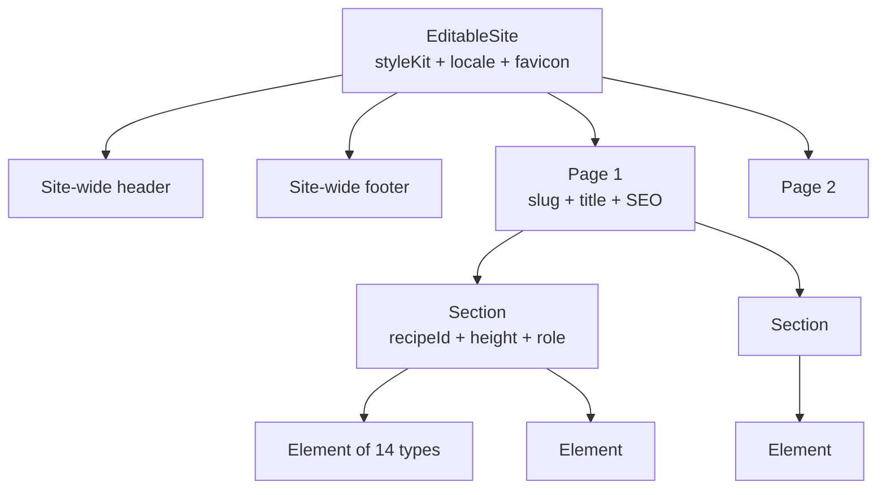

---

## D-elements — Element types + variant axes (14 atoms)

Source: [src/canvas/schema.ts:32-47](../../../src/canvas/schema.ts) (ELEMENT_TYPES), per-type definitions in [src/canvas/elements/](../../../src/canvas/elements/), [ADR 0011 (Proposed)](../../adr/0011-canvas-element-registry.md)

**Fourteen atoms. Each is its own discriminated branch with its own variants and own validator.**

- 14 types: `text`, `media`, `action`, `shape`, `container`, `form`, `embed`, `chart`, `accordion`, `carousel`, `table`, `code`, `nav`, `collection`.
- Variant axes (sample):
  - **text:** role (heading / body / label), fontSize 12-96, fontWeight, align.
  - **action:** 7 variants — solid / outline / ghost / pill / glass / brutalist / underline.
  - **shape:** 6 variants — rect / pill / circle / line / badge / blob.
  - **container:** 7 surface variants — flat / raised / glass / outlined / sticker / editorial-frame / soft-panel.
  - **media:** image | video, fit (cover / contain), video.playback flags (autoplay / muted / loop / controls).
  - **chart:** 5 kinds — bar / line / pie / donut / area.
  - **code:** 12 languages, line-numbers toggle.
  - **embed:** provider resolved from URL — YouTube / Vimeo / Loom / Figma / Spotify / SoundCloud / CodePen / Twitter.
- Discriminated union → compile-time exhaustiveness via D28's union-cover checks.
- ADR 0011 (Proposed) consolidates per-element module ownership into a registry; inspector dispatch is mid-migration.
- ⚠ Don't claim "infinite element types" — it's fourteen, bounded by design.
- ⚠ `'custom'` recipe (D-sections) is different from element variants — recipes parametrise sections, variants parametrise elements.

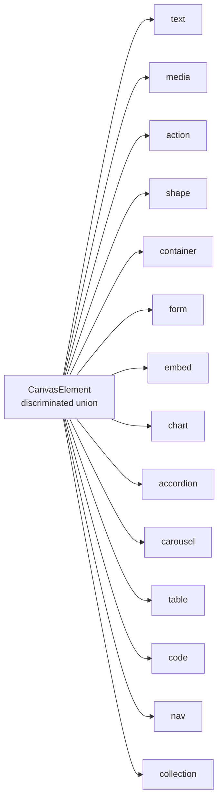

---

## D9 — Responsive layout engine + breakpoint cascade

Source: [src/canvas/layout/engine.ts](../../../src/canvas/layout/engine.ts), [src/canvas/responsive/](../../../src/canvas/responsive/)

**Authors edit a semantic tree. Engine resolves to absolute positions per breakpoint, with cascading overrides.**

- Semantic primitives: stack / grid / split.
- Breakpoint cascade: desktop → tablet → mobile. Each inherits from the parent.
- Per-breakpoint overrides are deltas, not full re-specs.
- Engine is a pure function — same input, same positioned section.
- ⚠ Not media queries — layouts computed ahead, not in CSS.
- ⚠ Overflow is an author error caught by the validator, not handled gracefully.

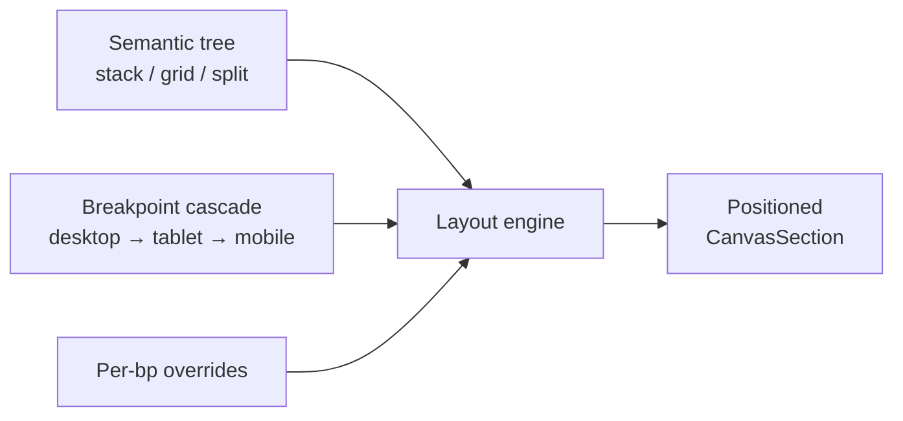

---

## D7 — Yjs CRDT + element-style projection ★ flagship

Source: [ADR 0007](../../adr/0007-yjs-revival.md), [src/live/site-room.ts](../../../src/live/site-room.ts)

**Two editors converge without a server picking a winner. Merge is conflict-free by construction.**

- Each client owns its own Y.Doc. No server-held truth.
- Edits emit binary diffs via `Y.encodeStateAsUpdate`.
- SiteRoom DO broadcasts; clients converge.
- Snapshot = whole Y.Doc encoded as bytes → stored in `siteVersion` (base64 in text column).
- EditableSite is a *projection* — canvas reads through it so CRDT machinery doesn't leak into render.
- Live-drawn animation: empty Docs → Maya edit → SiteRoom appears → Sam edit → fan-out back → snapshot + projection.
- ⚠ CRDT, not Operational Transforms. Different math.
- ⚠ Server doesn't resolve conflicts — the merge function does.
- ⚠ Every client has its own Y.Doc — never draw a shared one.

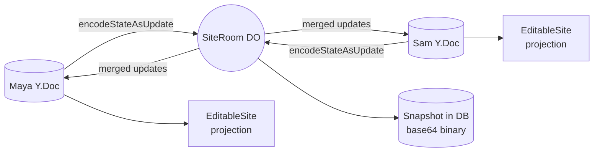

---

## D3 — SiteRoom DO WebSocket fan-out

Source: [ADR 0007](../../adr/0007-yjs-revival.md), [src/live/site-room.ts](../../../src/live/site-room.ts)

**One DO per site. Editors push diffs in, visitors get them broadcast out.**

- WS upgrade tags role (`editor` / `visitor`) at connect time.
- Editor diff → SiteRoom → fan-out to all visitors + ack to other editors.
- DO hibernates between updates; uses Hibernation API.
- ⚠ Not polling — single broadcast in DO state.
- ⚠ D7 = *what* is sent (Yjs); D3 = *how* it's distributed (DO + WS).

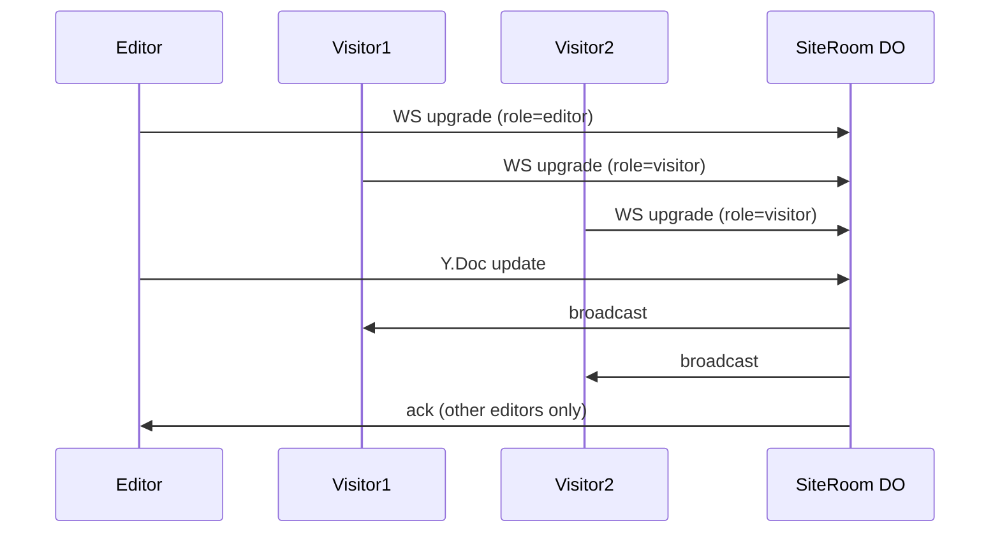

---

## D5 — Edit token issuance + origin binding

Source: [src/auth/](../../../src/auth/), [ADR 0005](../../adr/0005-custom-domains.md)

**Bearer cookie bound to one origin. Replay on a different host dies.**

- Clerk verifies session JWT → Worker mints `HMAC-SHA256(siteId + origin + nonce)`.
- Cookie scoped to apex; prefix from `COOKIE_NAME_PREFIX` env var.
- Every `/__api/*` call: timing-safe HMAC verify + Host header must match bound origin.
- ⚠ HMAC, not signed JWT.
- ⚠ `COOKIE_NAME_PREFIX` is env-driven (`__opencanvas_`); don't hardcode the literal.

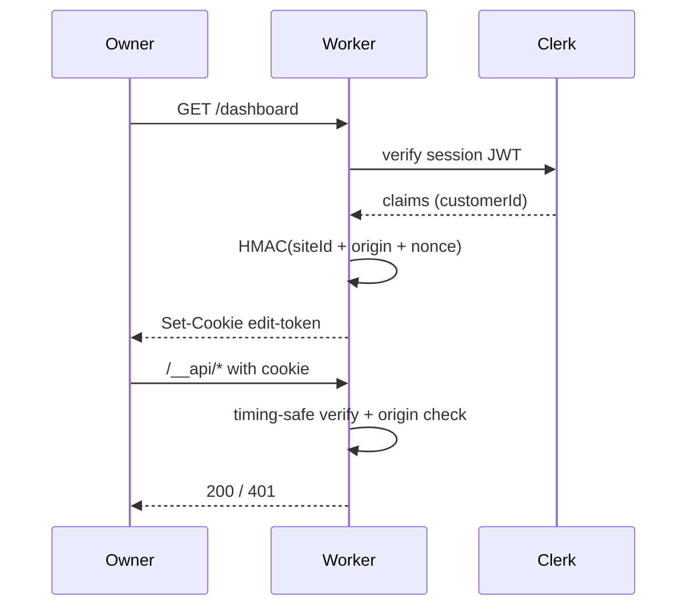

---

## D10 — Invite token (HMAC JWT)

Source: [src/auth/invite-token.ts](../../../src/auth/invite-token.ts), [ADR 0010](../../adr/0010-invite-link-bearer-auth.md)

**The link is the credential. Single-use, 7-day expiry.**

- HMAC-SHA256 JWT, sub = invitee email, includes siteId + exp.
- Delivered via Resend email.
- Redemption: timing-safe verify + check redemption table (single-use).
- Post-redeem: insert `collaborator` row + issue edit token (D5 machinery).
- ⚠ Verify 7-day TTL against [src/auth/invite-token.ts](../../../src/auth/invite-token.ts) before recording.

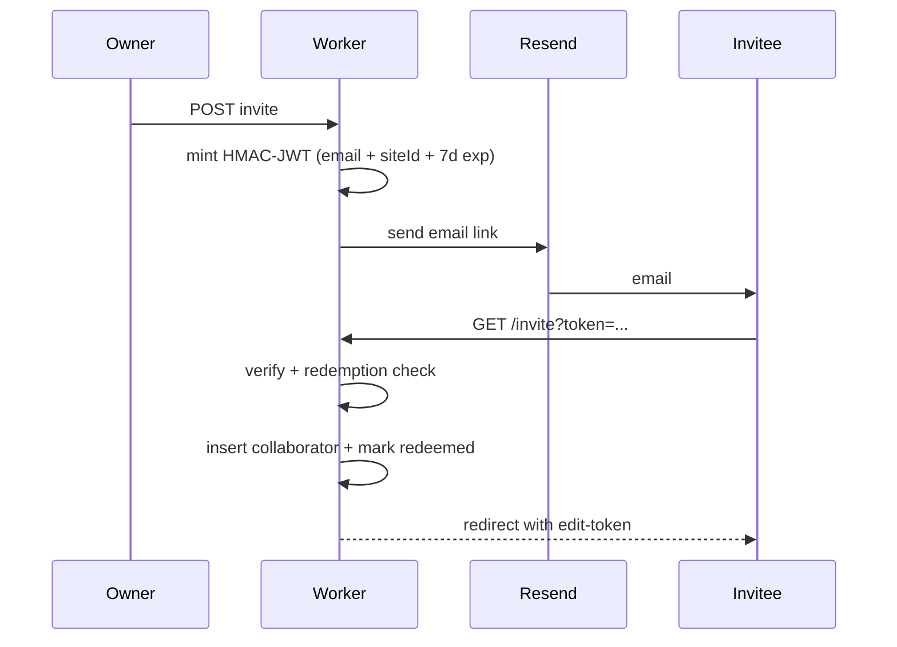

---

## D6 — AI agent + chat preview/apply gate ★ flagship

Source: [ADR 0012 (Proposed)](../../adr/0012-validation-write-gate.md), [ADR 0014 (Proposed)](../../adr/0014-template-literal-data-substitution.md), [src/agent/](../../../src/agent/), [src/canvas/validate.ts](../../../src/canvas/validate.ts)

**The agent never mutates state directly. Every change becomes a preview the owner accepts.**

- Owner prompt + current site state + tool schemas → Gemini 2.5 Pro.
- Mutating tools go through per-arg parsers (inline marks, media kind, element types, style-kit tokens, page meta, motion fields, site config).
- Read-only tools (`query_site`, `query_assets`) skip the preview path.
- Valid ops → preview cards streamed via SSE.
- Owner Accept → Apply layer → `validate.ts` (the only write gate per ADR 0012).
- Invalid → 502, no partial apply.
- ⚠ Agent edits the EditableSite projection, not Y.Doc directly.
- ⚠ Don't show fallback paths — invalid is fatal.

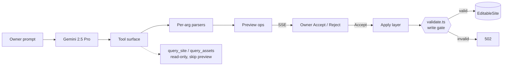

---

## D-aigen — AI image generation (Replicate / Flux Schnell)

Source: [src/routes/api/canvas.ts:632-733](../../../src/routes/api/canvas.ts), [ADR 0004 decision 2](../../adr/0004-owner-asset.md)

**Generated bytes live in the browser until the owner applies. Generation is a preview, not a side effect.**

- Endpoint: `POST /sites/:siteId/assets/generate` with `{prompt, boxW, boxH}` ([canvas.ts:693-733](../../../src/routes/api/canvas.ts)).
- `snapToFluxAspectRatio` rounds the requested box dims to one of Flux's supported ratios — generation isn't arbitrary-size.
- `generateImageViaReplicate` POSTs to `black-forest-labs/flux-schnell/predictions` with Bearer `REPLICATE_API_TOKEN` and `Prefer: wait` header for synchronous response.
- Worker returns the PNG bytes **raw to the browser** — no R2 write, no `ownerAsset` row, no DB touch.
- Only on Apply does the browser do a separate multipart POST to `/api/owner/assets`, which runs the D11 content-address pipeline.
- This is the **preview-before-persist** pattern from ADR 0004 decision 2 — generate cheap, commit only on owner intent.
- ⚠ Generation alone does NOT create an asset. Senior viewers: lead with this — it's the non-obvious choice.
- ⚠ Aspect ratios snapped to Flux's set, not arbitrary.

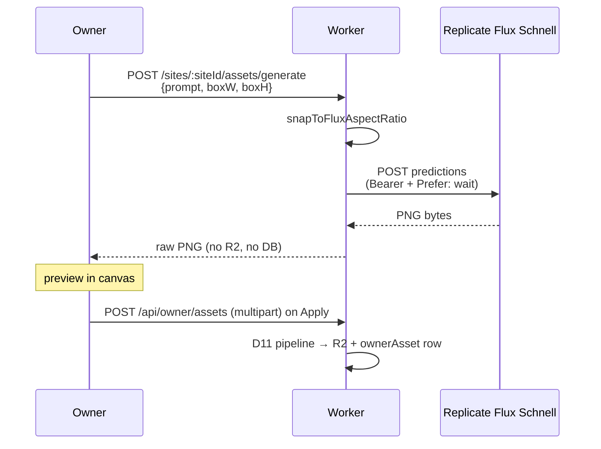

---

## D13 — Version snapshot + Y.Doc deterministic encoding

Source: [src/version/capture.ts](../../../src/version/capture.ts), [src/version/restore.ts](../../../src/version/restore.ts)

**A version is the whole Y.Doc encoded as bytes. Restore replays the encoding.**

- Autosave on quiescence triggers `Y.encodeStateAsUpdate(doc)`.
- Stored as base64 in a text column on `siteVersion` (D1 binaries didn't compress further).
- Restore: fetch row → base64 decode → `Y.applyUpdate` into fresh Doc → project to EditableSite.
- Encoding is deterministic — same Doc, same bytes.
- ⚠ Whole-Doc snapshot, not diff between versions.
- ⚠ Cross-version diff UI doesn't exist unless verified.

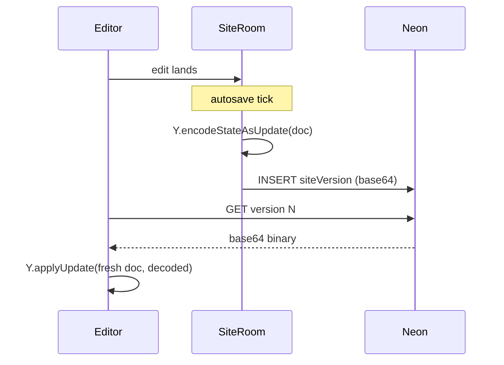

---

## D12 — Library section import + seed materialization

Source: [src/canvas/library-section-import.ts](../../../src/canvas/library-section-import.ts), [ADR 0023 (Proposed)](../../adr/0023-seed-asset-bytes-as-base64-text.md), [ADR 0019](../../adr/0019-section-recipe-custom-sentinel.md)

**A library section ships as JSON + seed bytes. Importing materialises into owner-assets and rewrites refs.**

- Section seed = JSON + base64 byte files in-repo (ADR 0023).
- Seed bytes pushed through the D11 asset pipeline — content-hash deduped against existing customer assets.
- Section JSON refs the seed by URL; we rewrite refs to assetIds (same translation pattern as D14).
- Section lands as `recipeId: 'custom'` per ADR 0019 — canvas treats it as hand-designed.
- ⚠ Materialised, not cloned by reference — mutating the section doesn't touch library.

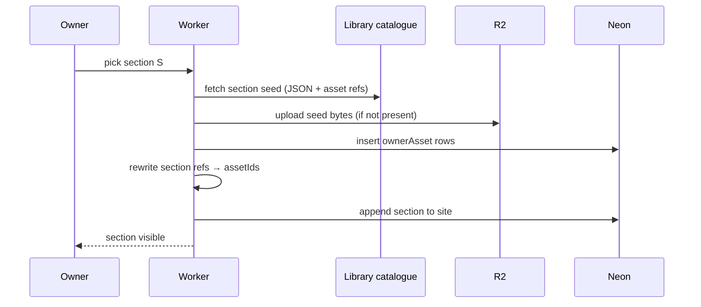

---

## D-sections — Recipes + `'custom'` sentinel (section "interchangeability")

Source: [src/canvas/schema.ts:102-113](../../../src/canvas/schema.ts) (AGENT_RECIPE_IDS + SECTION_RECIPE_IDS), [src/canvas/recipes.ts:46-72](../../../src/canvas/recipes.ts) (RecipeFactoryInput), [ADR 0019](../../adr/0019-section-recipe-custom-sentinel.md)

**Recipes are factories, not templates. Swap = regenerate from a recipe with a new brief.**

- Seven named recipes: `hero-split`, `feature-grid`, `gallery-strip`, `cta-band`, `logo-strip`, `testimonial-row`, `video-hero`.
- Plus the `'custom'` sentinel per ADR 0019 — marks the section as *hand-designed*; not regeneratable from a factory.
- Recipe factory signature: `(brief, styleKit, assetIds) → CanvasSection`. Each named recipe is one factory.
- **There is no named-slot model.** Sections don't expose "headline slot, bgMedia slot" for rebinding. The factory just produces a fully-formed section.
- **There is no in-place swap handler.** Pattern is *delete + add new*. To "change the hero," generate a new `hero-split` with a new brief and replace.
- `'custom'` factory is a stub (`buildCustom`) — exists for discriminated-union exhaustiveness only.
- ⚠ Do NOT pitch a slot system. It doesn't exist.
- ⚠ Do NOT pitch in-place section swap. Pattern is delete + add.
- ⚠ Senior takeaway: regenerative interchangeability beats slot-binding for AI-driven authoring — the model writes a new brief, not a slot-rebind script.

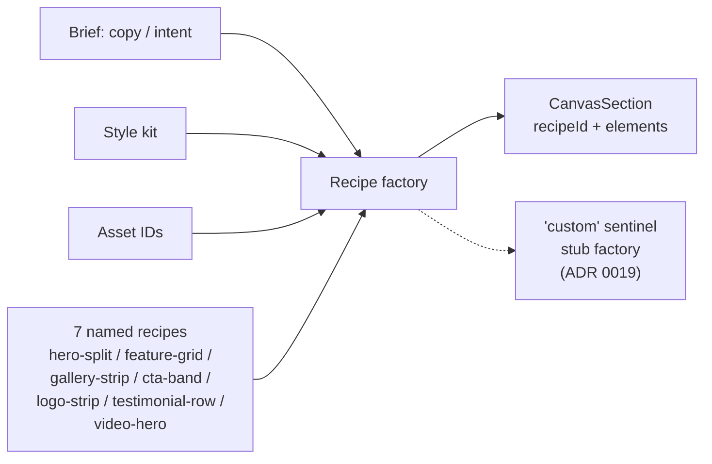

---

## D14 — Site Import architecture (3 frames) ★ flagship

Source: [ADR 0008](../../adr/0008-site-import-architecture.md), [src/routes/api/import.ts](../../../src/routes/api/import.ts)

**Scraper returns layout speaking foreign URLs + a flat bag of bytes. Two dictionaries + a rewrite pass + atomic commit.**

- **Frame 1 — Shape mismatch:** scraper output (sections refer to `originalUrl`) vs canvas model (refs are UUIDs).
- **Frame 2 — Dictionaries:** walk `scraperAssets`, hash each (SHA-256), build `mediaAssetIdMap` (originalUrl → UUID) and `fontFamilyTokenMap` (family → `font:hash`). Dedupe against existing customer `ownerAsset` by hash.
- **Frame 3 — Atomic commit:** `validateEditableSite` gate → R2 batch put → Drizzle `database.batch([site, ownerAsset, siteFont])`.
- WOFF2-only for fonts (no transcoding).
- Invalid tree → 502, nothing persists. Subdomain collision → 409.
- ⚠ Import button disabled in public POC — say "feature exists" if drawn at all.
- ⚠ No partial-fail fallback. Either everything commits or 502.
- ⚠ Not the same as `customTemplate` saving — separate endpoint, separate table.

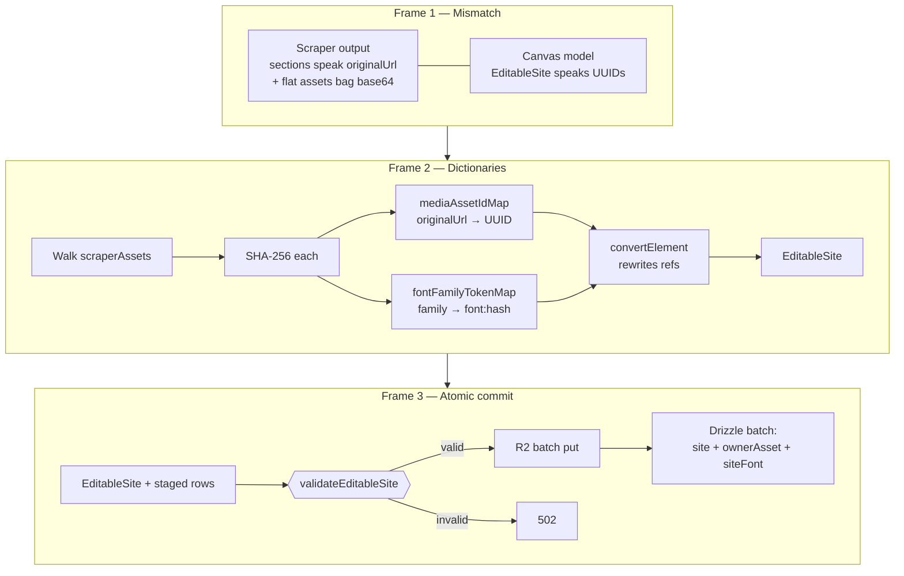

---

## D-template — Templates (customTemplate + clone-into-owner flow)

Source: [src/db/schema.ts:478-491](../../../src/db/schema.ts) (customTemplate), [src/routes/api/custom-templates.ts:6](../../../src/routes/api/custom-templates.ts) (save), [src/routes/api/sites.ts:428-446](../../../src/routes/api/sites.ts) (create-from-template), [src/routes/api/sites.ts:166-241](../../../src/routes/api/sites.ts) (asset re-rooting)

**A template is a frozen `EditableSite` + asset manifest. Create-from-template = clone state + re-root assets to the new owner.**

- `customTemplate` row carries: id, visibility (`global` / `private`), name, tagline, styleKit, **`siteState` (EditableSite JSONB)**, **`assetManifest` (AssetManifestEntry[] JSONB)**.
- **Save-as-template** (`POST /custom-templates`): clones current site's `editableState` into `siteState`, collects asset refs into the manifest.
- **Create-from-template** (`POST /sites?templateId=...`): reads `customTemplate.siteState`, calls `prepareSeedAssetsForCustomer` to re-root assets into the new owner's `ownerAsset` rows, then `materializeAssetId` walks pages → sections → elements and rewrites every assetId.
- Same two-pass translation pattern as D14 (site import) — collect refs, build ID map, rewrite the tree. Different source, same shape.
- `visibility: 'global'` = catalog-wide template; `'private'` = creator-only.
- ⚠ Template `siteState` is *frozen at save time*. Editing the source site later does not update the template.
- ⚠ Templates are how the Apogee Showcase fixture becomes a startable site. The demo's "start from Apogee → rebrand to Briar" arc rides this flow.

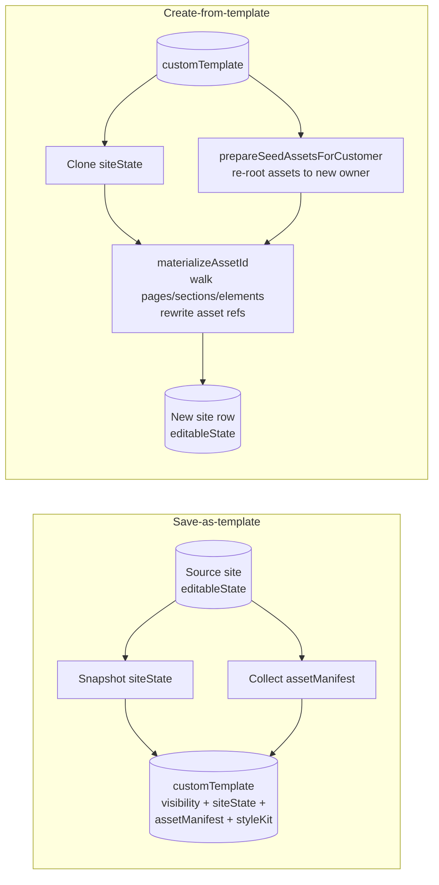

---

## D-snapshot — editableState vs publishedSnapshot

Source: [src/db/schema.ts:94-96](../../../src/db/schema.ts), [src/canvas/schema.ts:435-440](../../../src/canvas/schema.ts) (PublishedSnapshot), [src/routes/api/publish.ts:144-365](../../../src/routes/api/publish.ts)

**Two snapshots per site. Edits mutate one; visitors read the other. Publish is the only transition.**

- `site.editableState` — working state. What the editor mutates. Updated continuously via Y.Doc projection.
- `site.publishedSnapshot` — `PublishedSnapshot` type = `EditableSite + version + publishedAt`. What visitors render.
- `site.publishedVersion` — monotonic integer (1-based, not semver). Bumped on each successful publish.
- Publish (`POST /api/publish/sites/:siteId`): validate → copy `editableState` → `publishedSnapshot` → bump `publishedVersion` → run side effects (search index rebuild D20, version capture D13, SiteRoom broadcast to live visitors).
- Side-effect failure → `restorePreviousPublishState` rollback (publish.ts:144-200).
- Visitor render path reads `publishedSnapshot` ONLY, never `editableState`.
- ⚠ Editing never affects what visitors see — the column separation is the entire guarantee.
- ⚠ Publish is *not* atomic at the row level — it's a sequence with rollback. Atomic boundary is the publish handler.
- ⚠ This is the data-model precondition for D8: a11y gates the *transition*, not the editable state.

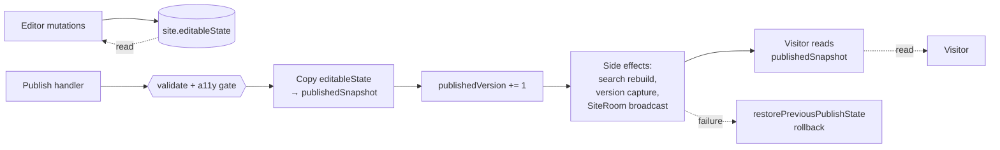

---

## D8 — A11y audit pipeline ★ flagship

Source: [src/a11y/audit.ts](../../../src/a11y/audit.ts), [src/a11y/checks/](../../../src/a11y/checks/), [src/a11y/severity.ts](../../../src/a11y/severity.ts)

**Six parallel checks. Blocking issues stop publish at 422.**

- Six checks: alt-text, action-labels, color-contrast, form-field-labels, heading-order, page-meta.
- Each check wrapped in crash-isolation — crash becomes a blocking `audit-crash` issue (no silent skip).
- Severity classifier tags each issue: blocking / warning / info.
- Any blocking → publish returns 422 with the full report.
- Contrast resolves against the *innermost surface by area, then z-index* — not just background.
- Heading H-level derived from font size via per-kit `headingScale`.
- ⚠ Audit *already* gates publish (live, not planned). Don't speak in the future tense.
- ⚠ Pure-validator pattern: collect ALL errors, no fail-fast.

```mermaid
flowchart LR
  pub[Publish request] --> orch[A11y orchestrator]
  orch --> c1[alt-text]
  orch --> c2[action-labels]
  orch --> c3[color-contrast]
  orch --> c4[form-field-labels]
  orch --> c5[heading-order]
  orch --> c6[page-meta]
  c1 --> sev[Severity classifier]
  c2 --> sev
  c3 --> sev
  c4 --> sev
  c5 --> sev
  c6 --> sev
  sev --> issues[blocking / warning / info]
  issues --> gate{{Publish gate}}
  gate -- blocking==0 --> ok[Publish proceeds]
  gate -- blocking>0 --> blocked[422 + report]
```

---

## D18 — SEO meta emission

Source: [src/seo/](../../../src/seo/)

**One assembler emits every SEO surface. They can't drift.**

- Single function reads page meta + site meta + URL.
- Fans out: title / description / canonical / OG / Twitter / JSON-LD / `<html lang>`.
- JSON-LD type derived from page kind, not free-form.
- ⚠ Not separate per-tag pipelines — one assembler.

```mermaid
flowchart LR
  page[Page render] --> asm[SEO assembler]
  asm --> title[title + description]
  asm --> canon[canonical URL]
  asm --> og[OG tags]
  asm --> tw[Twitter card]
  asm --> jsonld[JSON-LD]
  asm --> lang[html lang]
```

---

## D19 — OG image pipeline (Satori → resvg-wasm → R2)

Source: [src/og-image/rasterise.ts](../../../src/og-image/rasterise.ts), [src/og-image/cache.ts](../../../src/og-image/cache.ts)

**Template + page data, hashed for cache. First crawler pays the render cost.**

- Satori = JSX-like template → SVG.
- `@resvg/resvg-wasm` = SVG → PNG, all in-Worker.
- Cache key = hash of template version + page data → R2.
- TTFs bundled as `Data` modules (wrangler.toml rule).
- ⚠ No headless browser. Satori + resvg-wasm only.

```mermaid
sequenceDiagram
  participant Crawler
  participant W as Worker
  participant R2
  participant Sat as Satori
  participant Rv as resvg-wasm
  Crawler->>W: GET /og/<siteId>/<pageSlug>.png
  W->>W: compute cache key
  W->>R2: HEAD cache key
  alt cached
    R2-->>W: hit
    W-->>Crawler: PNG
  else miss
    W->>Sat: render template → SVG
    Sat-->>W: SVG
    W->>Rv: rasterise → PNG
    Rv-->>W: PNG
    W->>R2: PUT cache
    W-->>Crawler: PNG
  end
```

---

## D20 — Atomic search index rebuild (PG FTS)

Source: [src/search/](../../../src/search/)

**Reindex inside one transaction. Visitors never see partial.**

- Postgres FTS (`tsvector`), runs inside Neon — not Elasticsearch.
- Single transaction wraps DELETE + INSERT.
- Concurrent visitor queries see old, then new — never half (MVCC).

```mermaid
sequenceDiagram
  participant Pub as Publish path
  participant DB as Neon
  Pub->>DB: BEGIN
  Pub->>DB: DELETE searchIndex WHERE siteId = X
  Pub->>DB: INSERT new tsvector rows
  Pub->>DB: COMMIT
  Note over DB: visitors see old then new
```

---

## D15 — Form pipeline (Turnstile → DO RL → DB → webhook + Resend)

Source: [src/forms/](../../../src/forms/)

**Visitor input: bot check → throttle → DB → optional notify.**

- Turnstile server-verified with `TURNSTILE_SECRET`.
- FormRateLimiter DO: per-IP, 10 submissions/minute.
- `formSubmission` insert is source of truth; webhook + Resend are fire-and-forget.
- Webhook signed HMAC-SHA256 (`X-Opencanvas-Signature`).
- ⚠ Specifically Turnstile, not generic CF bot manager.
- ⚠ This is the prod (DO) limiter — dev uses the in-process variant (D26).

```mermaid
sequenceDiagram
  participant V as Visitor
  participant W as Worker
  participant TS as Turnstile
  participant RL as FormRateLimiter DO
  participant DB as Neon
  participant Hook as Owner webhook
  participant RS as Resend
  V->>W: POST /__opencanvas/forms/...
  W->>TS: verify token
  W->>RL: increment(ip)
  W->>DB: INSERT formSubmission
  W->>Hook: POST with X-Opencanvas-Signature
  W->>RS: send notification
  W-->>V: 200
```

---

## D16 — Password gate (PBKDF2 + HS256 cookie)

Source: [src/password/](../../../src/password/)

**Password proves you; cookie proves you proved it.**

- PBKDF2-SHA256, 100k iterations, 32-byte salt.
- Per-IP rate limit 5/min on the unlock endpoint.
- Timing-safe compare on hash.
- Redirect target validated same-origin (open-redirect blocked).
- Set HS256-signed unlock cookie → visitor re-fetches gated page.
- ⚠ Not bcrypt — PBKDF2-SHA256.
- ⚠ Verify HS256 signing literal against [src/password/](../../../src/password/) before recording.

```mermaid
sequenceDiagram
  participant V as Visitor
  participant W as Worker
  participant DB as Neon
  V->>W: POST /__opencanvas/unlock
  W->>W: rate-limit 5/min
  W->>DB: load passwordHash + salt
  W->>W: PBKDF2 verify (timing-safe)
  W->>W: validate redirect path (same-origin)
  W-->>V: Set-Cookie HS256 + redirect
```

---

## D21 — Addon entitlement vs site-addon split

Source: [ADR 0009](../../adr/0009-addon-entitlement-model.md)

**Buying an addon doesn't activate it. Installing on a site does.**

- `addonEntitlement` = customer-scoped purchase. One row per buy.
- `siteAddon` = site-scoped config. One row per install.
- Pause preserves config; revoke unwinds both.
- ⚠ Don't conflate the two tables. Owns ≠ uses.

```mermaid
stateDiagram-v2
  [*] --> Unpurchased
  Unpurchased --> Entitled: buy
  Entitled --> Configured: install on site
  Configured --> Active
  Active --> Paused: owner pauses
  Paused --> Active
  Entitled --> Revoked: refund / cancel
  Configured --> Revoked
  Active --> Revoked
```

---

## D17 — Custom domain state machine + CF for SaaS

Source: [ADR 0005](../../adr/0005-custom-domains.md), [src/custom-domain/](../../../src/custom-domain/)

**Four states, one cron, bounded poll.**

- CF for SaaS Custom Hostnames API on the backend.
- Cron `*/5` polls Pending/Verifying rows, reconciles `status` + `certIssuedAt`.
- 30-min stuck rows flip to Failed without further CF calls.
- ⚠ Wildcard subdomain is *not* a custom hostname (it's a Workers Route).
- ⚠ Reads `CF_API_TOKEN` + `CF_ZONE_ID` from secrets, not dashboard.

```mermaid
stateDiagram-v2
  [*] --> Pending: owner adds briar.app
  Pending --> Verifying: CF registered
  Verifying --> Active: cert issued
  Verifying --> Failed: 30min stuck
  Pending --> Failed: 30min stuck
  Active --> [*]: owner removes
```

---

## D27 — CSP dynamic frame-src

Source: [src/embed/csp.ts](../../../src/embed/csp.ts)

**CSP `frame-src` is the minimum set this page needs — derived from embeds actually used.**

- Per-page scan of embed elements.
- Provider allowlist baked in code (YouTube, Vimeo, Spotify, Google Maps, etc.).
- Union of providers used → `frame-src` directive.
- Pages with no embeds get a stricter CSP than pages with.
- ⚠ Only `frame-src` is per-page. `script-src` nonce is ADR 0020 (Proposed), not shipped.

```mermaid
sequenceDiagram
  participant W as Worker
  participant Page as Page model
  participant CSP as CSP builder
  W->>Page: load page elements
  W->>CSP: collect embed providers
  CSP->>CSP: union frame-src allowlists
  CSP-->>W: CSP header
  W-->>Visitor: HTML + CSP
```

---

## D26 — Dual rate limiter (in-process dev vs DO prod)

Source: [src/live/form-rate-limiter.ts](../../../src/live/form-rate-limiter.ts)

**One interface, two backends — chosen by environment.**

- `RateLimiter.check(key, limit, window)` contract.
- Dev impl: `Map`-backed, in-process, ephemeral.
- Prod impl: `FormRateLimiter` DO; counters persist across isolate cycling.
- DO alarm prunes old buckets — no leak.
- ⚠ Dev impl is *not* production-safe. The duality is the point.

```mermaid
classDiagram
  class RateLimiter {
    +check(key, limit, window) bool
  }
  class InProcessLimiter {
    -counts Map
    +check(...)
  }
  class FormRateLimiterDO {
    -alarm() prune
    -counts DO storage
    +check(...)
  }
  RateLimiter <|-- InProcessLimiter
  RateLimiter <|-- FormRateLimiterDO
```

---

## D22 — Security pass (poster)

Source: various — see each box

**Defense by category. No single magic guard.**

- **Auth tokens:** Clerk JWT, edit HMAC (origin-bound), invite HMAC JWT (7d), unlock HS256.
- **Hashing:** PBKDF2-SHA256 100k + 32B salt (pw); timing-safe XOR everywhere; SHA-256 IP truncation.
- **Input:** Drizzle parameterised queries; `escapeHtml` / `escapeAttr` / `escapeCssValue` / `sanitiseCssKey`; SMTP header guard; GA measurement ID regex.
- **Output:** CSP dynamic `frame-src`; chart SVG attr escape; element selector escape; version-preview meta XSS; inline-link XSS guard.
- **Network:** Turnstile; rate limits (5/min unlock, 10/min form); webhook `X-Opencanvas-Signature`; redirect path validation.
- **Operations:** admin null-safety; loud failures (no silent retries); custom-domain ownership; asset unlink logging.
- ⚠ It's a glossary, not a flow. Don't try to draw arrows between groups.

```mermaid
flowchart TB
  subgraph T["Auth tokens"]
    A1[Clerk JWT]
    A2[Edit HMAC origin-bound]
    A3[Invite HMAC JWT 7d]
    A4[Unlock HS256]
  end
  subgraph H["Hashing"]
    H1[PBKDF2-SHA256 100k]
    H2[Timing-safe XOR]
    H3[SHA-256 IP trunc]
  end
  subgraph I["Input"]
    I1[Drizzle parameterised]
    I2[escapeHtml / Attr / Css]
    I3[SMTP header guard]
  end
  subgraph O["Output"]
    O1[CSP frame-src]
    O2[SVG attr escape]
    O3[Inline-link guard]
  end
  subgraph N["Network"]
    N1[Turnstile]
    N2[Per-IP RL]
    N3[Webhook HMAC sig]
    N4[Redirect validation]
  end
```

---

## D23 — Database schema ER

Source: [src/db/schema.ts](../../../src/db/schema.ts), [drizzle/](../../../drizzle/)

**Two root tables: `customer` and `site`. Everything else hangs off one.**

- Customer-scoped: `ownerAsset`, `addonEntitlement`.
- Site-scoped: `collaborator`, `siteFont`, `siteVersion`, `customDomain`, `siteAddon`, `formSubmission`, `searchIndex`.
- `customTemplate` saved *from* a site, used to create other sites.
- `editableState` and `publishedSnapshot` are JSONB on `site` — asset refs are logical, not FK.
- ⚠ Verify table count from `schema.ts` exports before recording (script says "~17").

```mermaid
erDiagram
  customer ||--o{ site : owns
  customer ||--o{ ownerAsset : owns
  customer ||--o{ addonEntitlement : owns
  site ||--o{ collaborator : has
  site ||--o{ siteFont : has
  site ||--o{ siteVersion : has
  site ||--o{ customTemplate : "saved from"
  site ||--o{ customDomain : has
  site ||--o{ siteAddon : has
  site ||--o{ formSubmission : receives
  site ||--o{ searchIndex : indexes
  addonEntitlement ||--o{ siteAddon : enables
  invite }o--|| site : grants
```

---

## D24 — API surface (grouped by auth)

Source: [src/routes/](../../../src/routes/), [src/index.ts](../../../src/index.ts)

**Three auth tiers. Surface groups by *who can call it*.**

- **Public:** landing, `/health`, sitemap, robots, favicon, `/og/...`, `/assets/...`, `/fonts/...`, `/__opencanvas/forms`, `/__opencanvas/search`, `/__opencanvas/unlock`, `/__live` WS.
- **`/api/*` (Clerk JWT):** sites, publishing, canvas-agent, chat, assets, fonts, collaborators, sections, library, custom-templates, version, domains, password, forms, search, a11y, addons, slot-history, profile, import, on-site-edit.
- **`/__api/*` (edit cookie):** canvas, canvas-agent, publish, owner/assets, sections/import, library/sections, custom-templates, chat.
- ⚠ Verify endpoint counts before recording. Don't list every route at 1080p.

```mermaid
flowchart TB
  subgraph Pub["Public"]
    P1["landing /"]
    P2["/health /favicon /sitemap /robots"]
    P3["/og /assets /fonts"]
    P4["/__opencanvas/forms / search / unlock"]
    P5["/__live (WS)"]
  end
  subgraph Clerk["/api/* (Clerk JWT)"]
    C1[sites / publishing / assets / fonts]
    C2[collaborators / sections / library]
    C3[custom-templates / version / domains]
    C4[forms / search / a11y / addons / import]
  end
  subgraph Edit["/__api/* (edit cookie)"]
    E1[canvas / canvas-agent / publish]
    E2[owner-assets / sections-import / chat]
  end
```

---

## D25 — Deploy + runtime

Source: [wrangler.toml](../../../wrangler.toml), [package.json](../../../package.json)

**Local → CI → one binary on the edge. No staging cluster.**

- Bun for scripts + smokes; `tsc --noEmit` in pre-commit.
- GitHub Actions: typecheck + lint + smokes + `wrangler deploy`.
- Routes: `opencanvas.aayushman.dev` apex + `*.opencanvas.aayushman.dev` wildcard.
- Storage: Neon + R2 + two DO classes.
- Non-secret config in `[vars]` block — *not* dashboard-set (caused outage 2026-05-29; ADRs 0013 / 0017 / 0018).
- One cron `*/5`.
- ⚠ CI runs smokes; e2e is local.
- ⚠ Tell the dashboard-strip outage story when discussing `[vars]`.

```mermaid
flowchart LR
  dev[Local dev<br/>Bun + tsc + smokes] --> gh[GitHub]
  gh --> ci[Actions CI<br/>typecheck + lint + smoke]
  ci --> deploy[wrangler deploy]
  deploy --> wkr[[Cloudflare Workers]]
  wkr --> neon[(Neon)]
  wkr --> r2[(R2)]
  wkr --> dos[(SiteRoom + FormRateLimiter)]
  ext[Clerk / Resend / Gemini /<br/>Replicate / Turnstile / CF for SaaS] -. HTTPS .-> wkr
  cron[cron */5] --> wkr
```

---

## D28 — DevEx (the safety net)

Source: [scripts/](../../../scripts/), [src/canvas/responsive/](../../../src/canvas/responsive/), [src/canvas/layout/](../../../src/canvas/layout/), pre-commit in [package.json](../../../package.json)

**Smokes + pure validators + compile-time invariants + ADR-canonical docs.**

- ~40 smoke scripts, hermetic, no network/DB. `bun run <name>:smoke`.
- Pure validators: collect all errors, never throw (ADR 0012 for canvas, ADR 0025 (Proposed) for renderer-is-only-throw-site).
- Compile-time union-cover checks: `_ELEMENT_TYPES_COVERS_UNION` + `_UNION_COVERS_ELEMENT_TYPES`.
- Pre-commit hook: typecheck.
- Doc surface: CLAUDE.md / CONTEXT.md / ADR index canonical; subsystem READMEs per major folder.
- ⚠ ADRs are the *only* canonical docs. FEATURES.md / BUTTONS.md / handoff-* are working memos.
- ⚠ Confirm ADR 0025 status before recording.

```mermaid
flowchart TB
  subgraph BT["Build-time safety"]
    BT1[~40 smoke scripts]
    BT2[Union-cover compile checks]
    BT3[Pre-commit typecheck]
  end
  subgraph RT["Run-time safety"]
    RT1[Pure validators<br/>collect all errors]
    RT2[Layout engine]
    RT3[Design-section parser]
  end
  subgraph DS["Doc surface"]
    DS1[CLAUDE.md / CONTEXT.md]
    DS2[ADR index — canonical]
    DS3[Subsystem READMEs]
  end
```

---

## Pre-recording checklist

- [ ] `schema.ts` table count for D23 — verify "~17".
- [ ] Endpoint group counts in D24 against `src/routes/`.
- [ ] ADR statuses for 0011, 0012, 0014, 0015, 0016, 0020, 0021, 0022, 0023, 0024, 0025, 0026.
- [ ] Invite-token TTL in [src/auth/invite-token.ts](../../../src/auth/invite-token.ts) (script says 7d).
- [ ] A11y check count = 6 in [src/a11y/checks/](../../../src/a11y/checks/).
- [ ] FormRateLimiter window literals (5/min unlock, 10/min form).
- [ ] `/__api` route list against [src/routes/](../../../src/routes/).
