# Live-Draw Reference — Act 2 (28 blocks)

Single reference for the one-canvas live-draw recording. Each block has:

- **From D<x>:** the bridge in — say this as you finish the previous block, so blocks feel continuous, not stitched.
- **ADR / source:** where the truth lives. ADRs first (canonical per repo policy); source files where no ADR exists.
- **Tech on screen:** every concrete tech the viewer should see drawn or hear named. If a name on this line isn't on the canvas or in your voiceover by the end of the block, you missed it.
- **Mermaid reference:** the shape to mimic in Excalidraw. Same node count, same topology.
- **Anchor:** the one sentence the viewer leaves with.
- **Draw order:** numbered reveals + `◀ say:` cue phrases.
- **Pitfalls:** dead features and common mis-statements to avoid.
- **To D<x>:** the bridge out.

The blocks are in the narrative order from [act-2-script.md](../act-2-script.md), not the numeric `D<n>` order. The `D<n>` labels are stable identifiers; ignore the numbers for flow purposes.

---

## Ordering observations (push-back)

Before recording, decide on these — current order is defensible but not the only choice:

1. **D5 + D10 (auth tokens) come *after* D7 + D3 (collab).** This reads as "we showed editing; now the credential machinery." If you'd rather establish the gate before the room — "here's who's allowed in, here's what they do" — move D5 + D10 to slot between D4 and D11.
2. **D26 (rate limiter) sits in the security cluster** but is mechanically the DO that throttles D15 (forms). Consider pairing it next to D15. Current placement loses the connection between the *thing being defended* (forms endpoint) and the *defense* (rate limiter DO).
3. **D27 (CSP frame-src)** is per-page-rendered, tied to embeds in the page. Could live in the publish-time cluster (next to D18/D19) instead of the security cluster. Current placement frames it as a defense; alternate placement frames it as page-emission output. Both are accurate.

Decide once, then commit — switching mid-recording reads as fumbling.

---

## Canvas spatial layout (one big Excalidraw canvas)

Lay rows top-to-bottom, blocks left-to-right within each row. Narrative arrows snake across rows so the viewer's eye follows naturally.

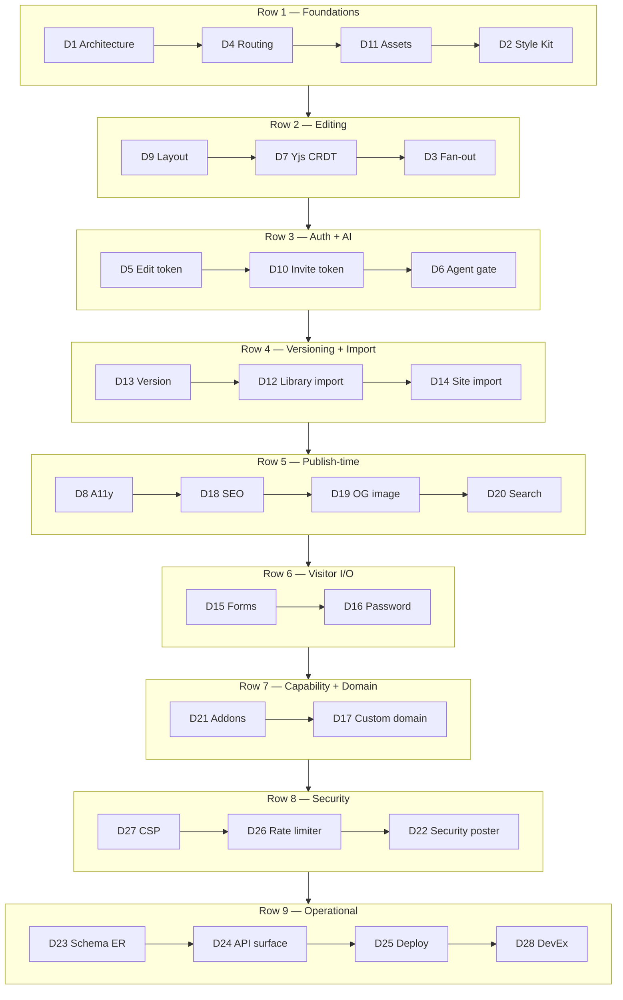
```mermaid
flowchart TB
  subgraph R1["Row 1 — Foundations"]
    direction LR
    D1[D1 Architecture] --> D4[D4 Routing] --> D11[D11 Assets] --> D2[D2 Style Kit]
  end
  subgraph R2["Row 2 — Editing"]
    direction LR
    D9[D9 Layout] --> D7[D7 Yjs CRDT] --> D3[D3 Fan-out]
  end
  subgraph R3["Row 3 — Auth + AI"]
    direction LR
    D5[D5 Edit token] --> D10[D10 Invite token] --> D6[D6 Agent gate]
  end
  subgraph R4["Row 4 — Versioning + Import"]
    direction LR
    D13[D13 Version] --> D12[D12 Library import] --> D14[D14 Site import]
  end
  subgraph R5["Row 5 — Publish-time"]
    direction LR
    D8[D8 A11y] --> D18[D18 SEO] --> D19[D19 OG image] --> D20[D20 Search]
  end
  subgraph R6["Row 6 — Visitor I/O"]
    direction LR
    D15[D15 Forms] --> D16[D16 Password]
  end
  subgraph R7["Row 7 — Capability + Domain"]
    direction LR
    D21[D21 Addons] --> D17[D17 Custom domain]
  end
  subgraph R8["Row 8 — Security"]
    direction LR
    D27[D27 CSP] --> D26[D26 Rate limiter] --> D22[D22 Security poster]
  end
  subgraph R9["Row 9 — Operational"]
    direction LR
    D23[D23 Schema ER] --> D24[D24 API surface] --> D25[D25 Deploy] --> D28[D28 DevEx]
  end
  R1 --> R2 --> R3 --> R4 --> R5 --> R6 --> R7 --> R8 --> R9
```

Rough physical canvas dims: assume each block is a ~600x400 cluster of Excalidraw nodes; with 9 rows of up to 4 blocks each, plan a ~2600x3800 canvas. Zoom out to fit at the end; zoom in per block during recording.

---

## Conventions (lock before drawing)

- **Two colors only.** One for *data/state* (e.g. dark blue fills). One for *control/flow* (e.g. orange edges). Same scheme in every block.
- **Red is reserved.** Only on things that stop everything (validator gates, publish blockers, unique-violation 409s). Never decorative.
- **Dashed edges** = optional, disabled, or async. The scraper edge in D1, the cron tick in D25 — keep this consistent.
- **Excalidraw library:** build one shared library file with: External service box, DO box (rounded corner), DB table cylinder, R2 bucket, Validator gate (red border), Y.Doc. Drop these into every block.
- **Roughness 1.** Higher gets noisy on video zoom.

---

## Blocks in narrative order

### D1 — System architecture overview

**From:** (cold open — first block).
**ADR / source:** [docs/architecture/0001-architecture.md](../../architecture/0001-architecture.md), [wrangler.toml](../../../wrangler.toml).
**Tech on screen:** Cloudflare Workers, Hono, Neon Postgres, Drizzle ORM, R2 (`rev01-assets`), Durable Objects (`SiteRoom`, `FormRateLimiter`), Clerk, Resend, Gemini 2.5 Pro, Replicate (Flux Schnell), Cloudflare for SaaS, Turnstile, Playwright scraper, cron `*/5`.

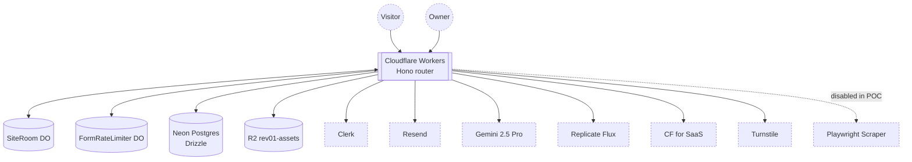
```mermaid
flowchart TB
  visitor((Visitor)):::ext
  owner((Owner)):::ext
  clerk[Clerk]:::ext
  resend[Resend]:::ext
  gemini[Gemini 2.5 Pro]:::ext
  replicate[Replicate Flux]:::ext
  cfsaas[CF for SaaS]:::ext
  turnstile[Turnstile]:::ext
  scraper[Playwright Scraper]:::ext
  workers[[Cloudflare Workers<br/>Hono router]]
  siteroom[(SiteRoom DO)]
  formrl[(FormRateLimiter DO)]
  neon[(Neon Postgres<br/>Drizzle)]
  r2[(R2 rev01-assets)]
  visitor --> workers
  owner --> workers
  workers <--> siteroom
  workers --> formrl
  workers --> neon
  workers --> r2
  workers --> clerk
  workers --> resend
  workers --> gemini
  workers --> replicate
  workers --> cfsaas
  workers --> turnstile
  workers -. disabled in POC .-> scraper
  classDef ext stroke-dasharray: 3 3
```

**Anchor:** _"One Worker is the hub. Everything else is storage it owns or external services it calls — no server in the middle."_

**Draw order:**
1. **Workers box, center, large** ◀ *"Hono router on Cloudflare's edge runtime. Single binary, deployed via wrangler."*
2. **Visitor (top-left) + Owner (top-right)** ◀ *"Two audiences, same Worker."*
3. **Storage row bottom: Neon + R2** ◀ *"Relational data via Drizzle, binaries in R2 keyed by content hash."*
4. **DO column right-of-center: SiteRoom, FormRateLimiter** ◀ *"Stateful islands. SiteRoom is one DO per site for live updates — ADR 0007. FormRateLimiter throttles per-IP."*
5. **External row top + right: Clerk, Resend, Gemini, Replicate, CF for SaaS, Turnstile, Scraper (dashed)** ◀ *"Everything else is an HTTP call out. Scraper is dashed — disabled in the public POC."*
6. **Cron glyph on Worker (`*/5`)** ◀ *"One scheduled handler — polls custom-hostname status every five minutes."*

**Pitfalls:**
- Don't say "auto-translate via Gemini" — dead feature.
- Don't say "Symbols" — dead feature.
- Don't show the scraper as a solid edge.
- Don't say "the import button works" — disabled in public POC.

**To D4:** _"That's the hub. Now we zoom into the first thing the Worker does on every request — turn a URL into a site."_

---

### D4 — Published address routing

**From D1:** every request enters via that central Workers box. What does it do first? It routes.
**ADR / source:** [docs/adr/0002-published-address.md](../../adr/0002-published-address.md).
**Tech on screen:** apex host (`opencanvas.aayushman.dev`), wildcard subdomain (`*.opencanvas.aayushman.dev`), custom hostname (via CF for SaaS), `site.subdomain` column, `customDomain` table.

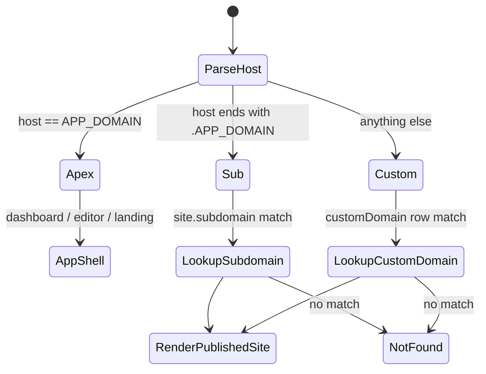
```mermaid
stateDiagram-v2
  [*] --> ParseHost
  ParseHost --> Apex: host == APP_DOMAIN
  ParseHost --> Sub: host ends with .APP_DOMAIN
  ParseHost --> Custom: anything else
  Apex --> AppShell: dashboard / editor / landing
  Sub --> LookupSubdomain: site.subdomain match
  Custom --> LookupCustomDomain: customDomain row match
  LookupSubdomain --> RenderPublishedSite
  LookupCustomDomain --> RenderPublishedSite
  LookupSubdomain --> NotFound: no match
  LookupCustomDomain --> NotFound: no match
```

**Anchor:** _"Three host shapes, three lookup paths, one render. The host string is the routing key."_

**Draw order:**
1. **Incoming URL on the left** ◀ *"Visitor request arrives. We parse the host."*
2. **Three branches: apex / subdomain / custom** ◀ *"Apex hits app shell — dashboard, editor, landing. Anything matching wildcard `.opencanvas.aayushman.dev` is a subdomain — we look up `site.subdomain`. Anything else must be a registered custom domain."*
3. **Both wildcard and custom converge to RenderPublishedSite** ◀ *"Once we know the site row, render is identical."*
4. **NotFound branch** ◀ *"No match — 404. Loud, not fallback."*

**Pitfalls:**
- Don't say `rev01.aayushman.dev` — apex migrated to `opencanvas.aayushman.dev` on 2026-05-29.
- Don't claim Workers Custom Domains supports wildcards — it doesn't; the wildcard is a Workers *Route*, not a Custom Domain. ([wrangler.toml:6-16](../../../wrangler.toml#L6-L16))

**To D11:** _"Routing landed the visitor on the right site. That site renders binaries — where do those binaries live?"_

---

### D11 — Owner Asset content-addressed pipeline

**From D4:** the site we routed to is mostly images and fonts. Here's where the bytes live.
**ADR / source:** [docs/adr/0004-owner-asset.md](../../adr/0004-owner-asset.md), [docs/adr/0006-asset-storage-backend.md](../../adr/0006-asset-storage-backend.md).
**Tech on screen:** SHA-256, R2 (`rev01-assets`), `ownerAsset` table (Neon + Drizzle), magic-byte dimension prober (PNG/JPEG/GIF/WebP), `customer_id` foreign key, `/assets/<contentHash>` public URL.

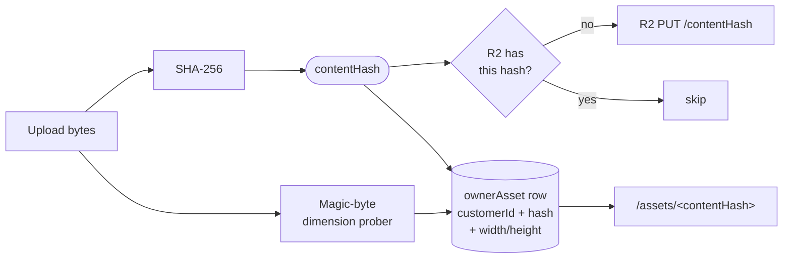
```mermaid
flowchart LR
  up[Upload bytes] --> hash[SHA-256]
  up --> probe[Magic-byte<br/>dimension prober]
  hash --> ch([contentHash])
  ch --> q{R2 has<br/>this hash?}
  q -- no --> r2w[R2 PUT /contentHash]
  q -- yes --> skip[skip]
  ch --> row[(ownerAsset row<br/>customerId + hash<br/>+ width/height)]
  probe --> row
  row --> url["/assets/&lt;contentHash&gt;"]
```

**Anchor:** _"Same bytes → one R2 object → multiple `ownerAsset` rows. Identity comes from content, not from the upload event."_

**Draw order:**
1. **Upload bytes, left** ◀ *"Browser POSTs a file."*
2. **SHA-256 + magic-byte prober (parallel)** ◀ *"We hash the bytes. We probe magic bytes for dimensions — no full decode."*
3. **R2 conditional write** ◀ *"If the hash already lives in R2, we skip the upload. Bytes are deduplicated globally."*
4. **`ownerAsset` row, scoped to `customer_id`** ◀ *"The DB row carries ownership. R2 doesn't know who owns what — the table does."*
5. **Public URL `/assets/<contentHash>`** ◀ *"URL is content-addressable. Two owners uploading the same image get the same URL and two rows."*

**Pitfalls:**
- Not MD5 — SHA-256.
- Don't say R2 enforces ownership.
- Don't claim full image decode — only magic-byte probing.

**To D2:** _"Bytes have homes. Now what controls how they appear styled — the Style Kit."_

---

### D2 — Style Kit determinism + dark variants

**From D11:** an image rendered against the wrong palette feels wrong. Style Kit makes "wrong" impossible by deriving every surface from one seed.
**ADR / source:** [docs/adr/0022-twelve-token-oklch-theme-grammar.md](../../adr/0022-twelve-token-oklch-theme-grammar.md) (Proposed), [src/canvas/style-kits.ts](../../../src/canvas/style-kits.ts).
**Tech on screen:** OKLCH color space, 12-token theme grammar, seed → derived tokens, light/dark variant projection.

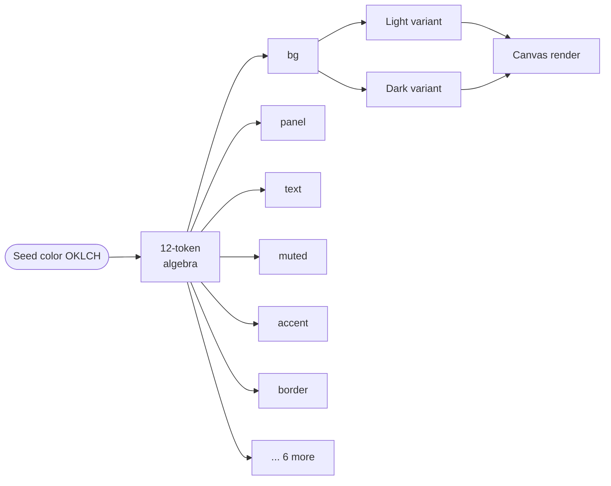
```mermaid
flowchart LR
  seed([Seed color OKLCH]) --> algebra[12-token<br/>algebra]
  algebra --> bg[bg]
  algebra --> panel[panel]
  algebra --> text[text]
  algebra --> muted[muted]
  algebra --> accent[accent]
  algebra --> border[border]
  algebra --> dots[... 6 more]
  bg --> light[Light variant]
  bg --> dark[Dark variant]
  light --> render[Canvas render]
  dark --> render
```

**Anchor:** _"One seed produces twelve tokens deterministically. Editor and published site read the same tokens — they cannot drift."_

**Draw order:**
1. **Seed swatch, left** ◀ *"Owner picks one color. That's the entire input."*
2. **12-token algebra, center** ◀ *"OKLCH lets us shift lightness and chroma predictably. Twelve named roles — bg, panel, text, muted, accent, border, and six more."*
3. **Token list radiating from algebra** ◀ *"Each token is computed, not chosen. No hand-tuning, no per-kit drift."*
4. **Light + dark branches** ◀ *"Dark variant is another deterministic projection from the same seed."*
5. **Canvas render** ◀ *"The renderer reads tokens. Editor uses the same lookup — pixel parity by construction."*

**Pitfalls:**
- ADR 0022 is Proposed, not Accepted — phrase as "the grammar we're consolidating on."
- Don't say "themes" plural — the kit is one grammar, not a swap library.

**To D9:** _"Colors decide how things look. Layout decides where things sit. Now the responsive engine."_

---

### D9 — Responsive layout engine + breakpoint cascade

**From D2:** style is the paint; layout is the frame. Sections position themselves through a semantic tree.
**ADR / source:** [src/canvas/layout/engine.ts](../../../src/canvas/layout/engine.ts), [src/canvas/layout/tree.ts](../../../src/canvas/layout/tree.ts), [src/canvas/responsive/](../../../src/canvas/responsive/).
**Tech on screen:** semantic tree (stack / grid / split), breakpoint cascade (desktop → tablet → mobile), positioned `CanvasSection`, override map.

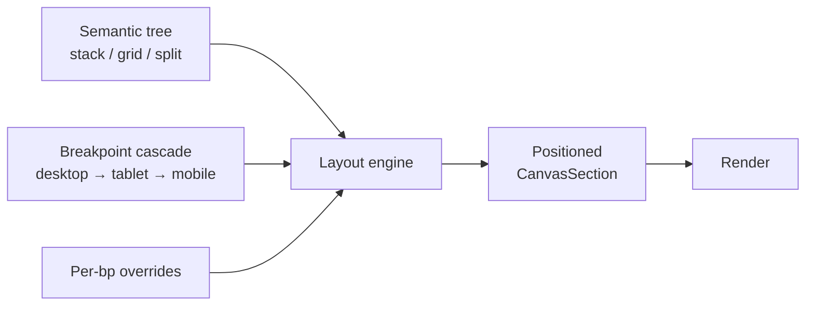
```mermaid
flowchart LR
  tree[Semantic tree<br/>stack / grid / split] --> resolve[Layout engine]
  bp[Breakpoint cascade<br/>desktop → tablet → mobile] --> resolve
  over[Per-bp overrides] --> resolve
  resolve --> sec[Positioned<br/>CanvasSection]
  sec --> render[Render]
```

**Anchor:** _"Authors edit a semantic tree. The engine resolves it to absolute positions per breakpoint, with cascading overrides."_

**Draw order:**
1. **Semantic tree, top-left** ◀ *"Author describes structure — stack, grid, split. No pixels yet."*
2. **Breakpoint cascade column** ◀ *"Desktop is the base. Tablet inherits. Mobile inherits from tablet. Overrides flow down."*
3. **Override map merging in** ◀ *"At each breakpoint, the author can override a child's position — but only delta from parent."*
4. **Engine box, center, large** ◀ *"Single pure function. Same input, same positioned section."*
5. **Positioned `CanvasSection`, right** ◀ *"Output is concrete pixels. Renderer doesn't think about layout — it draws."*

**Pitfalls:**
- Don't say "media queries" — we compute layouts ahead, not in CSS.
- Don't claim the engine handles overflow — sections have fixed height; overflow is an author error caught by the validator.

**To D7:** _"We've covered the static document. Now: how do two people edit it at once?"_

---

### D7 — Yjs CRDT + element-style projection (animated)

**From D9:** two authors, same document. Without a server to pick a winner, how do they converge?
**ADR / source:** [docs/adr/0007-yjs-revival.md](../../adr/0007-yjs-revival.md), [src/live/site-room.ts](../../../src/live/site-room.ts).
**Tech on screen:** Yjs, `y-protocols`, `Y.Doc`, `Y.encodeStateAsUpdate`, SiteRoom DO, base64 snapshot in DB, EditableSite projection.

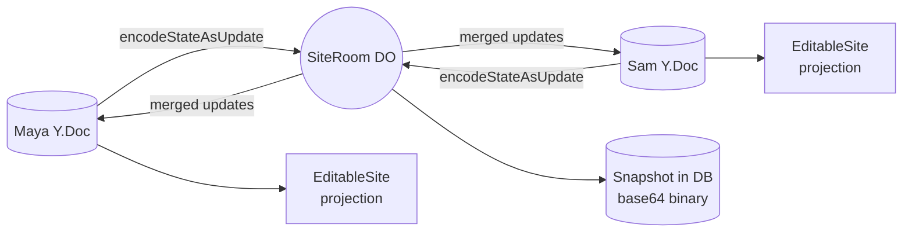
```mermaid
flowchart LR
  maya[(Maya Y.Doc)] -- encodeStateAsUpdate --> sr((SiteRoom DO))
  sam[(Sam Y.Doc)] -- encodeStateAsUpdate --> sr
  sr -- merged updates --> maya
  sr -- merged updates --> sam
  maya --> proj1[EditableSite<br/>projection]
  sam --> proj2[EditableSite<br/>projection]
  sr --> snap[(Snapshot in DB<br/>base64 binary)]
```

**Anchor:** _"Two editors converge to the same state without a server picking a winner. Merge is conflict-free by construction."_

**Draw order (5 live reveals):**
1. **Empty Y.Doc boxes — Maya left, Sam right** ◀ *"Each client owns a Y.Doc. No server-held truth yet."*
2. **Maya edits → `encodeStateAsUpdate` arrow → SiteRoom DO appears** ◀ *"She emits a binary diff. SiteRoom is the broadcast hub — one DO per site."*
3. **Sam's arrow appears simultaneously** ◀ *"He edits concurrently. Order doesn't matter. The merge is commutative."*
4. **Arrows from SiteRoom back to both Y.Docs** ◀ *"Fan-out. Both clients converge."*
5. **Snapshot below SiteRoom + projection edges from each Y.Doc** ◀ *"Autosave encodes the whole Doc — that's our version history. The canvas reads through a projection so CRDT machinery doesn't leak into render."*

**Pitfalls:**
- Not Operational Transforms. CRDT. Different math.
- The server doesn't resolve conflicts — the merge function does.
- Don't draw a single shared Y.Doc — every client has its own.

**To D3:** _"Two editors agree via the Y.Doc. But how do visitors see the changes go live?"_

---

### D3 — SiteRoom DO WebSocket fan-out (animated)

**From D7:** Yjs handles editor↔editor convergence. SiteRoom handles editor↔visitor live preview.
**ADR / source:** [docs/adr/0007-yjs-revival.md](../../adr/0007-yjs-revival.md), [src/live/site-room.ts](../../../src/live/site-room.ts).
**Tech on screen:** WebSocket upgrade, SiteRoom DO, role-tagged connections (`editor`, `visitor`), broadcast loop, hibernation API.

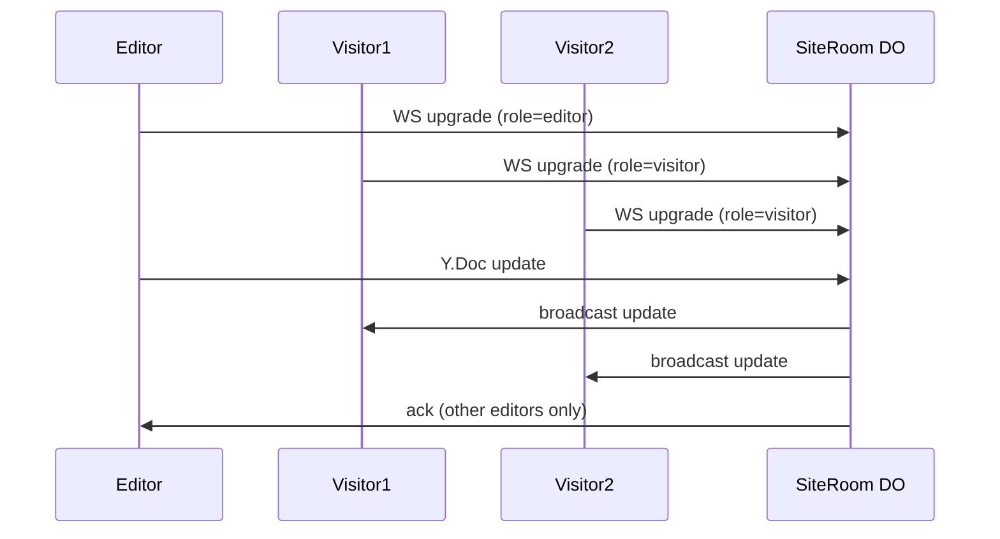
```mermaid
sequenceDiagram
  participant Editor
  participant Visitor1
  participant Visitor2
  participant SR as SiteRoom DO
  Editor->>SR: WS upgrade (role=editor)
  Visitor1->>SR: WS upgrade (role=visitor)
  Visitor2->>SR: WS upgrade (role=visitor)
  Editor->>SR: Y.Doc update
  SR->>Visitor1: broadcast update
  SR->>Visitor2: broadcast update
  SR->>Editor: ack (other editors only)
```

**Anchor:** _"One DO per site. Editors push diffs in, visitors get the same diff broadcast out. Same pipe, role-tagged."_

**Draw order:**
1. **SiteRoom box, center** ◀ *"One Durable Object per site. Hibernates between updates."*
2. **Three WS upgrades from editor + two visitors** ◀ *"Each connection tags its role at upgrade time."*
3. **Editor pushes a Y.Doc update arrow** ◀ *"A diff arrives — same shape as in D7."*
4. **Fan-out arrows to both visitors** ◀ *"Broadcast. Visitors render the diff against their own projection."*
5. **Ack edge back to other editors** ◀ *"Editors get the merged update so they converge — visitors don't ack."*

**Pitfalls:**
- Don't show fan-out as polling — it's a single broadcast in DO state.
- Don't conflate this with D7 — Yjs is *what* is sent; SiteRoom is *how* it's distributed.

**To D5:** _"Fan-out lets anyone connect. The gate that decides whether your connection is allowed is the edit token."_

---

### D5 — Edit token issuance + origin binding

**From D3:** anyone could try to WS-upgrade. What stops them? An origin-bound HMAC token issued at session start.
**ADR / source:** [docs/adr/0005-custom-domains.md](../../adr/0005-custom-domains.md), [src/auth/](../../../src/auth/).
**Tech on screen:** HMAC-SHA256, edit-token cookie (`__opencanvas_edit_token`), origin binding, Clerk session, timing-safe compare.

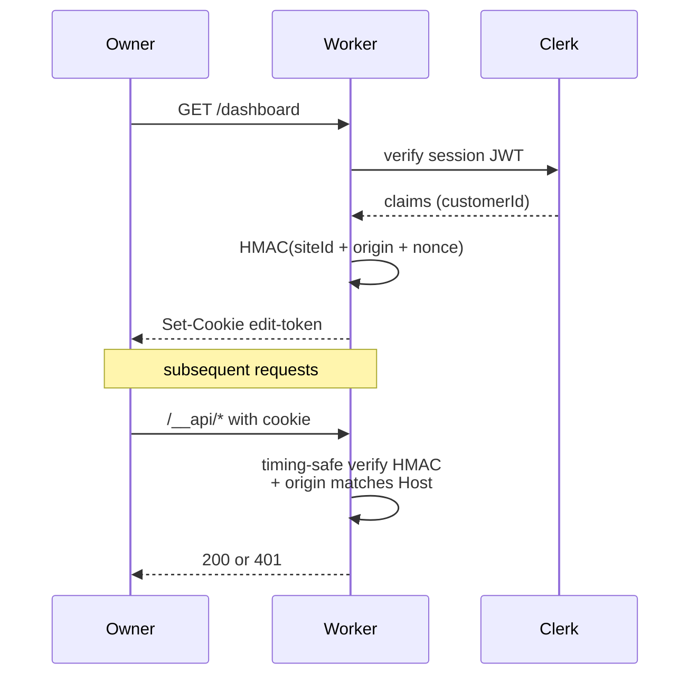
```mermaid
sequenceDiagram
  participant Owner
  participant W as Worker
  participant Clerk
  Owner->>W: GET /dashboard
  W->>Clerk: verify session JWT
  Clerk-->>W: claims (customerId)
  W->>W: HMAC(siteId + origin + nonce)
  W-->>Owner: Set-Cookie edit-token
  Note over Owner,W: subsequent requests
  Owner->>W: /__api/* with cookie
  W->>W: timing-safe verify HMAC<br/>+ origin matches Host
  W-->>Owner: 200 or 401
```

**Anchor:** _"Edit token is a bearer credential bound to one origin. Replay it on a different host and it dies."_

**Draw order:**
1. **Owner → Worker → Clerk** ◀ *"Owner already has a Clerk session. We verify the JWT."*
2. **HMAC mint box** ◀ *"Worker mints `HMAC-SHA256(siteId + origin + nonce)`."*
3. **Set-Cookie back to Owner** ◀ *"Cookie scoped to apex `opencanvas.aayushman.dev`."*
4. **Later request with cookie** ◀ *"Every `/__api/*` call carries the cookie."*
5. **Timing-safe verify gate** ◀ *"XOR-compare, constant time. Origin must match the Host header — replay across origins fails."*

**Pitfalls:**
- Don't say "JWT" for the edit token — it's an HMAC, not signed JWT.
- `COOKIE_NAME_PREFIX` is env-driven (`__opencanvas_`). Don't hardcode the literal in the script.

**To D10:** _"Edit token lets the owner in. Invite token lets the owner bring collaborators in. Same bearer model, longer life."_

---

### D10 — Invite token (HMAC JWT) sequence

**From D5:** edit token = owner's per-session pass. Invite token = a transferable 7-day pass an owner hands to a collaborator.
**ADR / source:** [docs/adr/0010-invite-link-bearer-auth.md](../../adr/0010-invite-link-bearer-auth.md), [src/auth/invite-token.ts](../../../src/auth/invite-token.ts).
**Tech on screen:** HMAC-SHA256 JWT, 7-day expiry, single-use redemption row, Resend email delivery, `collaborator` table.

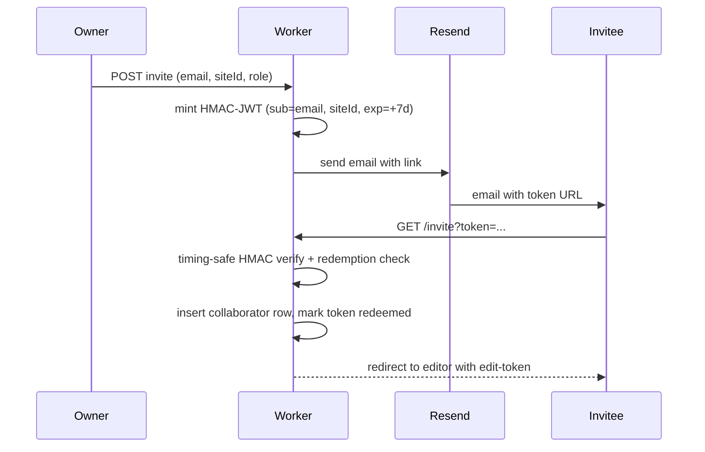
```mermaid
sequenceDiagram
  participant Owner
  participant W as Worker
  participant Resend
  participant Invitee
  Owner->>W: POST invite (email, siteId, role)
  W->>W: mint HMAC-JWT (sub=email, siteId, exp=+7d)
  W->>Resend: send email with link
  Resend->>Invitee: email with token URL
  Invitee->>W: GET /invite?token=...
  W->>W: timing-safe HMAC verify + redemption check
  W->>W: insert collaborator row, mark token redeemed
  W-->>Invitee: redirect to editor with edit-token
```

**Anchor:** _"Invite link itself is the credential. Holder = redeemer. No login required, redeemed once."_

**Draw order:**
1. **Owner issues invite, top** ◀ *"Owner picks an email and role."*
2. **HMAC-JWT mint, signed with `WEBHOOK_SIGNING_SECRET`-class secret** ◀ *"Bearer JWT, HMAC-SHA256, expires in seven days."*
3. **Resend → Invitee email** ◀ *"Link in the email is the entire token."*
4. **Invitee clicks → verify gate** ◀ *"Timing-safe verify, then check redemption table — single-use."*
5. **Insert `collaborator` row + issue edit token** ◀ *"From this moment on, invitee acts via the same edit-token machinery from D5."*

**Pitfalls:**
- Don't say "the invitee needs a Clerk account" — they don't until after redemption (depends on implementation; verify per [src/auth/invite-token.ts](../../../src/auth/invite-token.ts) before recording).
- 7 days is the spec'd lifetime — confirm against current code before stating literally.

**To D6:** _"Owner brought Sam in. Now owner brings the AI in. How does the AI not break the site?"_

---

### D6 — AI agent + chat preview/apply gate

**From D10:** human collaborators get edit tokens and respect each other's edits. The agent gets a *narrower* surface — every mutation goes through a preview gate first.
**ADR / source:** [docs/adr/0012-validation-write-gate.md](../../adr/0012-validation-write-gate.md) (Proposed), [docs/adr/0014-template-literal-data-substitution.md](../../adr/0014-template-literal-data-substitution.md) (Proposed), [src/agent/](../../../src/agent/), [src/canvas/validate.ts](../../../src/canvas/validate.ts).
**Tech on screen:** Gemini 2.5 Pro, tool surface (mutating + read-only), per-arg parsers, preview ops (SSE-streamed), Accept/Reject, Apply layer, validator (write gate), EditableSite.

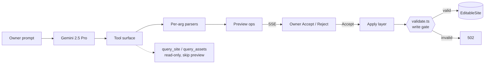
```mermaid
flowchart LR
  prompt[Owner prompt] --> gemini[Gemini 2.5 Pro]
  gemini --> tools[Tool surface]
  tools --> parsers[Per-arg parsers]
  tools -.-> rotool[query_site / query_assets<br/>read-only, skip preview]
  parsers --> preview[Preview ops]
  preview -- SSE --> owner[Owner Accept / Reject]
  owner -- Accept --> apply[Apply layer]
  apply --> gate{{validate.ts<br/>write gate}}
  gate -- valid --> state[(EditableSite)]
  gate -- invalid --> reject[502]
```

**Anchor:** _"The agent never mutates state directly. Every change becomes a preview card the owner accepts; only then does it cross the validator."_

**Draw order:**
1. **Prompt → Gemini, top-left** ◀ *"Owner prompt plus current site state plus the tool schemas."*
2. **Tool surface fans out** ◀ *"Mutating tools and read-only tools — `query_site`, `query_assets` skip the preview path entirely."*
3. **Per-arg parsers column** ◀ *"Every argument validated: inline marks, media kind, element type, style-kit tokens, page meta, motion fields, site config."*
4. **Preview ops stack, SSE to Owner** ◀ *"Valid ops produce preview cards streamed live."*
5. **Owner Accept → Apply → validator gate (red)** ◀ *"Validator is the *only* write gate per ADR 0012. Anything invalid fails loud — no partial apply."*
6. **EditableSite mutates** ◀ *"State updates only after the gate passes."*

**Pitfalls:**
- Don't claim the agent edits Y.Doc directly — it edits the EditableSite projection, which then re-projects.
- Don't show fallback for "invalid op" — there is none; it's a 502.

**To D13:** _"Every change funnels through validate.ts. After the change lands, Y.Doc captures it forever. That's version history."_

---

### D13 — Version snapshot + Y.Doc deterministic encoding

**From D6:** state changed. How is the *previous* state remembered? Snapshots.
**ADR / source:** [src/version/capture.ts](../../../src/version/capture.ts), [src/version/restore.ts](../../../src/version/restore.ts).
**Tech on screen:** `Y.encodeStateAsUpdate` (deterministic binary), `siteVersion` table, base64 storage in Neon, restore path.

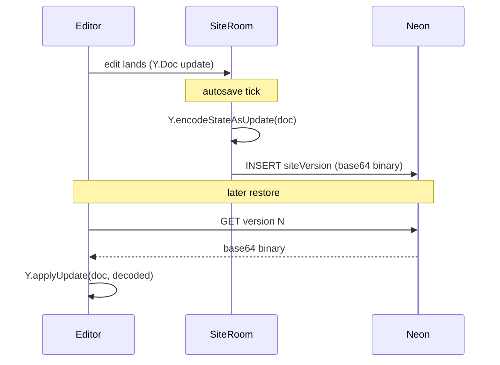
```mermaid
sequenceDiagram
  participant Editor
  participant SR as SiteRoom
  participant DB as Neon
  Editor->>SR: edit lands (Y.Doc update)
  Note over SR: autosave tick
  SR->>SR: Y.encodeStateAsUpdate(doc)
  SR->>DB: INSERT siteVersion (base64 binary)
  Note over Editor,DB: later restore
  Editor->>DB: GET version N
  DB-->>Editor: base64 binary
  Editor->>Editor: Y.applyUpdate(doc, decoded)
```

**Anchor:** _"A version is the whole Y.Doc encoded as bytes. Restore replays the encoding back into a fresh Doc — same projection, same render."_

**Draw order:**
1. **Editor → SiteRoom, autosave tick** ◀ *"Autosave fires on quiescence."*
2. **`Y.encodeStateAsUpdate` box** ◀ *"Whole Doc serialised to binary. Deterministic — same Doc, same bytes."*
3. **Insert into `siteVersion` (base64-encoded text column)** ◀ *"We store base64 in a text column — D1 binaries didn't compress further."*
4. **Restore flow on the bottom** ◀ *"Fetch a version, base64-decode, `Y.applyUpdate` into a fresh Doc — that Doc projects to EditableSite the usual way."*

**Pitfalls:**
- Snapshot is the *whole* Doc, not a diff between versions. (Yjs diff-compression is a separate concern; spec the literal current behaviour.)
- Don't claim cross-version diff UI exists unless verified — restore is whole-Doc replay.

**To D12:** _"History stores the past. Where does *new* content come from? First — sections out of the library."_

---

### D12 — Library section import + seed materialization

**From D13:** owner wants to add a new section. The library is the curated source of pre-designed sections.
**ADR / source:** [src/canvas/library-section-import.ts](../../../src/canvas/library-section-import.ts).
**Tech on screen:** library section catalogue, seed asset materialization (base64 → R2 + `ownerAsset` rows per ADR 0023), placeholder text substitution, `recipeId: 'custom'` sentinel per ADR 0019.

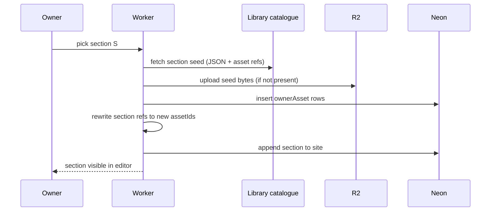
```mermaid
sequenceDiagram
  participant Owner
  participant W as Worker
  participant Lib as Library catalogue
  participant R2
  participant DB as Neon
  Owner->>W: pick section S
  W->>Lib: fetch section seed (JSON + asset refs)
  W->>R2: upload seed bytes (if not present)
  W->>DB: insert ownerAsset rows
  W->>W: rewrite section refs to new assetIds
  W->>DB: append section to site
  W-->>Owner: section visible in editor
```

**Anchor:** _"A library section ships as JSON + seed bytes. Importing materialises the bytes as owner-assets and rewrites refs — the section is now *yours*."_

**Draw order:**
1. **Library section, left** ◀ *"Section seed is JSON plus base64 byte files in-repo, per ADR 0023."*
2. **Worker fetches seed, center** ◀ *"Read seed bytes once at import time."*
3. **R2 + `ownerAsset` inserts** ◀ *"Seed bytes go through the D11 pipeline — content-hash deduped against this customer's existing assets."*
4. **Rewrite refs box** ◀ *"Section JSON refs the seed by URL. We rewrite to assetIds — same translation pattern you'll see in D14."*
5. **Append to site → render** ◀ *"Section lands as a `recipeId: 'custom'` row — ADR 0019 sentinel — so the canvas treats it as hand-designed, not template-bound."*

**Pitfalls:**
- Don't say "the section is cloned by reference" — it's materialised; mutating it doesn't mutate the library copy.
- Section recipe `'custom'` is the explicit sentinel per ADR 0019. Don't introduce a different name.

**To D14:** _"Library imports come from us. Site imports come from the user's old website. Same translation pattern, much bigger scope."_

---

### D14 — Site Import architecture (3-frame teaching diagram)

**From D12:** library = one section, our catalogue. Site import = a whole website, the user's URL. Watch the two-pass translation at scale.
**ADR / source:** [docs/adr/0008-site-import-architecture.md](../../adr/0008-site-import-architecture.md), [src/routes/api/import.ts](../../../src/routes/api/import.ts).
**Tech on screen:** Playwright scraper (external service, bearer-auth), SHA-256 hasher, `mediaAssetIdMap`, `fontFamilyTokenMap`, WOFF2 enforcement, `validateEditableSite`, Drizzle `database.batch`, OKLCH style-kit synthesis.

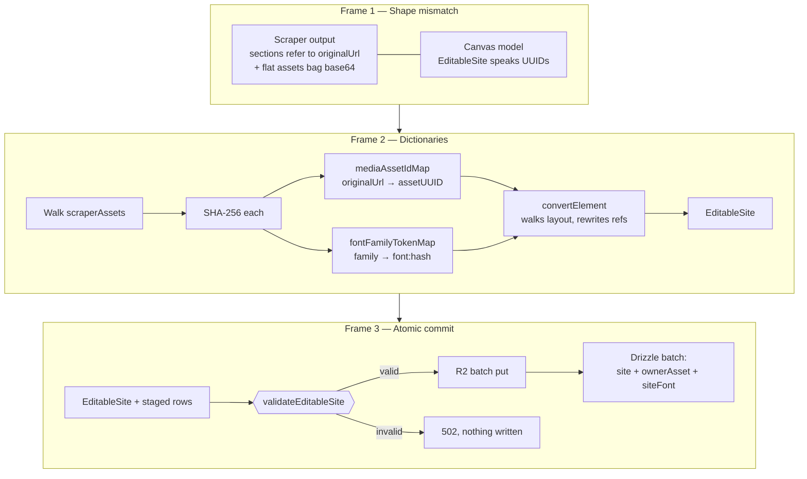
```mermaid
flowchart TB
  subgraph F1["Frame 1 — Shape mismatch"]
    scr[Scraper output<br/>sections refer to originalUrl<br/>+ flat assets bag base64] --- canvas[Canvas model<br/>EditableSite speaks UUIDs]
  end
  subgraph F2["Frame 2 — Dictionaries"]
    pass1[Walk scraperAssets] --> hash[SHA-256 each]
    hash --> map1[mediaAssetIdMap<br/>originalUrl → assetUUID]
    hash --> map2[fontFamilyTokenMap<br/>family → font:hash]
    map1 --> conv[convertElement<br/>walks layout, rewrites refs]
    map2 --> conv
    conv --> site[EditableSite]
  end
  subgraph F3["Frame 3 — Atomic commit"]
    site2[EditableSite + staged rows] --> val{{validateEditableSite}}
    val -- valid --> r2put[R2 batch put]
    r2put --> dbb[Drizzle batch:<br/>site + ownerAsset + siteFont]
    val -- invalid --> err502[502, nothing written]
  end
  F1 --> F2 --> F3
```

**Anchor:** _"Scraper returns layout speaking foreign URLs + a flat bag of bytes. We build two dictionaries, rewrite the layout to speak our IDs, then commit everything in one batch."_

**Draw order — swap between three frames:**

**Frame 1 (the WHY):**
1. **Scraper output box** containing `sections` (refer to `https://source.com/hero.jpg`) + `assets[]` (base64 bytes keyed by URL) ◀ *"Two halves. Layout knows source URLs. Bytes sit beside it."*
2. **Canvas model box** containing `EditableSite` with `assetId: UUID` ◀ *"Our model only speaks UUIDs. We need a translator."*

**Frame 2 (the HOW):**
1. **`mediaAssetIdMap: originalUrl → assetUUID`** as a key-value box ◀ *"Walk each asset, hash the bytes, mint a UUID — or reuse the existing UUID if this customer already owns the same hash."*
2. **`fontFamilyTokenMap: "Inter" → "font:<hash>"`** ◀ *"Same for fonts. WOFF2-only — anything else fails loud, no transcoding."*
3. **`convertElement` consuming layout + dictionaries → EditableSite** ◀ *"One pass. Every scraper element rewritten."*

**Frame 3 (the commit):**
1. **In-memory staging area** ◀ *"Queued R2 uploads + queued DB rows + the new EditableSite. Nothing has touched R2 or DB yet."*
2. **`validateEditableSite` gate (red)** ◀ *"Invalid tree → 502, nothing persists."*
3. **R2 batch put → Drizzle `database.batch([site, ownerAsset, siteFont])`** ◀ *"R2 first (an orphan blob is harmless), then one DB round-trip. Half-imported sites are impossible."*

**Pitfalls:**
- Import button is disabled in public POC — say "feature exists, recording uses fixture data" if you draw the button at all.
- Don't show a fallback for "scrape partially fails" — the route 502s and rolls back.
- Don't conflate this with `customTemplate` saving — separate endpoint, separate table.

**To D8:** _"Imported content might be inaccessible. Before any site can publish — imported or hand-built — the a11y audit gates it."_

---

### D8 — A11y audit pipeline (publish gate)

**From D14:** content arrived. Before it goes live, six checks run in parallel. Blocking issues stop publish at 422.
**ADR / source:** [src/a11y/audit.ts](../../../src/a11y/audit.ts), [src/a11y/checks/](../../../src/a11y/checks/), [src/a11y/severity.ts](../../../src/a11y/severity.ts).
**Tech on screen:** orchestrator, 6 parallel check workers (alt-text, action-labels, color-contrast, form-field-labels, heading-order, page-meta), crash isolation wrapper, severity classifier, publish gate.

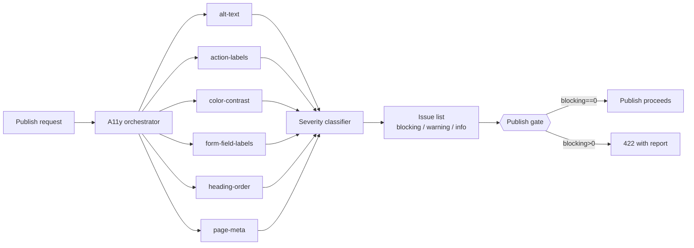
```mermaid
flowchart LR
  pub[Publish request] --> orch[A11y orchestrator]
  orch --> c1[alt-text]
  orch --> c2[action-labels]
  orch --> c3[color-contrast]
  orch --> c4[form-field-labels]
  orch --> c5[heading-order]
  orch --> c6[page-meta]
  c1 --> sev[Severity classifier]
  c2 --> sev
  c3 --> sev
  c4 --> sev
  c5 --> sev
  c6 --> sev
  sev --> issues[Issue list<br/>blocking / warning / info]
  issues --> gate{{Publish gate}}
  gate -- blocking==0 --> ok[Publish proceeds]
  gate -- blocking>0 --> blocked[422 with report]
```

**Anchor:** _"Six independent checks, one verdict. Blocking issues are fatal — publish returns 422 with the report."_

**Draw order:**
1. **Publish request → orchestrator** ◀ *"Owner clicks publish. Orchestrator fans out."*
2. **Six check boxes in a column, each wrapped in a crash-isolation try/catch** ◀ *"Each check runs independently. If a check crashes, the wrapper converts the crash into a blocking `audit-crash` issue — no silent skips."*
3. **Severity classifier** ◀ *"Each issue tagged blocking, warning, or info."*
4. **Publish gate (red border) on the right** ◀ *"If any blocking issue exists, 422 with the report. Live behaviour — already in code, not planned."*

**Pitfalls:**
- The audit *already* gates publish — don't speak of it as future work.
- Contrast resolves against the innermost surface by area, then z-index — call this out beside the contrast worker.
- Heading H-level is derived from font size via per-kit `headingScale`, not from the element type alone.

**To D18:** _"Publish is gated. Once a site passes, here's what gets emitted — SEO meta first."_

---

### D18 — SEO meta emission pipeline

**From D8:** publish proceeded. The first thing the published HTML carries is SEO metadata.
**ADR / source:** [src/seo/](../../../src/seo/).
**Tech on screen:** title / description, canonical URL, OG tags, Twitter card, JSON-LD, `lang` attribute, sitemap.

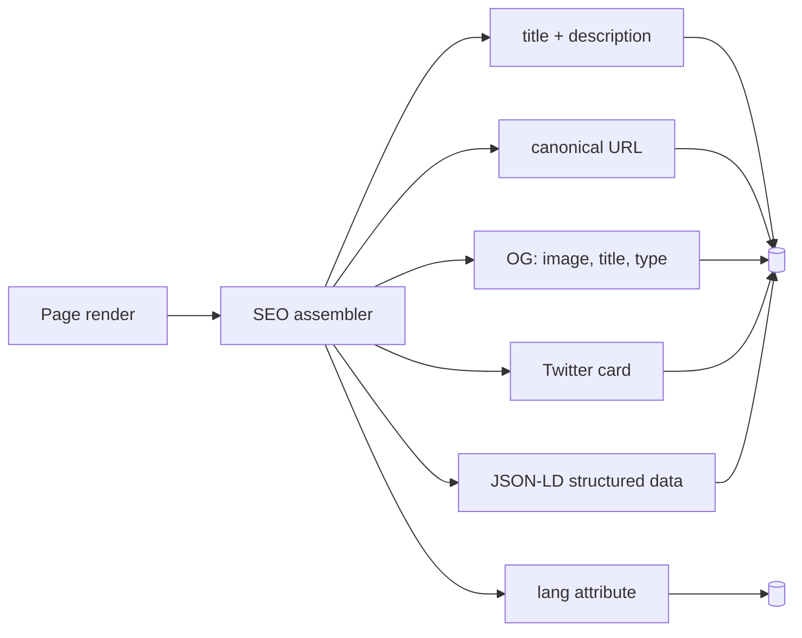
```mermaid
flowchart LR
  page[Page render] --> assembler[SEO assembler]
  assembler --> title[title + description]
  assembler --> canon[canonical URL]
  assembler --> og[OG: image, title, type]
  assembler --> tw[Twitter card]
  assembler --> jsonld[JSON-LD structured data]
  assembler --> lang[lang attribute]
  title --> head[(<head>)]
  canon --> head
  og --> head
  tw --> head
  jsonld --> head
  lang --> html[(<html lang>)]
```

**Anchor:** _"One assembler emits all SEO surfaces from one source — site meta + page meta — so they cannot contradict each other."_

**Draw order:**
1. **Page render box, left** ◀ *"Publish path renders the page."*
2. **Assembler in the middle** ◀ *"Single function. Takes site meta + page meta + URL."*
3. **Fan out to the tag families** ◀ *"Title, canonical, OG, Twitter, JSON-LD, lang. All from one assembler — they can't drift."*
4. **All flow into `<head>` / `<html>`** ◀ *"Tags land in the rendered HTML. Visitors and crawlers both read the same source."*

**Pitfalls:**
- Don't show separate per-tag pipelines — there's one assembler.
- JSON-LD type is derived from page kind, not free-form.

**To D19:** _"Meta references an OG image. Where does that image come from?"_

---

### D19 — OG image pipeline (Satori → resvg-wasm → R2 cache)

**From D18:** OG meta needs an image URL. We generate it on demand, cache it by content hash.
**ADR / source:** [src/og-image/rasterise.ts](../../../src/og-image/rasterise.ts), [src/og-image/cache.ts](../../../src/og-image/cache.ts), [src/og-image/on-publish.ts](../../../src/og-image/on-publish.ts).
**Tech on screen:** Satori (HTML → SVG), `@resvg/resvg-wasm` (SVG → PNG), R2 content-hash cache, TTF fonts.

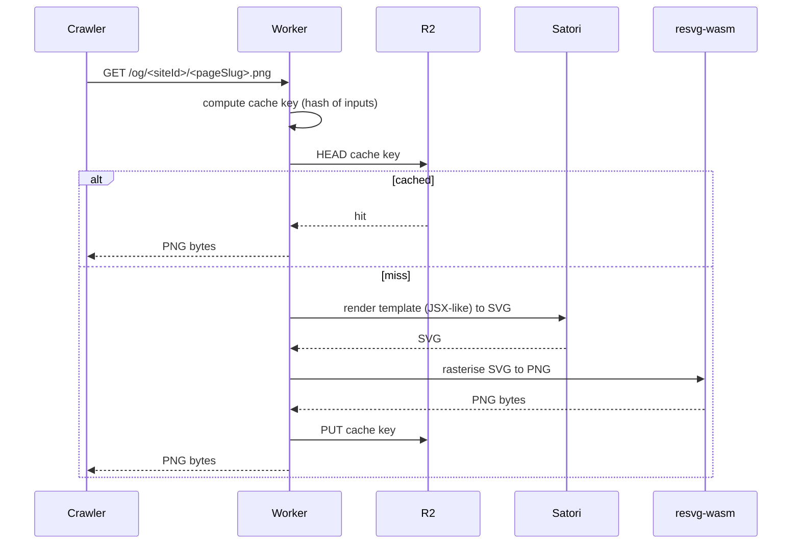
```mermaid
sequenceDiagram
  participant Crawler
  participant W as Worker
  participant R2
  participant Sat as Satori
  participant Rv as resvg-wasm
  Crawler->>W: GET /og/<siteId>/<pageSlug>.png
  W->>W: compute cache key (hash of inputs)
  W->>R2: HEAD cache key
  alt cached
    R2-->>W: hit
    W-->>Crawler: PNG bytes
  else miss
    W->>Sat: render template (JSX-like) to SVG
    Sat-->>W: SVG
    W->>Rv: rasterise SVG to PNG
    Rv-->>W: PNG bytes
    W->>R2: PUT cache key
    W-->>Crawler: PNG bytes
  end
```

**Anchor:** _"OG image = template + page data, hashed for caching. First crawler pays the render cost; everyone after gets R2 bytes."_

**Draw order:**
1. **Crawler → Worker** ◀ *"Crawler requests `/og/<siteId>/<pageSlug>.png`."*
2. **Cache key box** ◀ *"Hash of the template version + page data — deterministic."*
3. **R2 HEAD check** ◀ *"Hit → return bytes immediately. Miss → render."*
4. **Satori box** ◀ *"JSX-like template → SVG."*
5. **resvg-wasm** ◀ *"SVG → PNG, all in-Worker, no headless browser."*
6. **R2 PUT + response** ◀ *"Cache for the next crawler. TTF fonts ship inside the wasm bundle."*

**Pitfalls:**
- Not Puppeteer. Not headless browsers. Just `Satori` + `resvg-wasm` — both run inside the Worker.
- TTFs are bundled as `Data` modules per [wrangler.toml:18-22](../../../wrangler.toml#L18-L22).

**To D20:** _"OG is cached. Search index also rebuilt at publish — atomically, so visitors don't see partial states."_

---

### D20 — Atomic search index rebuild (PG FTS)

**From D19:** publish emits SEO + OG. It also rebuilds the search index — but visitors must never see it half-rebuilt.
**ADR / source:** [src/search/](../../../src/search/).
**Tech on screen:** Postgres full-text search (`tsvector`), per-site index rows, transactional rebuild (replace-in-transaction).

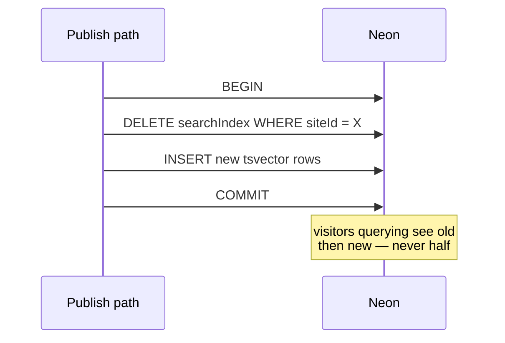
```mermaid
sequenceDiagram
  participant Pub as Publish path
  participant DB as Neon
  Pub->>DB: BEGIN
  Pub->>DB: DELETE searchIndex WHERE siteId = X
  Pub->>DB: INSERT new tsvector rows
  Pub->>DB: COMMIT
  Note over DB: visitors querying see old<br/>then new — never half
```

**Anchor:** _"Search index rebuilds inside one transaction. Visitor queries see *the* index, not a transient half-state."_

**Draw order:**
1. **Publish path → DB BEGIN** ◀ *"Single transaction wraps the rebuild."*
2. **DELETE old rows for this site** ◀ *"Site's old index gone, inside transaction."*
3. **INSERT new `tsvector` rows** ◀ *"Page-by-page, all in the same transaction."*
4. **COMMIT** ◀ *"Atomic. Concurrent visitor queries see the old index until commit, then the new — never a partial."*

**Pitfalls:**
- Not Elasticsearch. Postgres FTS — runs inside Neon.
- Visitor reads don't block the rebuild; Postgres MVCC handles it.

**To D15:** _"Publish is complete. Visitors arrive. The first thing they touch that mutates state — forms."_

---

### D15 — Form pipeline (Turnstile → DO rate limit → DB → webhook + Resend)

**From D20:** publish landed the site. Visitor submits a form. What happens?
**ADR / source:** [src/forms/submit.ts](../../../src/forms/submit.ts), [src/forms/turnstile.ts](../../../src/forms/turnstile.ts), [src/forms/webhook.ts](../../../src/forms/webhook.ts).
**Tech on screen:** Turnstile bot challenge, `FormRateLimiter` DO (per-IP 10/min), `formSubmission` table, outbound HMAC-signed webhook (`X-Rev01-Signature`), Resend notification to owner.

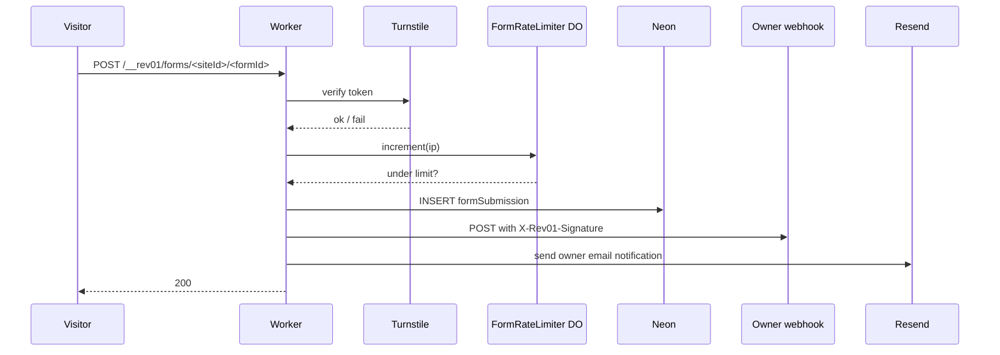
```mermaid
sequenceDiagram
  participant V as Visitor
  participant W as Worker
  participant TS as Turnstile
  participant RL as FormRateLimiter DO
  participant DB as Neon
  participant Hook as Owner webhook
  participant RS as Resend
  V->>W: POST /__rev01/forms/<siteId>/<formId>
  W->>TS: verify token
  TS-->>W: ok / fail
  W->>RL: increment(ip)
  RL-->>W: under limit?
  W->>DB: INSERT formSubmission
  W->>Hook: POST with X-Rev01-Signature
  W->>RS: send owner email notification
  W-->>V: 200
```

**Anchor:** _"Visitor input goes through bot check, then per-IP throttle, then DB, then optional webhook + email — each step is independently failable."_

**Draw order:**
1. **Visitor POST, left** ◀ *"Form arrives at `/__rev01/forms/<siteId>/<formId>`."*
2. **Turnstile verify** ◀ *"Bot challenge token verified server-side using `TURNSTILE_SECRET`."*
3. **FormRateLimiter DO** ◀ *"Per-IP, 10 submissions per minute. DO is the source of truth for the counter."*
4. **DB insert** ◀ *"Submission lands. Owner sees it in the inbox."*
5. **Webhook + Resend (parallel)** ◀ *"Webhook is HMAC-signed with `X-Rev01-Signature`. Resend sends an owner notification — both are owner-configured, neither blocks 200."*

**Pitfalls:**
- Don't say "we use Cloudflare's bot manager" — it's Turnstile specifically.
- Don't conflate FormRateLimiter with the dev in-process limiter — that's D26.

**To D16:** _"Forms are public. Some published pages aren't — they're password-gated."_

---

### D16 — Password gate (PBKDF2 + HS256 unlock cookie)

**From D15:** forms accept public input. Some pages don't accept public eyes either — they're gated.
**ADR / source:** [src/password/](../../../src/password/).
**Tech on screen:** PBKDF2-SHA256 (100k iters, 32-byte salt), HS256 unlock cookie, per-IP rate limit (5/min), redirect path validation.

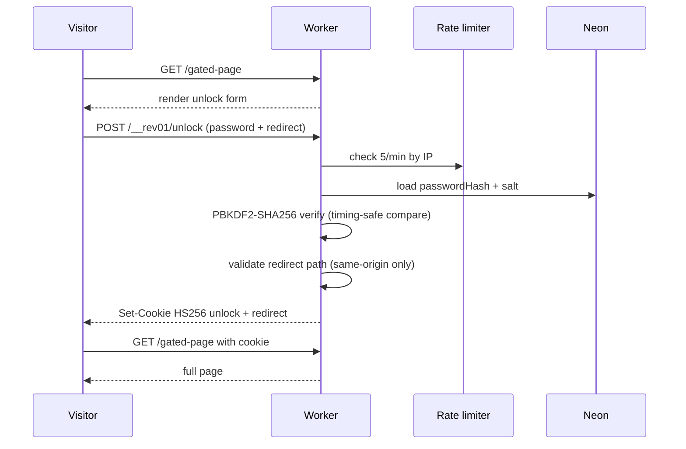
```mermaid
sequenceDiagram
  participant V as Visitor
  participant W as Worker
  participant RL as Rate limiter
  participant DB as Neon
  V->>W: GET /gated-page
  W-->>V: render unlock form
  V->>W: POST /__rev01/unlock (password + redirect)
  W->>RL: check 5/min by IP
  W->>DB: load passwordHash + salt
  W->>W: PBKDF2-SHA256 verify (timing-safe compare)
  W->>W: validate redirect path (same-origin only)
  W-->>V: Set-Cookie HS256 unlock + redirect
  V->>W: GET /gated-page with cookie
  W-->>V: full page
```

**Anchor:** _"Password proves you, the cookie proves you proved it. Cookie is HS256-signed so it can't be forged client-side."_

**Draw order:**
1. **Visitor lands on gated page, top-left** ◀ *"Server-side check: cookie absent → render unlock form."*
2. **POST unlock + rate-limit (5/min)** ◀ *"Cheap, per-IP — defends against credential stuffing."*
3. **PBKDF2-SHA256 verify** ◀ *"100k iterations, 32-byte salt. Timing-safe compare on the hash."*
4. **Redirect-path validation** ◀ *"Redirect target must be same-origin — open-redirect blocked."*
5. **Set HS256 cookie, redirect, visitor re-fetches** ◀ *"From now on, cookie unlocks the page until expiry."*

**Pitfalls:**
- Not bcrypt. PBKDF2-SHA256 specifically.
- Cookie signed HS256, not HMAC-only — verify the literal in [src/password/](../../../src/password/) before stating.
- Open-redirect validation is a separate guard — call it out, don't bury it.

**To D21:** _"Visitors are visitors. Owners can layer addons onto sites. How is owner-bought capability separate from per-site config?"_

---

### D21 — Addon entitlement vs site-addon split

**From D16:** visitor-facing surface ends. Owner-facing capability begins. Addons are bought by the customer, configured per site.
**ADR / source:** [docs/adr/0009-addon-entitlement-model.md](../../adr/0009-addon-entitlement-model.md).
**Tech on screen:** `addonEntitlement` (customer-scoped purchase), `siteAddon` (site-scoped config), lifecycle states (active, paused, revoked).

```mermaid
stateDiagram-v2
  [*] --> Unpurchased
  Unpurchased --> Entitled: customer buys addon
  Entitled --> Configured: install on site
  Configured --> Active: site addon enabled
  Active --> Paused: owner pauses
  Paused --> Active
  Entitled --> Revoked: refund / cancel
  Configured --> Revoked
  Active --> Revoked
```

**Anchor:** _"Buying an addon doesn't activate it. Installing it on a site does. Revoke unwinds both."_

**Draw order:**
1. **Two stacked boxes: `addonEntitlement` (customer-scoped) + `siteAddon` (site-scoped)** ◀ *"One row per purchase. One row per install. Different tables."*
2. **Lifecycle arrows: bought → installed → active** ◀ *"Each transition is a deliberate owner action."*
3. **Paused state branching off Active** ◀ *"Reversible. Doesn't delete config."*
4. **Revoke arrows from each state** ◀ *"Refund or cancellation unwinds everything — entitlement and every installed siteAddon."*

**Pitfalls:**
- Don't conflate the two tables — `addonEntitlement` says "customer owns it," `siteAddon` says "site uses it."
- "Pause" preserves config; "revoke" doesn't.

**To D17:** _"Custom domain is one such addon — but with extra machinery. How does briar.app become a route?"_

---

### D17 — Custom domain state machine + CF for SaaS lifecycle

**From D21:** custom domain is purchased like any addon. Then DNS and certs have their own state machine.
**ADR / source:** [docs/adr/0005-custom-domains.md](../../adr/0005-custom-domains.md), [src/custom-domain/](../../../src/custom-domain/), [wrangler.toml:119-120](../../../wrangler.toml#L119-L120) (cron).
**Tech on screen:** Cloudflare for SaaS Custom Hostnames API, `customDomain` table (status, certIssuedAt), 5-minute cron poll, ownership token verification.

```mermaid
stateDiagram-v2
  [*] --> Pending: owner adds briar.app
  Pending --> Verifying: CF registered, awaiting CNAME
  Verifying --> Active: CF reports cert issued
  Verifying --> Failed: 30min stuck
  Pending --> Failed: 30min stuck
  Active --> [*]: owner removes
```

**Anchor:** _"Custom hostname has four states. A 5-minute cron polls Cloudflare and reconciles them. 30-minute stuck rows flip to failed without further calls."_

**Draw order:**
1. **Owner adds `briar.app` → `customDomain` row in `Pending`** ◀ *"Worker registers the hostname with CF for SaaS."*
2. **Owner adds CNAME → Verifying** ◀ *"Visitor DNS now points at our zone."*
3. **Cron tick every 5 minutes** ◀ *"Scheduled handler polls CF for each Pending/Verifying row."*
4. **Cert issued → Active** ◀ *"Worker route picks it up via D4 routing."*
5. **30-minute stuck → Failed** ◀ *"Stop hitting CF. Owner sees the failure state. Loud, not silent."*

**Pitfalls:**
- Wildcard subdomain is *not* a custom hostname — it's a Workers Route. Don't conflate.
- Worker reads `CF_API_TOKEN` + `CF_ZONE_ID` from secrets — not from dashboard.

**To D27:** _"Custom domain delivers pages. Each page sets its own CSP based on the embed providers it uses."_

---

### D27 — CSP dynamic frame-src

**From D17:** the page is delivered. Its Content-Security-Policy header is computed per-page based on which embeds it actually uses.
**ADR / source:** [src/embed/csp.ts](../../../src/embed/csp.ts).
**Tech on screen:** per-page embed scan, `frame-src` directive, allowlist per provider (YouTube, Vimeo, Spotify, Google Maps, etc.), CSP header emission.

```mermaid
sequenceDiagram
  participant W as Worker (render path)
  participant Page as Page model
  participant CSP as CSP builder
  W->>Page: load page elements
  W->>CSP: collect embed providers used
  CSP->>CSP: union of provider frame-src allowlists
  CSP-->>W: Content-Security-Policy: frame-src ...
  W-->>Visitor: HTML + CSP header
```

**Anchor:** _"CSP `frame-src` is the minimum set that lets this page work — derived from embeds actually used. No catch-all `*`."_

**Draw order:**
1. **Page model with embed elements** ◀ *"YouTube on this page, no Spotify."*
2. **CSP builder scans element list** ◀ *"Per-provider allowlist baked in code; union of what's used."*
3. **Header emission** ◀ *"`frame-src` is exactly what the page needs. Pages without embeds have a stricter CSP than pages with."*

**Pitfalls:**
- Don't say "the CSP is the same for every page" — it's per-page.
- Don't promise `script-src` is also dynamic — only `frame-src` is per-page per ADR 0020 (Proposed) discusses nonces for script.

**To D26:** _"CSP defends pages. Rate limiter defends endpoints — same interface, two backends."_

---

### D26 — Dual rate limiter (in-process dev vs DO prod)

**From D27:** rate-limiting is the other reusable defense. Same interface, two implementations — chosen by environment.
**ADR / source:** [src/live/form-rate-limiter.ts](../../../src/live/form-rate-limiter.ts).
**Tech on screen:** `RateLimiter` interface, in-process `Map`-backed dev impl, `FormRateLimiter` DO prod impl.

```mermaid
classDiagram
  class RateLimiter {
    +check(key, limit, window) bool
  }
  class InProcessLimiter {
    -counts Map~string,Counter~
    +check(...)
  }
  class FormRateLimiterDO {
    -alarm() prune
    -counts DO storage
    +check(...)
  }
  RateLimiter <|-- InProcessLimiter
  RateLimiter <|-- FormRateLimiterDO
```

**Anchor:** _"One interface, two backends. Dev runs in-process — fast, ephemeral. Prod runs in a Durable Object — survives isolate cycling."_

**Draw order:**
1. **Interface box at top: `RateLimiter.check()`** ◀ *"Single contract — same signature wherever you call it."*
2. **Two implementations beneath** ◀ *"In-process `Map` for dev — no DO infra to start. DO for prod — counters persist across requests."*
3. **DO alarm for pruning** ◀ *"Old buckets evicted on a DO alarm — no leak."*

**Pitfalls:**
- Don't say "we have one rate limiter" — there are two implementations, one interface. The duality is the point.
- Dev impl is *not* production-safe — calling it out is the whole reason this block exists.

**To D22:** _"Rate limit is one defense. Here's the full poster of every defense the codebase has."_

---

### D22 — Security pass (one big poster)

**From D26:** we've shown specific defenses (HMAC tokens in D5/D10, validator gate in D6, Turnstile/rate-limit in D15, PBKDF2 in D16, CSP in D27). Here's everything at once.
**ADR / source:** various — see groups below.
**Tech on screen:** all the names below.

```mermaid
flowchart TB
  subgraph T["Auth tokens"]
    A1[Clerk JWT]
    A2[Edit token HMAC-SHA256<br/>origin-bound]
    A3[Invite JWT HMAC<br/>7-day]
    A4[Unlock cookie HS256]
  end
  subgraph H["Hashing"]
    H1[PBKDF2-SHA256<br/>100k + 32B salt]
    H2[Timing-safe XOR<br/>every signature]
    H3[SHA-256 IP truncation]
  end
  subgraph I["Input"]
    I1[Drizzle parameterised]
    I2[escapeHtml / escapeAttr<br/>escapeCssValue / sanitiseCssKey]
    I3[SMTP header guard]
    I4[GA measurement ID regex]
  end
  subgraph O["Output"]
    O1[CSP dynamic frame-src]
    O2[Chart SVG attr escape]
    O3[Element selector escape]
    O4[Version-preview meta XSS]
    O5[Inline-link XSS guard]
  end
  subgraph N["Network"]
    N1[Turnstile]
    N2[Per-IP RL<br/>5/min unlock, 10/min form]
    N3[Webhook X-Rev01-Signature]
    N4[Redirect path validation]
  end
  subgraph Op["Operations"]
    P1[Admin null-safety]
    P2[Loud failures]
    P3[Custom domain ownership]
    P4[Asset unlink logging]
  end
```

**Anchor:** _"Defense by category. No single magic guard — defenses stack by attack class."_

**Draw order:** glossary — point at each group as you read it. Don't try to connect groups with arrows. Spend ~10s per group; the whole block is ~60-90s.

1. **Auth tokens** ◀ *"Four credential kinds; each scoped, signed, time-bounded."*
2. **Hashing** ◀ *"Strong KDF for passwords. Constant-time compare for everything signed."*
3. **Input** ◀ *"Every untrusted byte goes through a labelled escaper. Drizzle handles SQL — no string concat."*
4. **Output** ◀ *"CSP, SVG attrs, selectors, link hrefs — sanitised at emit time."*
5. **Network** ◀ *"Turnstile, rate limits, webhook signatures, redirect validation."*
6. **Operations** ◀ *"Loud failures (no silent retries), ownership checks at every shared-resource boundary, audit logging on destructive ops."*

**Pitfalls:**
- Don't try to draw this as a flow — it's a glossary.
- If a defense isn't in the codebase, don't put it on the poster. Verify each line before recording.

**To D23:** _"That's the runtime view. Now the data view — every table at once."_

---

### D23 — Database schema ER (17 tables)

**From D22:** runtime defenses live in code; their state lives in tables. Here's the whole schema.
**ADR / source:** [src/db/schema.ts](../../../src/db/schema.ts), [drizzle/](../../../drizzle/).
**Tech on screen:** Neon Postgres, Drizzle ORM, ~17 tables (verify count vs current schema before recording), JSONB columns for `editableState` / `publishedSnapshot`.

```mermaid
erDiagram
  customer ||--o{ site : owns
  customer ||--o{ ownerAsset : owns
  customer ||--o{ addonEntitlement : owns
  site ||--o{ collaborator : has
  site ||--o{ siteFont : has
  site ||--o{ siteVersion : has
  site ||--o{ customTemplate : "saved from"
  site ||--o{ customDomain : has
  site ||--o{ siteAddon : has
  site ||--o{ formSubmission : receives
  site ||--o{ searchIndex : indexes
  ownerAsset }o..o{ site : "referenced in editableState"
  addonEntitlement ||--o{ siteAddon : enables
  invite }o--|| site : grants
  user }o--|| customer : "Clerk-linked"
```

**Anchor:** _"Customer owns assets and sites. Site owns everything site-scoped. Each table has one clear owner; no orphan rows."_

**Draw order:**
1. **Centre on `customer` and `site` cylinders** ◀ *"Two root tables. Everything else hangs off one of them."*
2. **Customer-scoped fan-out: ownerAsset, addonEntitlement** ◀ *"Bought once, used many sites."*
3. **Site-scoped fan-out: collaborator, font, version, customDomain, siteAddon, formSubmission, searchIndex** ◀ *"Per-site lifecycle. Delete the site, these go too."*
4. **`customTemplate` and `invite`** ◀ *"`customTemplate` saved *from* a site, used to create other sites. `invite` grants access to a site."*

**Pitfalls:**
- Count is "~17" — verify against current `schema.ts` exports before stating literally.
- Don't draw FK arrows for the JSONB ref from `editableState` to `ownerAsset` rows — it's a logical reference, not a DB constraint. Annotate as dashed.

**To D24:** _"Tables describe state. Routes describe motion. Here's the API surface."_

---

### D24 — API surface map (~90 endpoints, grouped by auth)

**From D23:** state lives in tables; access lives in routes. Three columns, one per auth mechanism.
**ADR / source:** [src/routes/](../../../src/routes/), [src/index.ts](../../../src/index.ts).
**Tech on screen:** public routes (no auth), `/api/*` (Clerk-authed), `/__api/*` (edit-token cookie), DOs (SiteRoom WebSocket, FormRateLimiter), one cron.

```mermaid
flowchart TB
  subgraph Pub["Public (no auth)"]
    P1["landing /"]
    P2["/health"]
    P3["/favicon.ico /sitemap.xml /robots.txt"]
    P4["/og/:siteId/:pageSlug.png"]
    P5["/fonts/:contentHash"]
    P6["/assets/:contentHash"]
    P7["/__rev01/forms/:siteId/:formId"]
    P8["/__rev01/search"]
    P9["/__rev01/unlock"]
    P10["/__live (WS)"]
  end
  subgraph Clerk["/api/* (Clerk JWT)"]
    C1["sites (6)"]
    C2["publishing (2)"]
    C3["canvas-agent / chat (4)"]
    C4["assets / fonts (8)"]
    C5["collaborators (3)"]
    C6["sections / library / custom-templates (8)"]
    C7["version (4)"]
    C8["domains / password / forms / search (8)"]
    C9["a11y / addons / slot-history / profile / import / on-site-edit (12)"]
  end
  subgraph Edit["/__api/* (edit-token cookie)"]
    E1["canvas, canvas-agent, publish"]
    E2["owner/assets, sections/import"]
    E3["library/sections, custom-templates"]
    E4["chat"]
  end
```

**Anchor:** _"Three auth tiers. The surface groups by *who can call it*, not by feature."*

**Draw order:**
1. **Three vertical columns; tall headers Public / `/api` / `/__api`** ◀ *"Each column is a different auth gate."*
2. **Public column — list the 10 endpoints** ◀ *"No auth — anyone, including crawlers."*
3. **Clerk column — list feature groups, not every endpoint** ◀ *"Owner authenticated via Clerk JWT. Roughly 50+ endpoints, grouped by feature."*
4. **Edit-token column** ◀ *"Editor surface uses a cookie issued by D5 — narrower, performance-tuned for canvas paths."*

**Pitfalls:**
- Don't list every endpoint at 1080p — unreadable. Group counts only.
- Verify endpoint counts before recording (use a quick grep of route registrations).

**To D25:** _"Routes ship via deploy. Here's the operational view — from local to edge."_

---

### D25 — Deploy + runtime

**From D24:** the API surface is the public face. How does code get from local to the edge?
**ADR / source:** [wrangler.toml](../../../wrangler.toml), [package.json](../../../package.json), CI workflows.
**Tech on screen:** Bun, TypeScript strict, Wrangler 4, GitHub Actions, Cloudflare Workers, Neon, R2, DO namespaces, 13 env secrets, cron.

```mermaid
flowchart LR
  dev[Local dev<br/>Bun + tsc + smokes] -- git push --> gh[GitHub]
  gh --> ci[GitHub Actions CI<br/>typecheck + lint + smoke]
  ci -- wrangler deploy --> wkr[[Cloudflare Workers]]
  wkr <--> neon[(Neon Postgres)]
  wkr <--> r2[(R2)]
  wkr <--> dos[(SiteRoom + FormRateLimiter DOs)]
  ext[Clerk / Resend / Gemini /<br/>Replicate / Turnstile / CF for SaaS] -. HTTPS .-> wkr
  cron[cron */5] --> wkr
```

**Anchor:** _"Local Bun + typecheck → GitHub → CI runs smokes → wrangler deploys one binary to the edge. No staging cluster — the edge *is* the runtime."_

**Draw order:**
1. **Local dev box, bottom-left** ◀ *"Bun 1.3.x for scripts and smokes. `tsc --noEmit` for typecheck. Pre-commit hook enforces typecheck."*
2. **GitHub + CI in the middle** ◀ *"Push → typecheck, lint, smokes. CI is the source of truth for green."*
3. **Cloudflare Workers, right** ◀ *"`wrangler deploy` ships the binary. Routes are `opencanvas.aayushman.dev` apex + `*.opencanvas.aayushman.dev` wildcard."*
4. **Storage + DO row beneath the Worker** ◀ *"Neon for relational. R2 for binaries. DOs for state islands. All bindings declared in `wrangler.toml`."*
5. **External services up top, dashed** ◀ *"Bearer secrets via `wrangler secret put`. Non-secret config (apex, AUTHORIZED_PARTIES, cookie prefix, email sender) lives in `[vars]` in wrangler.toml — committed, not dashboard."*
6. **Cron tick into Worker** ◀ *"One cron — every 5 minutes, custom-hostname status poll."*

**Pitfalls:**
- Non-secret config is in `[vars]` block per ADRs 0013/0017/0018, *not* dashboard-set — dashboard-set values got stripped on deploy on 2026-05-29 and caused an outage. Tell that story.
- Don't claim CI runs e2e — it runs smokes; e2e is local.

**To D28:** _"Deploy lands code. DevEx is what keeps that code safe to change."_

---

### D28 — DevEx (the safety net)

**From D25:** deploy gets code out. The harder problem is letting future-you change it without breaking it. That's smokes + pure validators + type invariants + the doc surface.
**ADR / source:** [scripts/](../../../scripts/), [src/canvas/responsive/](../../../src/canvas/responsive/), [src/canvas/layout/](../../../src/canvas/layout/), pre-commit hook in [package.json:96-98](../../../package.json#L96-L98).
**Tech on screen:** ~40 smoke scripts (hermetic, no network, no DB), pure validators (collect all errors), layout engine, design-section parser, compile-time union-cover checks, CLAUDE.md / CONTEXT.md / ADR index, subsystem READMEs.

```mermaid
flowchart TB
  subgraph BT["Build-time safety"]
    BT1[~40 smoke scripts<br/>bun run *:smoke]
    BT2[Compile-time union cover<br/>_ELEMENT_TYPES_COVERS_UNION]
    BT3[Pre-commit: typecheck]
  end
  subgraph RT["Run-time safety"]
    RT1[Pure validators<br/>collect all errors]
    RT2[Layout engine<br/>semantic → positioned]
    RT3[Design-section parser<br/>LLM output → validated section]
  end
  subgraph DS["Doc surface"]
    DS1[CLAUDE.md / CONTEXT.md]
    DS2[ADR index — canonical]
    DS3[Subsystem READMEs<br/>src/*/SUBSYSTEM.md]
  end
```

**Anchor:** _"Smokes are the per-feature contract. Pure validators collect every error before failing. Compile-time invariants stop schema drift. ADRs are the only canonical docs."_

**Draw order:**
1. **Three group cards: Build-time / Run-time / Doc surface** ◀ *"Three layers of safety — none of them is enough alone."*
2. **Smokes column** ◀ *"Forty-plus scripts, each hermetic. Run any one in milliseconds. CI runs them all."*
3. **Pure validators** ◀ *"Never throw, never short-circuit. Collect every error and return them as a list — the caller decides the verdict. ADR 0012 — for canvas, ADR 0025 — for renderer-is-only-throw-site."*
4. **Union-cover compile-time checks** ◀ *"`_ELEMENT_TYPES_COVERS_UNION` and `_UNION_COVERS_ELEMENT_TYPES` make schema drift a build error."*
5. **Doc surface, right** ◀ *"ADRs are canonical. CLAUDE.md drives agent behaviour. Subsystem READMEs document folder-level invariants."*

**Pitfalls:**
- ADRs are the *only* canonical docs — FEATURES.md, BUTTONS.md, handoff-* and similar are working memos, not truth.
- Don't say "ADR 0025 is accepted" if still Proposed — verify against the index before recording.

**To viewer:** _"That's the system. One Worker, two state islands, every change funnelled through a validator, every defense category covered, every contract under a smoke test. The video ends here — the codebase keeps going."_

---

## Pre-recording checklist (do once)

- [ ] Verify schema.ts table count for D23 — replace "~17" with the actual count.
- [ ] Verify endpoint group counts in D24 against `src/routes/`.
- [ ] Confirm ADRs 0011, 0012, 0014, 0015, 0016, 0020, 0021, 0022, 0023, 0024, 0025, 0026 statuses (the script cites several as Proposed — re-check the ADR index right before recording).
- [ ] Confirm invite-token TTL literal in [src/auth/invite-token.ts](../../../src/auth/invite-token.ts) (script says 7 days).
- [ ] Confirm a11y check count is 6 in [src/a11y/checks/](../../../src/a11y/checks/).
- [ ] Confirm FormRateLimiter window literals (script says 5/min unlock, 10/min form).
- [ ] Confirm the editor / `__api` route list against [src/routes/](../../../src/routes/) — the column in D24 must match real routes.

If any of these drift before recording, fix them in this file — don't re-narrate around them.
