# Tier 4 — Montage Slides (PPT-ready)

13 quick slides for the "routine stuff" segment. One diagram each, one anchor line, gloss in ~10s and move on.

---

## D4 — Published-address routing

**Three host shapes, one render.**

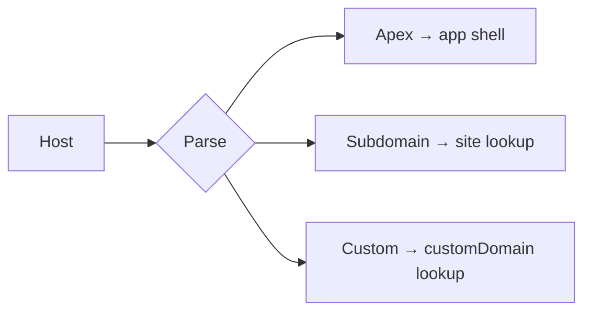

---

## D5 — Edit token

**HMAC cookie bound to one origin.**

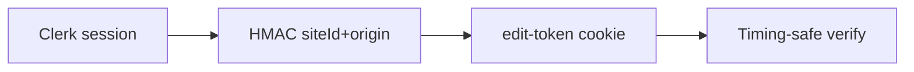

---

## D10 — Invite token

**The link is the credential. Single-use.**

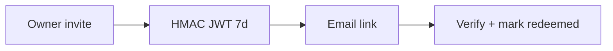

---

## D15 — Form pipeline

**Bot check → throttle → DB → notify.**

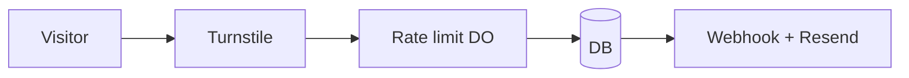

---

## D16 — Password gate

**PBKDF2 verify → signed cookie.**

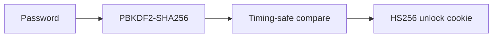

---

## D17 — Custom domain

**Four states, one cron, bounded poll.**

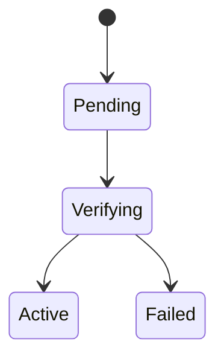

---

## D18 — SEO meta emission

**One assembler, every tag.**

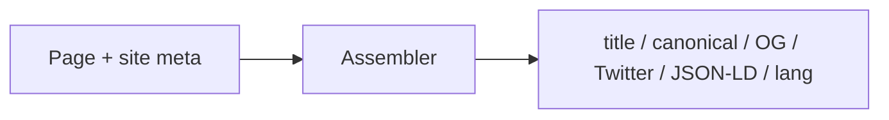

---

## D20 — Atomic search rebuild

**Reindex in one transaction.**

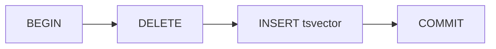

---

## D22 — Security pass

**Defense by category.**

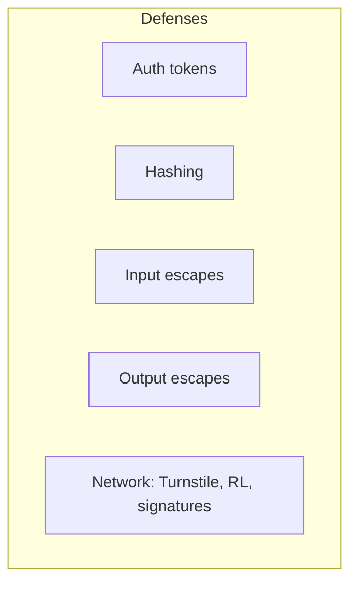

---

## D23 — Schema ER

**Two roots: customer + site.**

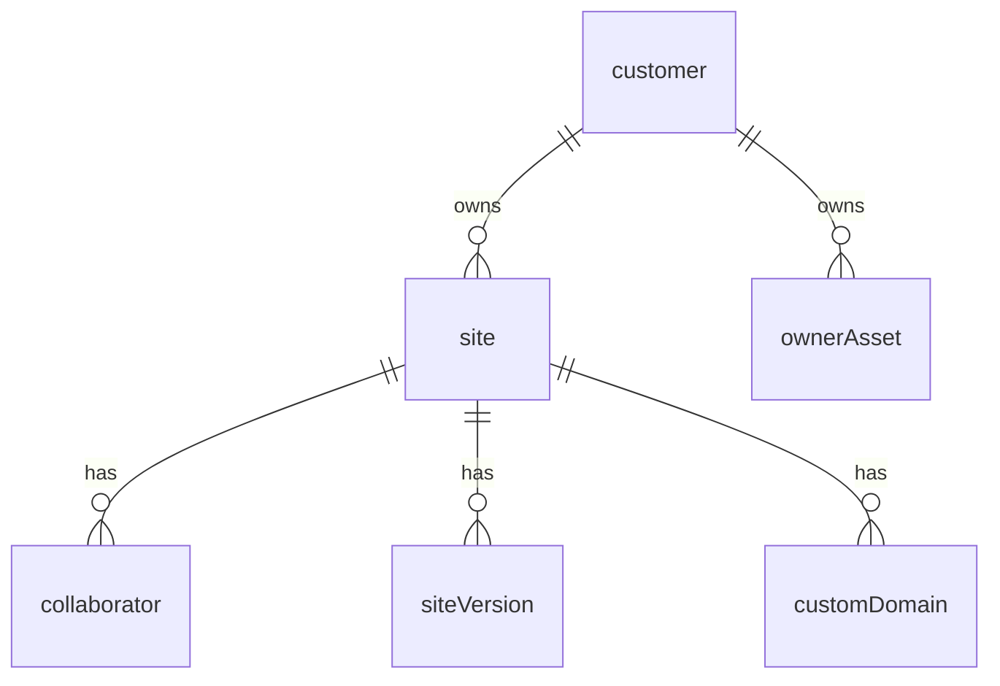

---

## D24 — API surface

**90+ endpoints, 3 auth tiers.**

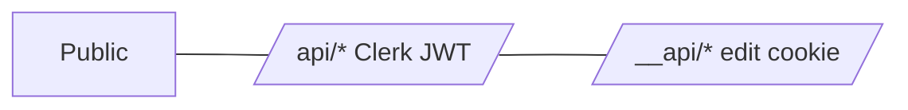

---

## D25 — Deploy + runtime

**Local → CI → one binary on the edge.**

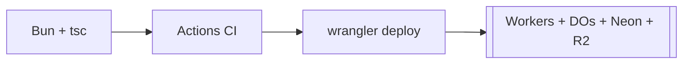

---

## D29 — In-app notifications

**Row commits → per-Owner DO fan-out → SSE to bell. Email in parallel.**

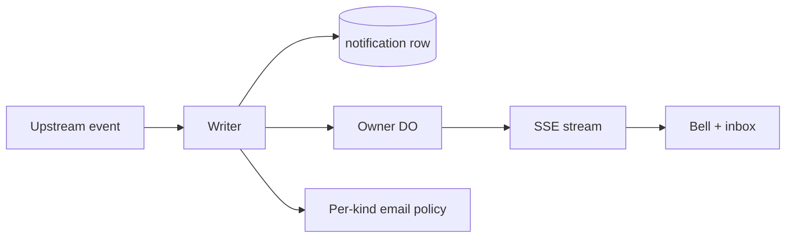

Recipient kinds: `customer` (personal) | `site` (fanned-out via `notification_read`).
Kinds: `form_submission` | `collaborator_event` | `publish_event` | `access_event`.
Reconnect: `Last-Event-ID` → `?since=…` backfill. No queue.

---

## Coda

*"All routine. The interesting parts you've already seen."*
