# Key Architecture

> Contributor-facing tour of Open Canvas's five non-obvious engineering decisions. If you're trying to find your bearings in this codebase, read here first — then pivot to the [ADR index](adr/README.md) for the canonical decision records, or to [CONTEXT.md](../CONTEXT.md) for project-wide context.
>
> Scope: how data moves through the system, where the write gates live, what each subsystem is responsible for.

---

## Throughline

> Two clients converge on a single document model without a server picking a winner. The AI mutates it through a gate that rejects invalid writes outright and never produces side effects from generation. The whole Y.Doc snapshots deterministically into base64. New sections come from regenerative recipes the AI rewrites rather than slot-binds, and bigger imports — whether scraped or template-cloned — share the same two-pass translation algorithm. Publish is a column copy gated by six parallel a11y checks that block at 422.

★ marks the five non-obvious decisions. The other sections set context.

| # | Section | Diagrams | ★ |
|---|---|---|---|
| 1 | [Document model](#1--document-model) | D1, D2 | |
| 2 | [Co-edit (CRDT + fan-out)](#2--co-edit-) | D3, D4 | ★ |
| 3 | [AI surfaces (gate + preview)](#3--ai-surfaces-) | D5, D6 | ★ |
| 4 | [Versioning](#4--versioning) | D7 | |
| 5 | [Section recipes](#5--section-recipes) | D8 | |
| 6 | [Composition (import + template)](#6--composition-) | D9, D10 | ★ |
| 7 | [Publish: column split](#7--publish-column-split) | D11 | |
| 8 | [Publish: a11y gate](#8--publish-a11y-gate-) | D12 | ★ |

---

## Map

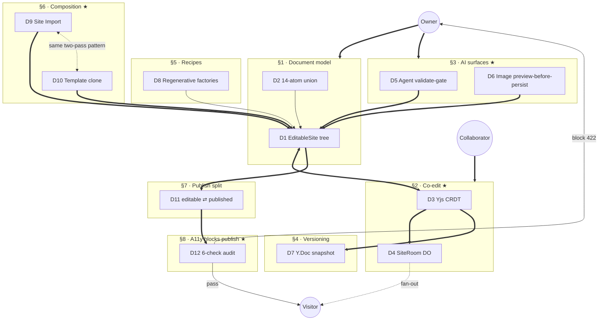

Bold arrows (`==>`) carry primary data flow. Dotted (`-.->`) are cross-cutting relationships — the dotted edge between D9 and D10 is the meta-beat (same algorithm, different source shape).

---

## 1 · Document model

**The schema every other section operates on.** Deliberately small. The whole system reduces to producing, consuming, or projecting one of these.

### D1 — EditableSite tree

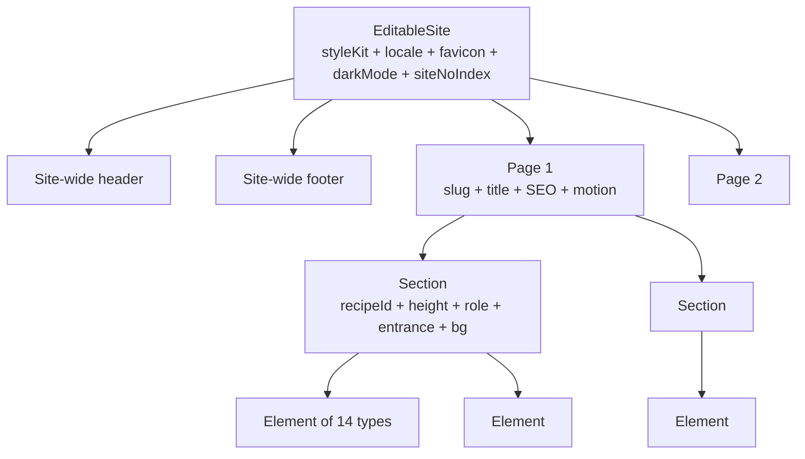

Root is `EditableSite`. Carries site-wide settings the renderer needs at the top level — style kit, locale, favicon, dark-mode flag, no-index flag. Header and footer are *site-wide single children*, not per-page; changing the header changes every page. Below that, an array of pages → array of sections → array of elements. Element is the leaf; everything else is structure.

### D2 — Element union (14 atoms)

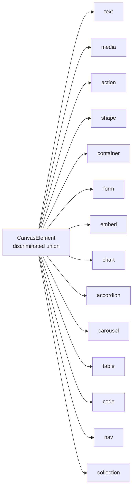

Fourteen element types: `text`, `media`, `action`, `shape`, `container`, `form`, `embed`, `chart`, `accordion`, `carousel`, `table`, `code`, `nav`, `collection`. Each is a discriminated branch of one union type, with its own variant axes and its own validator.

**Bounded by design.** Two compile-time invariants — `_ELEMENT_TYPES_COVERS_UNION` and `_UNION_COVERS_ELEMENT_TYPES` in [`src/canvas/schema.ts`](../src/canvas/schema.ts) — force the element-type literal list and the union type to exactly cover each other. Add a new type to one without the other and the build fails. There is no path through the code where the set of element types is open-ended.

**Source:** [`src/canvas/schema.ts`](../src/canvas/schema.ts), per-element modules in [`src/canvas/elements/`](../src/canvas/elements/), [ADR 0011](adr/0011-canvas-element-registry.md)

**Gotchas:**
- Header + footer are *site-wide*, not per-page.
- Style kit, locale, dark-mode flag, favicon — all at root.
- Don't try to extend the element union without updating both invariant arrays.

---

## 2 · Co-edit ★

**Two clients converge on one document without a server picking a winner.** This is the trick everything else sits on top of. D3 is *what* gets sent (Yjs binary diffs). D4 is *how* it's distributed (Durable Object + WebSocket).

### D3 — Yjs CRDT

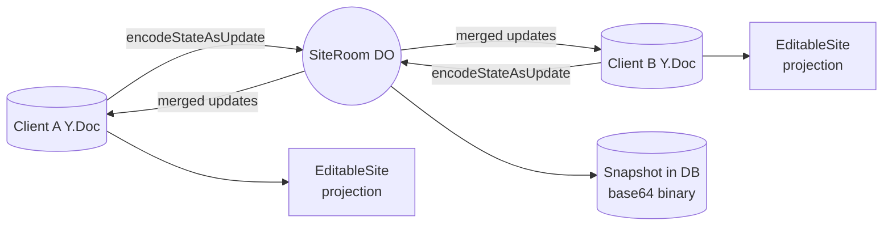

Each client owns its own Y.Doc. **Not a shared one** — every editor has its own. Edits encode to binary via `Y.encodeStateAsUpdate` and ship to the SiteRoom Durable Object. SiteRoom broadcasts merged updates back to every connected client.

There is no conflict-resolution rule. No "last writer wins," no operational transform. Y.js is a CRDT: the merge function is mathematical — any two updates produce the same merged state regardless of arrival order. Order doesn't matter; identity does.

The renderer never reads the Y.Doc directly. It reads a projection — a typed, flat `EditableSite` view derived from the Y.Doc state. CRDT machinery is bookkeeping; the canvas, the inspector, the validator all read a clean tree. The isolation is deliberate; CRDT engines can be swapped without disturbing the rest of the editor.

### D4 — SiteRoom fan-out

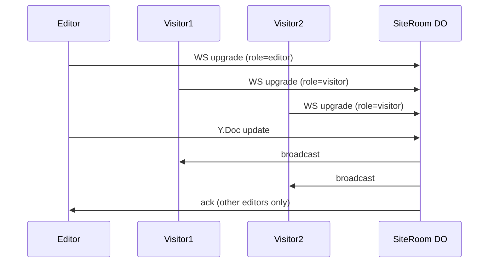

Every client connects to SiteRoom over WebSocket. The upgrade request carries the role — `editor` (authenticated by the edit cookie) or `visitor` (anonymous). SiteRoom tags the connection at connect time and never trusts the client to re-state its role.

When an editor pushes an update, SiteRoom broadcasts to every visitor (the published page updates live, without redeploy or CDN purge) and acknowledges back to other editors (co-editors see each other's edits in real time without refreshing).

SiteRoom hibernates between messages via Cloudflare's WebSocket Hibernation API. State lives in DO storage; the runtime wakes up, processes the update, sends fan-out, sleeps. One DO per site scales because there's no idle process cost per active site.

**Source:** [ADR 0007](adr/0007-yjs-revival.md), [`src/live/site-room.ts`](../src/live/site-room.ts)

**Gotchas:**
- CRDT, not Operational Transform — different math, don't conflate.
- Server doesn't resolve conflicts — the merge function does.
- Every client has its own Y.Doc; never draw a shared one.
- D3 alone hides the broadcast; D4 alone is plumbing — they belong together.

---

## 3 · AI surfaces ★

**The AI never produces side effects. Owner is the only entity that can commit.** Two surfaces, two implementations, one principle. D5 gates document mutations through `validate.ts`; D6 gates image generation by keeping bytes browser-resident until the owner applies.

### D5 — Agent validate-gate

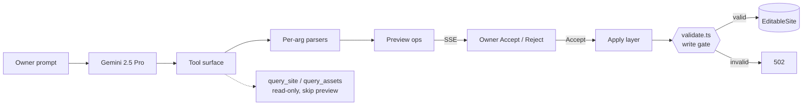

Owner prompt + current site state + tool schemas → Gemini 2.5 Pro. The tool surface has two kinds of tools. Read-only ones (`query_site`, `query_assets`) skip the preview path entirely. About fifteen mutating tools go through a per-argument parser — each parser knows what shape the canvas expects (inline marks, media kind, element type, style-kit tokens, page metadata, motion fields, site config). Malformed arguments are rejected before becoming a preview; the model retries.

Valid argument bundles become preview cards streamed via SSE. Owner accepts or rejects each card. Acceptance routes the change to the apply layer, which hands it to `validate.ts` — **the only write gate in the canvas**. Per ADR 0012, every mutation that touches `editableState` flows through this function. Invalid means any schema violation: the apply layer returns 502 and nothing changes. The agent gets the same gate the human editor gets. The gate doesn't know which one is calling.

### D6 — Image preview-before-persist

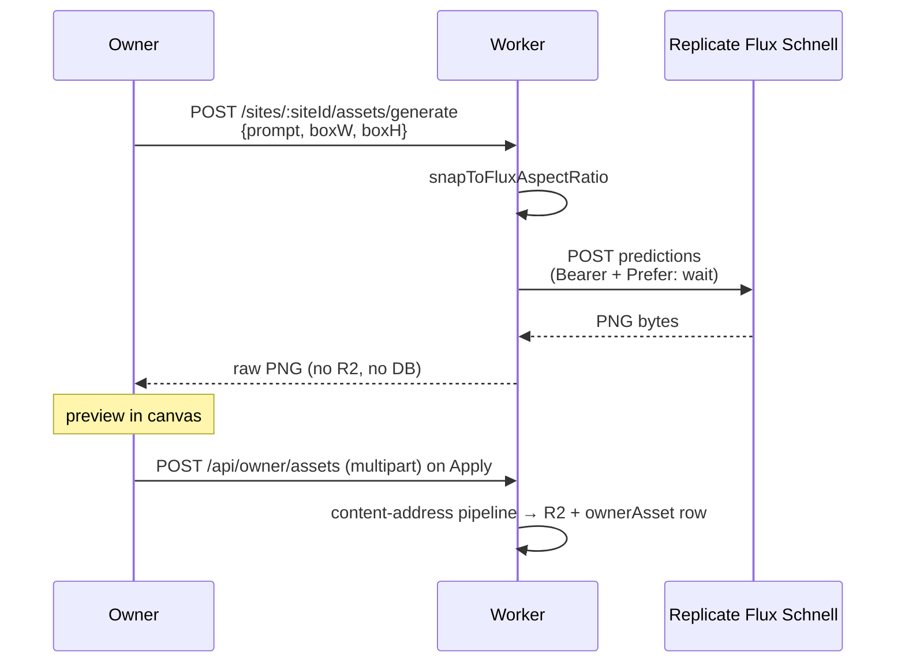

Browser POSTs prompt + box dimensions. Worker rounds the box to the nearest Flux-supported aspect ratio (`snapToFluxAspectRatio`) — Flux Schnell generates at a fixed set of ratios, not arbitrary sizes. Worker calls Replicate with `Prefer: wait` for a synchronous response, gets PNG bytes back, hands them straight to the browser.

**No R2 PUT. No `ownerAsset` row. No database transaction.** The generated bytes exist only in the browser's memory. They vanish if the owner closes the tab or generates a new image.

Only on Apply does the browser do a separate multipart POST to `/api/owner/assets`, which runs the standard content-addressed pipeline (SHA-256, R2 dedupe, `ownerAsset` row). The generated PNG becomes a real asset *only* at the moment the owner says "yes, I'm using this."

Preview-before-persist. Generation is a proposal, not a side effect. The obvious implementation — store everything Replicate returns and let the owner discover orphans later — was explicitly rejected.

**Source:** [ADR 0012 (validation-write-gate)](adr/0012-validation-write-gate.md), [ADR 0014 (template-literal substitution)](adr/0014-template-literal-data-substitution.md), [ADR 0004 decision 2 (preview-before-persist)](adr/0004-owner-asset.md), [`src/agent/`](../src/agent/), [`src/canvas/validate.ts`](../src/canvas/validate.ts), [`src/routes/api/canvas.ts:632-733`](../src/routes/api/canvas.ts)

**Gotchas:**
- AI runs *through* the same gate as the human editor — not alongside it.
- Generation alone does not create an asset. The "no R2, no DB" rule is load-bearing.
- Aspect ratios snap to Flux's fixed set — not arbitrary box dims.
- `validate.ts` is the only write path. Don't add a second one.

---

## 4 · Versioning

**A version is the whole Y.Doc encoded as bytes.** Deterministically. The decision rejects two more obvious alternatives — diffing against the previous version, or extracting JSON from `EditableSite`.

### D7 — Y.Doc deterministic snapshot

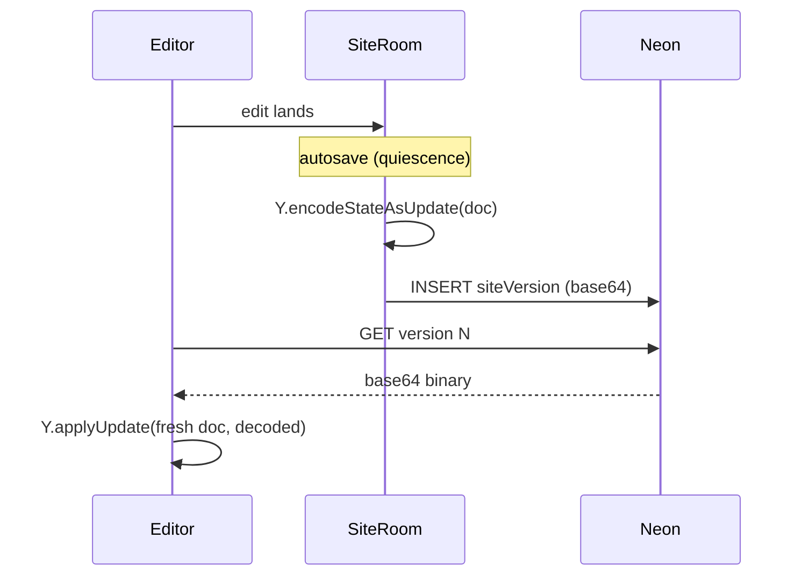

Autosave fires on editor quiescence. SiteRoom takes the whole Y.Doc, runs `Y.encodeStateAsUpdate`, base64-encodes the binary blob, writes one row to `siteVersion` (text column). Restoring: fetch the row, base64-decode, `Y.applyUpdate` into a fresh Y.Doc, project to `EditableSite`. Same code path the editor uses for any other state — just bootstrapped from disk instead of from a peer.

Encoding is deterministic. Same Doc, same bytes. A version restored from yesterday and a version restored today are byte-identical; any later edit continues from the same logical position. If you ever want a cross-version diff UI, compute it from the projected `EditableSite` trees, not from the binary blobs.

**Source:** [`src/version/`](../src/version/)

**Gotchas:**
- Whole-Doc snapshot, *not* diff between versions.
- Encoding is deterministic — depends on Y.js semantics.
- Cross-version diff UI doesn't exist unless re-verified against current state.

---

## 5 · Section recipes

**Sections are factories, not templates.** No slot-binding API. The AI changes a hero by writing a new brief, not by rebinding slots.

### D8 — Regenerative factories + `'custom'` sentinel

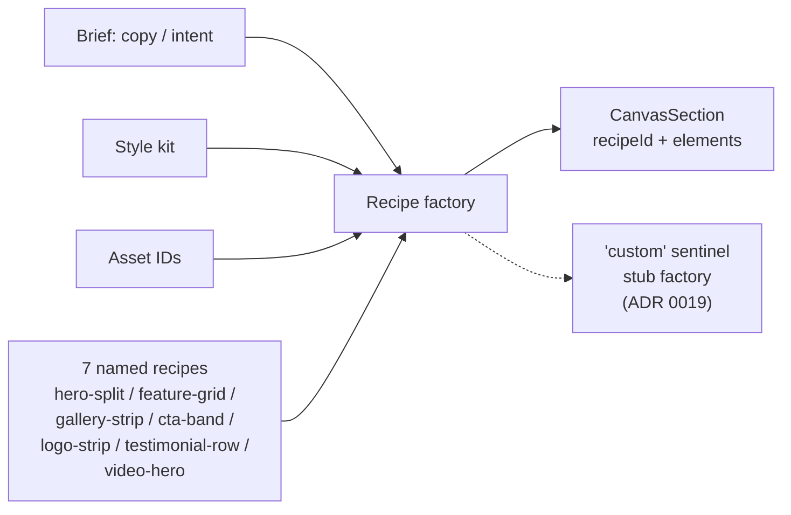

A recipe factory takes three inputs — brief (copy + intent), style kit, asset IDs — and returns one fully-formed `CanvasSection`. Seven named recipes (`hero-split`, `feature-grid`, `gallery-strip`, `cta-band`, `logo-strip`, `testimonial-row`, `video-hero`). Plus one sentinel called `'custom'` (ADR 0019) — the marker for hand-designed sections (imports, AI-freeform output, owner-composed). The `custom` factory is a stub; it exists only so the discriminated-union exhaustiveness check passes.

When the AI changes a hero, it writes a new brief, calls the hero-split factory again, and replaces the section. **Delete plus add.** Two operations the validator already understands. Regenerative interchangeability beats slot binding for AI authoring — the model writes English, not a slot-rebind script. The codebase doesn't have to maintain a slot-binding API surface that grows with every element type and variant axis.

**Source:** [ADR 0019](adr/0019-section-recipe-custom-sentinel.md), [`src/canvas/recipes.ts`](../src/canvas/recipes.ts), [`src/canvas/schema.ts:102-113`](../src/canvas/schema.ts)

**Gotchas:**
- No slot model. No named-slot rebinding API.
- No in-place section swap handler. Pattern is *delete + add new*.
- `'custom'` factory is a stub — don't add logic to it.

---

## 6 · Composition ★

**Two completely different content-source flows use the same two-pass translation algorithm.** Site Import (scraper output → owned site) and Template clone (one site's state → another owner's site) start with content blobs that speak different namespaces than the canvas. Both solve it the same way: build a mapping from old namespace to new, walk the element tree, rewrite every reference in place.

### D9 — Site Import (three frames)

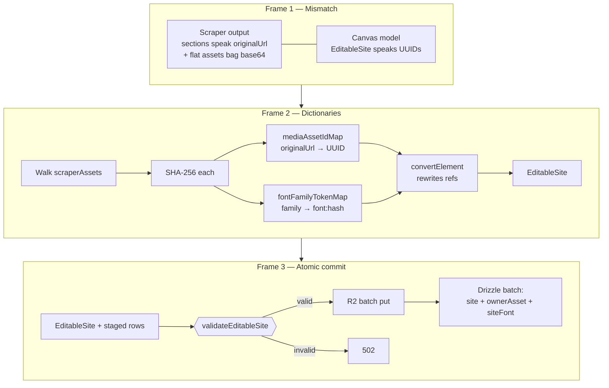

**Frame 1 — Mismatch.** The scraper (Playwright instance, disabled in the public POC) returns sections that reference asset bytes by their original public URL, plus a flat bag of base64-encoded asset blobs. The canvas speaks UUIDs — every asset reference is an `ownerAsset` row identified by content hash.

**Frame 2 — Dictionaries.** Walk the asset bag. SHA-256 each blob. Build two maps: `mediaAssetIdMap` (originalUrl → new owner-asset UUID, deduped against the customer's existing library by content hash) and `fontFamilyTokenMap` (family → `font:<hash>`). Then a single walk over the element tree with `convertElement`, which uses both maps to rewrite every reference. Output: an `EditableSite` that speaks UUIDs.

**Frame 3 — Atomic commit.** `validateEditableSite` runs on the rewritten tree (same gate the agent uses in §3, same gate publish uses in §7). Fail → 502, nothing persists. Pass → R2 batch put for asset bytes, single Drizzle batch insert for site row + ownerAsset rows + siteFont rows. All-or-nothing.

### D10 — Template clone-into-owner

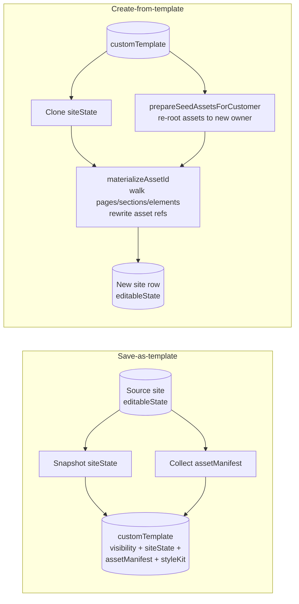

**Save-as-template.** Snapshot the source site's `editableState` into a `customTemplate` row (JSONB). Alongside it, collect an asset manifest — every asset referenced by the snapshot, recorded with its hash. The template carries visibility (`global` or `private`), state, manifest, and the style kit at save time. The snapshot is *frozen* — if the source site is edited tomorrow, the template doesn't update. Intentional; a template that drifted under its consumers would be a worse footgun than an out-of-date one.

**Create-from-template.** Clone `siteState`. Call `prepareSeedAssetsForCustomer` to create fresh `ownerAsset` rows for the new owner (deduplicating against the customer's existing library by content hash). Then `materializeAssetId` walks pages → sections → elements and rewrites every asset reference to the new owner's UUIDs.

### Shared two-pass algorithm

```
   D9 — Site Import                D10 — Template clone
   ─────────────────                ────────────────────

   Build dictionaries:              Build dictionaries:
     mediaAssetIdMap                  prepareSeedAssetsForCustomer
     fontFamilyTokenMap               (asset manifest → new
                                      owner-asset UUIDs)

         │                                  │
         ▼                                  ▼

   convertElement walks               materializeAssetId walks
   the tree, rewrites refs            the tree, rewrites refs

   ────── two-pass translation ──────
   collect refs → build ID map → rewrite tree

         same algorithm, different source shape
```

Both flows start with a content blob whose namespace doesn't match the canvas. Both build a mapping. Both walk the element tree and rewrite every reference. Both commit atomically through `validateEditableSite`. The general shape: any content source producing a tree of references that don't match the internal namespace can be onboarded by writing that mapper. The algorithm's the same.

**Source:** [ADR 0008](adr/0008-site-import-architecture.md), [`src/routes/api/import.ts`](../src/routes/api/import.ts), [`src/routes/api/sites.ts`](../src/routes/api/sites.ts), [`src/db/schema.ts:478-491`](../src/db/schema.ts) (`customTemplate`)

**Gotchas:**
- Site Import is **disabled in the public POC build** — feature exists, scraper service isn't reachable.
- Templates are frozen at save time — no live link to source site.
- Atomic commit means either everything lands or 502. No partial state.

---

## 7 · Publish: column split

**Two columns on the same `site` row.** `editableState` is the working column the editor mutates; `publishedSnapshot` is what visitors render. Editing never touches the second. Publish is the only path between them.

### D11 — editable ⇄ published

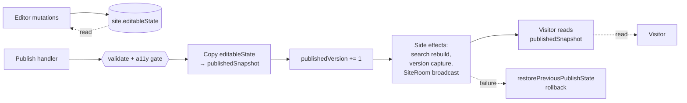

`site.editableState` is continuous — every CRDT projection (§2), every agent apply (§3), every import or template materialiser (§6) writes here. The editor reads here. `site.publishedSnapshot` is the read column for visitors; nothing writes to it except the publish handler.

Publish: validate the editable state, run the a11y audit (§8). If both pass, copy `editableState` → `publishedSnapshot`, bump `publishedVersion`, run the side-effect chain (search index rebuild, version capture, SiteRoom broadcast). If any side effect fails, `restorePreviousPublishState` rolls the published columns back.

The two-column split is the precondition for the a11y audit to be a *gate*. A11y can block publish at 422 — without affecting what visitors currently see — because the columns are physically separate. With a single state column, blocking publish would mean choosing between rolling back the owner's in-progress edits and shipping a broken site. The split removes that choice.

**Source:** [`src/db/schema.ts:94-96`](../src/db/schema.ts) (column definitions), [`src/routes/api/publish.ts:144-365`](../src/routes/api/publish.ts) (publish handler)

**Gotchas:**
- Editing never touches `publishedSnapshot`. Don't introduce a write path.
- Publish is *not* atomic at the row level — it's a sequence with rollback (`restorePreviousPublishState`).
- The atomic boundary is the publish handler, not the database row.

---

## 8 · Publish: a11y gate ★

**Six parallel a11y checks block publish at 422.** Already live, not planned. The audit returns a full report with the response; `publishedSnapshot` is untouched on fail.

### D12 — Six-check audit

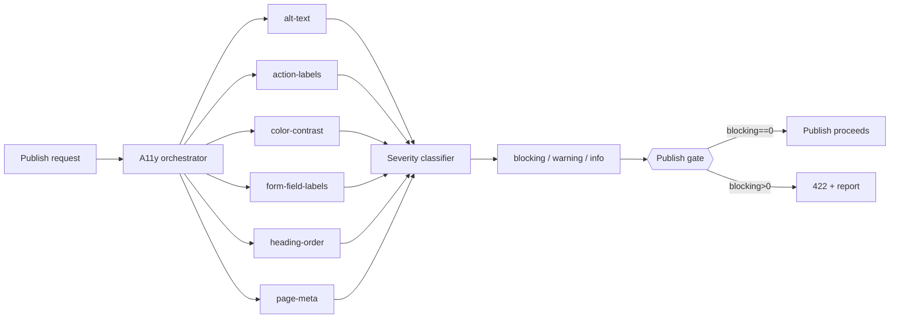

Six checks run in parallel. Each is a pure function over the editable state. Collect every issue — never fail fast. The list flows into a severity classifier that tags each issue blocking, warning, or info. The gate is binary on blocking: `blockingCount > 0` → 422 with the full report; `publishedSnapshot` untouched.

The checks:

- **alt-text.** Every media element needs alt text.
- **action-labels.** Every button-equivalent needs an accessible label (`aria-label`, visible label, or both).
- **color-contrast.** Every text element resolves its background against the surfaces stacked under it, by area of overlap, ties broken by z-index — not just the immediate parent. White text over a hero image checks contrast against whatever the topmost surface covering the text's bounding box happens to be.
- **form-field-labels.** Every input needs an associated label.
- **heading-order.** No skipping levels. H-levels are *derived* from font size via the style kit's `headingScale` — the check validates the derived H-level matches the visual hierarchy the author built, not authored H-tags.
- **page-meta.** Each page needs a title and description.

Each check is wrapped in a crash-isolation wrapper. If `color-contrast` throws (bad style kit, weird OKLCH value), the audit doesn't crash the publish handler — it emits a blocking issue called `audit-crash` and the gate still trips. **Crashes are blockers, never silent skips.**

Warnings and info appear in the same panel but don't trip the gate. The blockers are deliberately strict: things that actually break the page for a real assistive user. A lot of standard a11y rules ship as warnings on purpose.

**Source:** [`src/a11y/`](../src/a11y/), [`src/a11y/SUBSYSTEM.md`](../src/a11y/SUBSYSTEM.md)

**Gotchas:**
- Speak in **present tense** — this already gates, not a planned feature.
- Pure-validator pattern: collect ALL errors, never fail-fast.
- Crash → blocking `audit-crash` issue, never silent skip.
- Contrast resolves against the *innermost surface by area*, not the immediate parent.
- Heading order checks the *derived* H-level (font size → `headingScale`), not authored tags.

---

## Where to look next

**Canonical decision records:** [docs/adr/](adr/) (start with [docs/adr/README.md](adr/README.md) for the full index — every ADR has its Status in the table).

**Project context:** [CONTEXT.md](../CONTEXT.md) (domain language, repository-wide invariants).

**Key code surfaces:**

- [`src/canvas/schema.ts`](../src/canvas/schema.ts) — `EditableSite`, `CanvasPage`, `CanvasSection`, `CanvasElement` (§1, §2 projection target)
- [`src/canvas/validate.ts`](../src/canvas/validate.ts) — the only write gate (§3, §6, §7)
- [`src/live/site-room.ts`](../src/live/site-room.ts) — SiteRoom Durable Object (§2, §4 autosave)
- [`src/version/`](../src/version/) — Y.Doc snapshot capture and restore (§4)
- [`src/canvas/recipes.ts`](../src/canvas/recipes.ts) — section factories (§5)
- [`src/routes/api/import.ts`](../src/routes/api/import.ts) — Site Import handler (§6)
- [`src/routes/api/sites.ts`](../src/routes/api/sites.ts) — `customTemplate` save and create-from (§6)
- [`src/routes/api/publish.ts`](../src/routes/api/publish.ts) — publish handler, rollback (§7)
- [`src/a11y/`](../src/a11y/) — audit checks, severity classifier (§8)

**Subsystem READMEs:** every major folder under `src/` has a `SUBSYSTEM.md` with local invariants. Read those before changing anything inside the folder.
