# Key Architecture

> Contributor-facing tour of Open Canvas's non-obvious engineering decisions across four starred subsystems (§3 carries two distinct decisions — the validate-gate and preview-before-persist — so five decisions in all). If you're trying to find your bearings in this codebase, read here first — then pivot to the [ADR index](adr/README.md) for the canonical decision records, or to [CONTEXT.md](../CONTEXT.md) for project-wide context.
>
> Scope: how data moves through the system, where the write gates live, what each subsystem is responsible for.

---

## Throughline

> Two clients converge on a single document model without a server picking a winner. The AI mutates it through a gate that rejects invalid writes outright and never produces side effects from generation. The whole Y.Doc snapshots into Yjs update bytes that are deterministic in decoded state (not byte-identical — client IDs vary). New sections come from regenerative recipes the AI rewrites rather than slot-binds, and bigger imports — whether scraped or template-cloned — share the same two-pass translation algorithm. Publish copies the column after a validity check; a six-check a11y audit (checks run sequentially) is invoked on every publish but its result is discarded and it no longer blocks (a deliberate ship-fast call) — the dashboard a11y report runs its own independent audit.

★ marks the four non-obvious subsystems (§3 holds two decisions — D5 validate-gate and D6 preview-before-persist — for five in total). The other sections set context.

| # | Section | Diagrams | ★ |
|---|---|---|---|
| 1 | [Document model](#1--document-model) | D1, D2 | |
| 2 | [Co-edit (CRDT + fan-out)](#2--co-edit-) | D3, D4 | ★ |
| 3 | [AI surfaces (gate + preview)](#3--ai-surfaces-) | D5, D6 | ★ |
| 4 | [Versioning](#4--versioning) | D7 | |
| 5 | [Section recipes](#5--section-recipes) | D8 | |
| 6 | [Composition (import + template)](#6--composition-) | D9, D10 | ★ |
| 7 | [Publish: column split](#7--publish-column-split) | D11 | |
| 8 | [Publish: a11y audit](#8--publish-a11y-audit-) | D12 | ★ |

---

## Map

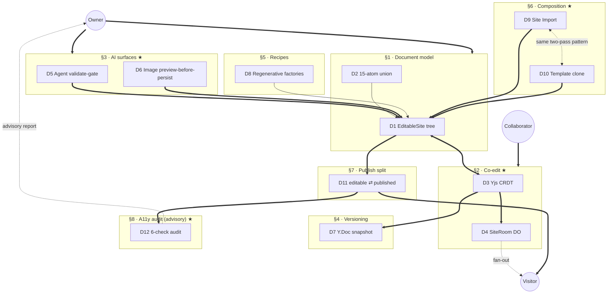

Bold arrows (`==>`) carry primary data flow. Dotted (`-.->`) are cross-cutting relationships — the dotted edge between D9 and D10 is the meta-beat (same algorithm, different source shape).

---

## 1 · Document model

**The schema every other section operates on.** Deliberately small. The whole system reduces to producing, consuming, or projecting one of these.

### D1 — EditableSite tree

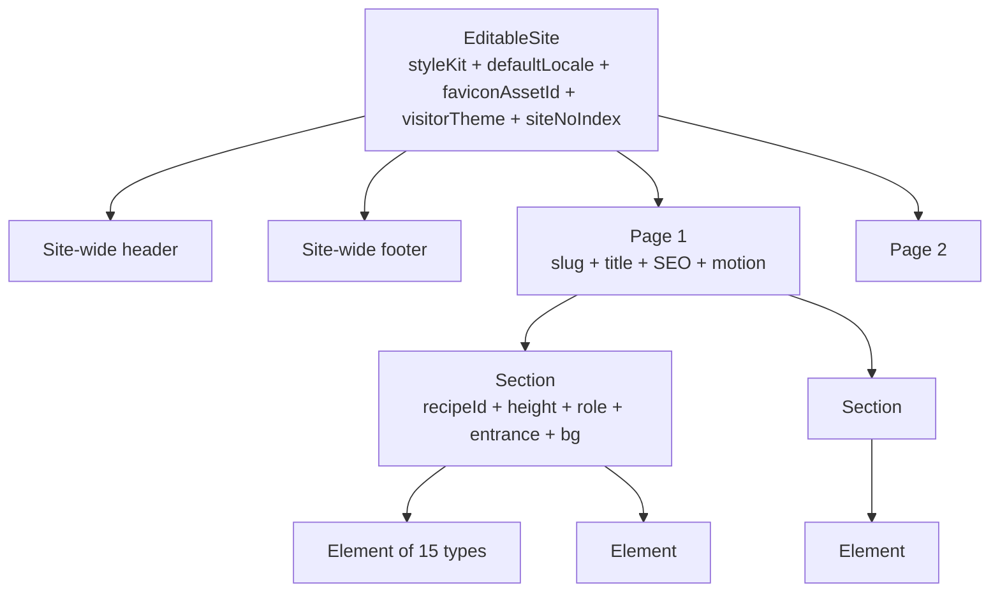

Root is `EditableSite`. Carries site-wide settings the renderer needs at the top level — style kit, `defaultLocale`, `faviconAssetId`, `visitorTheme` (`'light' | 'dark' | 'toggleable'`), no-index flag. Header and footer are *site-wide single children*, not per-page; changing the header changes every page. Below that, an array of pages → array of sections → array of elements. Element is the leaf; everything else is structure.

### D2 — Element union (15 atoms)

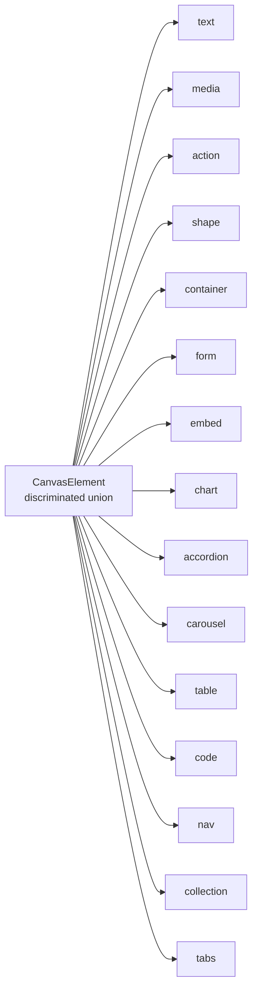

Fifteen element types: `text`, `media`, `action`, `shape`, `container`, `form`, `embed`, `chart`, `accordion`, `carousel`, `table`, `code`, `nav`, `collection`, `tabs`. Each is a discriminated branch of one union type, with its own variant axes and its own validator.

**Bounded by design.** Two compile-time invariants — `_ELEMENT_TYPES_COVERS_UNION` and `_UNION_COVERS_ELEMENT_TYPES` in [`src/canvas/schema.ts`](../src/canvas/schema.ts) — force the element-type literal list and the union type to exactly cover each other. Add a new type to one without the other and the build fails. There is no path through the code where the set of element types is open-ended.

**Source:** [`src/canvas/schema.ts`](../src/canvas/schema.ts), per-element modules in [`src/canvas/elements/`](../src/canvas/elements/), [ADR 0011](adr/0011-canvas-element-registry.md)

**Gotchas:**
- Header + footer are *site-wide*, not per-page.
- Style kit, `defaultLocale`, `visitorTheme`, `faviconAssetId` — all at root.
- Don't try to extend the element union without updating both invariant arrays.

---

## 2 · Co-edit ★

**Two clients converge on one document without a server picking a winner.** This is the trick everything else sits on top of. D3 is *what* gets sent (Yjs binary diffs). D4 is *how* it's distributed (Durable Object + WebSocket).

### D3 — Yjs CRDT

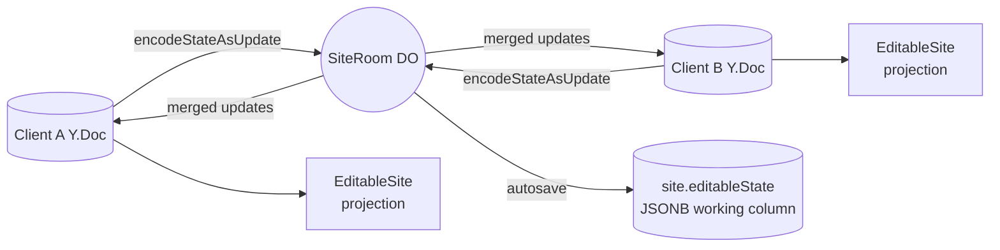

Each client owns its own Y.Doc. **Not a shared one** — every editor has its own. Edits encode to binary via `Y.encodeStateAsUpdate` and ship to the SiteRoom Durable Object. SiteRoom broadcasts merged Yjs updates back to the *other editor* clients only — the Y-update fan-out skips non-editor sockets. Visitors get publish and presence broadcasts, not live CRDT ops.

There is no conflict-resolution rule. No "last writer wins," no operational transform. Y.js is a CRDT: the merge function is mathematical — any two updates produce the same merged state regardless of arrival order. Order doesn't matter; identity does.

The renderer never reads the Y.Doc directly. It reads a projection — a typed, flat `EditableSite` view derived from the Y.Doc state. CRDT machinery is bookkeeping; the canvas, the inspector, the validator all read a clean tree. The isolation is deliberate; CRDT engines can be swapped without disturbing the rest of the editor.

### D4 — SiteRoom fan-out

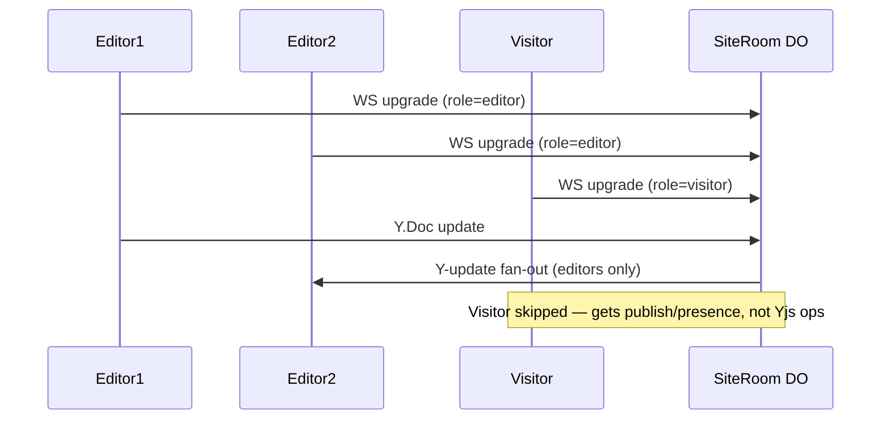

Every client connects to SiteRoom over WebSocket. The upgrade request carries the role — `editor` (authenticated by the edit cookie) or `visitor` (anonymous). SiteRoom tags the connection at connect time and never trusts the client to re-state its role.

When an editor pushes a Y.Doc update, SiteRoom fans it out to the *other editor* sockets only (co-editors see each other's edits in real time without refreshing). Visitor sockets are tagged at connect time and skipped by the Y-update fan-out; they receive publish and presence broadcasts instead — the published page refreshes when the owner publishes, without redeploy or CDN purge, not on every keystroke.

SiteRoom hibernates between messages via Cloudflare's WebSocket Hibernation API. State lives in DO storage; the runtime wakes up, processes the update, sends fan-out, sleeps. One DO per site scales because there's no idle process cost per active site.

**Source:** [ADR 0007](adr/0007-yjs-revival.md), [`src/live/site-room.ts`](../src/live/site-room.ts)

**Gotchas:**
- CRDT, not Operational Transform — different math, don't conflate.
- Server doesn't resolve conflicts — the merge function does.
- Every client has its own Y.Doc; never draw a shared one.
- D3 alone hides the broadcast; D4 alone is plumbing — they belong together.

---

## 3 · AI surfaces ★

**The AI never produces side effects. Owner is the only entity that can commit.** Two surfaces, two implementations, one principle. D5 gates document mutations through `validate.ts`; D6 gates image generation by keeping bytes browser-resident until the owner applies.

### D5 — Agent validate-gate

```mermaid
flowchart LR
  prompt[Owner prompt] --> gemini[Gemini (gemini-3.5-flash)]
  gemini --> tools[Tool surface]
  tools --> parsers[Per-arg parsers]
  tools -.-> rotool[query_site / query_assets<br/>read-only, skip preview]
  parsers --> preview[Preview ops]
  preview -- SSE --> owner[Owner Accept / Reject]
  owner -- Accept --> apply[Apply layer]
  apply --> gate{{validate.ts<br/>write gate}}
  gate -- valid --> state[(EditableSite)]
  gate -- invalid --> reject[400]
```

Owner prompt + current site state + tool schemas → Gemini (gemini-3.5-flash). The tool surface has two kinds of tools. Read-only ones (`query_site`, `query_assets`) skip the preview path entirely. About fifteen mutating tools go through a per-argument parser — each parser knows what shape the canvas expects (inline marks, media kind, element type, style-kit tokens, page metadata, motion fields, site config). Malformed arguments are rejected before becoming a preview; the model retries.

Valid argument bundles become preview cards streamed via SSE. Owner accepts or rejects each card. Acceptance routes the change to the apply layer, which hands it to `validate.ts` — **the write gate for every full-site mutation** (agent apply, import, publish, recipe materialisation). Per ADR 0012, those whole-`EditableSite` write paths all flow through `validateEditableSite`. (It is *not* a universal interceptor on every `editableState` write — e.g. the collections-scaffold endpoint and co-edit autosave persist projected/derived state without re-running it. The gate covers the full-site mutation paths, which is where untrusted/agent-shaped input enters.) Invalid means any schema violation: the apply layer returns 400 and nothing changes. The agent gets the same gate the human editor gets. The gate doesn't know which one is calling.

### D6 — Image preview-before-persist

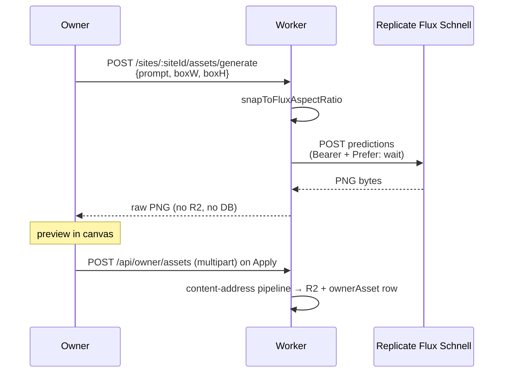

Browser POSTs prompt + box dimensions. Worker rounds the box to the nearest Flux-supported aspect ratio (`snapToFluxAspectRatio`) — Flux Schnell generates at a fixed set of ratios, not arbitrary sizes. Worker calls Replicate with `Prefer: wait` for a synchronous response, gets PNG bytes back, hands them straight to the browser.

**No R2 PUT. No `ownerAsset` row. No database transaction.** The generated bytes exist only in the browser's memory. They vanish if the owner closes the tab or generates a new image.

Only on Apply does the browser do a separate multipart POST to `/api/owner/assets`, which runs the standard content-addressed pipeline (SHA-256, R2 dedupe, `ownerAsset` row). The generated PNG becomes a real asset *only* at the moment the owner says "yes, I'm using this."

Preview-before-persist. Generation is a proposal, not a side effect. The obvious implementation — store everything Replicate returns and let the owner discover orphans later — was explicitly rejected.

**Source:** [ADR 0012 (validation-write-gate)](adr/0012-validation-write-gate.md), [ADR 0004 decision 2 (preview-before-persist)](adr/0004-owner-asset.md), [`src/agent/`](../src/agent/), [`src/canvas/validate.ts`](../src/canvas/validate.ts), [`src/routes/api/canvas.ts:705-733`](../src/routes/api/canvas.ts)

**Gotchas:**
- AI runs *through* the same gate as the human editor — not alongside it.
- Generation alone does not create an asset. The "no R2, no DB" rule is load-bearing.
- Aspect ratios snap to Flux's fixed set — not arbitrary box dims.
- `validate.ts` is the gate for full-site mutations (agent / import / publish / recipe). Any new whole-`EditableSite` write path must route through it — don't add a second one that bypasses it.

---

## 4 · Versioning

**A version is the whole Y.Doc encoded as bytes.** Deterministic in decoded state. The decision rejects two more obvious alternatives — diffing against the previous version, or extracting JSON from `EditableSite`.

### D7 — Y.Doc deterministic snapshot

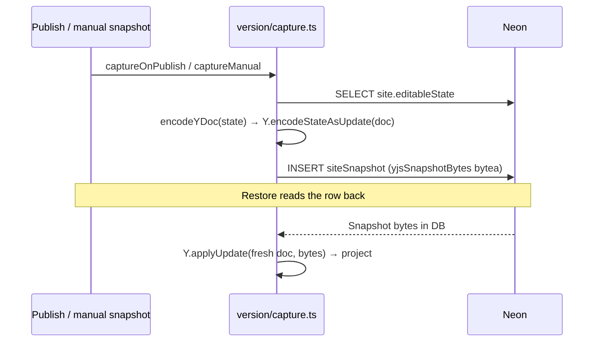

SiteRoom autosave persists the live working state to `site.editableState` (JSONB) on editor quiescence — it does **not** write `siteSnapshot`. Version rows are captured separately: the publish path (`captureOnPublish`) and the manual-snapshot / pre-restore path (`captureManual`) in [`src/version/capture.ts`](../src/version/capture.ts) load the current `editableState`, encode it through the frozen Yjs projection (`encodeYDoc` → `Y.encodeStateAsUpdate`), and write one row to the `siteSnapshot` table (`yjsSnapshotBytes` bytea column). Restoring: fetch the row, `Y.applyUpdate` the raw bytes into a fresh Y.Doc, project to `EditableSite`. Same projection code path the editor uses for any other state — just bootstrapped from disk instead of from a peer.

Encoding is deterministic in **decoded state**, not raw bytes. Y.Doc client IDs are deliberately random, so two encodes of the same logical state are *not* guaranteed byte-identical — the projection smoke (`yjs-projection.smoke.ts`) checks decoded-state / stable-JSON equivalence rather than pinning byte equality. A version restored from yesterday and one restored today decode to the same `EditableSite`; any later edit continues from the same logical position. If you ever want a cross-version diff UI, compute it from the projected `EditableSite` trees, not from the binary blobs.

**Source:** [`src/version/`](../src/version/)

**Gotchas:**
- Whole-Doc snapshot, *not* diff between versions.
- `siteSnapshot` rows come from `version/capture.ts` (publish + manual paths), *not* from SiteRoom autosave — autosave only writes `site.editableState`.
- Deterministic in *decoded state*, not raw bytes — Y.Doc client IDs vary, so don't assert byte equality.
- Cross-version diff UI doesn't exist unless re-verified against current state.

---

## 5 · Section recipes

**Sections are factories, not templates.** No slot-binding API. The AI changes a hero by writing a new brief, not by rebinding slots.

### D8 — Regenerative factories + `'custom'` sentinel

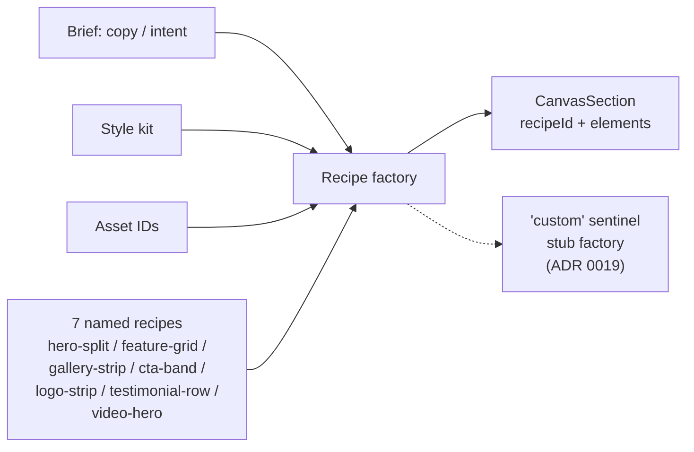

A recipe factory takes three inputs — brief (copy + intent), style kit, asset IDs — and returns one fully-formed `CanvasSection`. Seven named recipes (`hero-split`, `feature-grid`, `gallery-strip`, `cta-band`, `logo-strip`, `testimonial-row`, `video-hero`). Plus one sentinel called `'custom'` (ADR 0019) — the marker for hand-designed sections (imports, AI-freeform output, owner-composed). The `custom` factory is a stub; it exists only so the discriminated-union exhaustiveness check passes.

When the AI changes a hero, it writes a new brief, calls the hero-split factory again, and replaces the section. **Delete plus add.** Two operations the validator already understands. Regenerative interchangeability beats slot binding for AI authoring — the model writes English, not a slot-rebind script. The codebase doesn't have to maintain a slot-binding API surface that grows with every element type and variant axis.

**Source:** [ADR 0019](adr/0019-section-recipe-custom-sentinel.md), [`src/canvas/recipes.ts`](../src/canvas/recipes.ts), [`src/canvas/schema.ts:125-137`](../src/canvas/schema.ts)

**Gotchas:**
- No slot model. No named-slot rebinding API.
- No in-place section swap handler. Pattern is *delete + add new*.
- `'custom'` factory is a stub — don't add logic to it.

---

## 6 · Composition ★

**Two completely different content-source flows use the same two-pass translation algorithm.** Site Import (scraper output → owned site) and Template clone (one site's state → another owner's site) start with content blobs that speak different namespaces than the canvas. Both solve it the same way: build a mapping from old namespace to new, walk the element tree, rewrite every reference in place.

### D9 — Site Import (three frames)

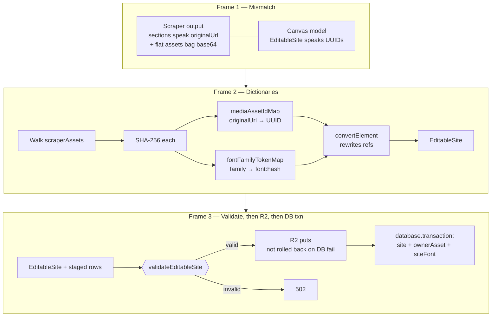

**Frame 1 — Mismatch.** The scraper (Playwright instance, disabled in the public POC) returns sections that reference asset bytes by their original public URL, plus a flat bag of base64-encoded asset blobs. The canvas speaks UUIDs — every asset reference is an `ownerAsset` row identified by content hash.

**Frame 2 — Dictionaries.** Walk the asset bag. SHA-256 each blob. Build two maps: `mediaAssetIdMap` (originalUrl → new owner-asset UUID, deduped against the customer's existing library by content hash) and `fontFamilyTokenMap` (family → `font:<hash>`). Then a single walk over the element tree with `convertElement`, which uses both maps to rewrite every reference. Output: an `EditableSite` that speaks UUIDs.

**Frame 3 — Validate, then commit.** `validateEditableSite` runs on the rewritten tree (same gate the agent uses in §3, same gate publish uses in §7). Fail → 502, nothing persists. Pass → R2 puts for the asset bytes run **first**, then a single `database.transaction` inserts the site row + ownerAsset rows + siteFont rows (postgres-js Drizzle has no `.batch()`, so it's a real transaction). The DB writes are transactional and roll back together on failure — but the R2 uploads happen *before* the transaction opens and are **not** rolled back, so a DB failure can orphan already-uploaded R2 objects. Not all-or-nothing across both stores.

### D10 — Template clone-into-owner

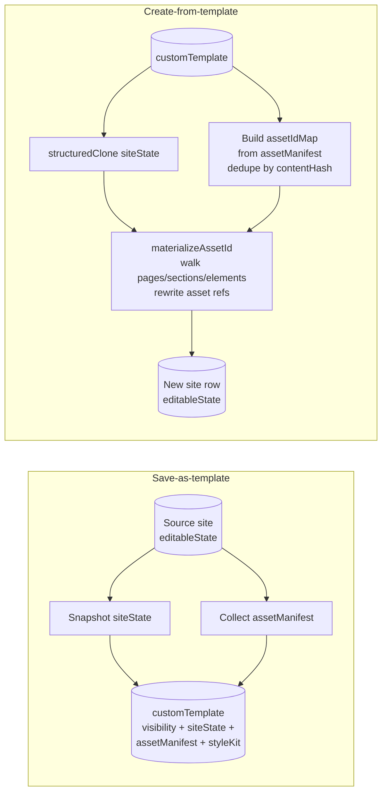

**Save-as-template.** Snapshot the source site's `editableState` into a `customTemplate` row (JSONB). Alongside it, collect an asset manifest — every asset referenced by the snapshot, recorded with its hash. The template carries visibility (`global` or `private`), state, manifest, and the style kit at save time. The snapshot is *frozen* — if the source site is edited tomorrow, the template doesn't update. Intentional; a template that drifted under its consumers would be a worse footgun than an out-of-date one.

**Create-from-template.** `structuredClone` the `siteState`. Build an `assetIdMap` by walking the template's `assetManifest`: each entry either reuses an existing `ownerAsset` id (matched by content hash against the new owner's library) or mints a fresh UUID and stages a new `ownerAsset` row. Then `materializeAssetId` walks pages → sections → elements and rewrites every asset reference through that map to the new owner's UUIDs. (`prepareSeedAssetsForCustomer` is the *Template-Seed* branch's helper — the custom-template path does its own manifest-driven mapping inline and does not call it.)

### Shared two-pass algorithm

```
   D9 — Site Import                D10 — Template clone
   ─────────────────                ────────────────────

   Build dictionaries:              Build dictionaries:
     mediaAssetIdMap                  assetIdMap from assetManifest
     fontFamilyTokenMap               (manifest entries → new
                                      owner-asset UUIDs)

         │                                  │
         ▼                                  ▼

   convertElement walks               materializeAssetId walks
   the tree, rewrites refs            the tree, rewrites refs

   ────── two-pass translation ──────
   collect refs → build ID map → rewrite tree

         same algorithm, different source shape
```

Both flows start with a content blob whose namespace doesn't match the canvas. Both build a mapping. Both walk the element tree and rewrite every reference. Both gate the rewritten tree through `validateEditableSite` before persisting (import's DB writes are transactional, though its R2 uploads precede the transaction). The general shape: any content source producing a tree of references that don't match the internal namespace can be onboarded by writing that mapper. The algorithm's the same.

**Source:** [ADR 0008](adr/0008-site-import-architecture.md), [`src/routes/api/import.ts`](../src/routes/api/import.ts), [`src/routes/api/sites.ts`](../src/routes/api/sites.ts), [`src/db/schema.ts:548-564`](../src/db/schema.ts) (`customTemplate`)

**Gotchas:**
- Site Import is **disabled in the public POC build** — feature exists, scraper service isn't reachable.
- Templates are frozen at save time — no live link to source site.
- Import's DB writes are transactional (`database.transaction`, not a Drizzle `.batch()`), but R2 uploads happen *before* the transaction and are **not** rolled back on DB failure — they can orphan. Not atomic across R2 + DB.

---

## 7 · Publish: column split

**Two columns on the same `site` row.** `editableState` is the working column the editor mutates; `publishedSnapshot` is what visitors render. Editing never touches the second. Publish is the only path between them.

### D11 — editable ⇄ published

```mermaid
flowchart LR
  editor[Editor mutations] --> es[(site.editableState)]
  pub[Publish handler] --> val{{validate (a11y audit advisory)}}
  val --> copy[Copy editableState<br/>→ publishedSnapshot]
  copy --> bump[publishedVersion += 1]
  bump --> sfx[Side effects:<br/>search rebuild,<br/>version capture,<br/>SiteRoom broadcast]
  sfx --> done[Visitor reads<br/>publishedSnapshot]
  sfx -. failure .-> restore[restorePreviousPublishState<br/>rollback]
  es -. read .-> editor
  done -. read .-> visitor[Visitor]
```

`site.editableState` is continuous — every CRDT projection (§2), every agent apply (§3), every import or template materialiser (§6) writes here. The editor reads here. `site.publishedSnapshot` is the read column for visitors; nothing writes to it except the publish handler.

Publish: validate the editable state, then invoke the a11y audit (§8) — whose result is discarded (vestigial; the dashboard runs its own). If validation passes, copy `editableState` → `publishedSnapshot`, bump `publishedVersion`, run the side-effect chain (search index rebuild, version capture, SiteRoom broadcast). If any side effect fails, `restorePreviousPublishState` rolls the published columns back.

The a11y audit runs on every publish for the dashboard report but does not block; the column split still isolates published state from in-progress edits. Because the columns are physically separate, any future re-introduction of a publish gate would never have to choose between rolling back the owner's in-progress edits and shipping a broken site — the split removes that choice.

**Source:** [`src/db/schema.ts:122`](../src/db/schema.ts) (`editableState`), [`src/db/schema.ts:139`](../src/db/schema.ts) (`publishedSnapshot`), [`src/routes/api/publish.ts:450-465`](../src/routes/api/publish.ts) (audit + handler core; file is 756 lines)

**Gotchas:**
- Editing never touches `publishedSnapshot`. Don't introduce a write path.
- Publish is *not* atomic at the row level — it's a sequence with rollback (`restorePreviousPublishState`).
- The atomic boundary is the publish handler, not the database row.

---

## 8 · Publish: a11y audit ★

**Six a11y checks run on every publish; blockers no longer abort publish** (gate dropped, commit cd16102). Already live. At publish, `runAudit()` is *called but its result is discarded* — the call is vestigial. The dashboard a11y report (`/a11y-report`) runs its **own independent** `runAudit()` when the Owner opens it; that is what surfaces findings.

### D12 — Six-check audit

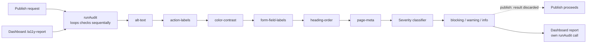

Six checks run sequentially — `runAudit` loops them one-by-one per page (it is synchronous, not a parallel fan-out). Each is a pure function over the editable state. Collect every issue — never fail fast. The list flows into a severity classifier that tags each issue blocking, warning, or info. The classifier still distinguishes blocking from warning/info, but the count no longer aborts the publish. The publish handler calls `runAudit()` and discards the result; `publishedSnapshot` is written regardless (gate dropped, commit cd16102). The findings the Owner sees come from the dashboard's own independent `runAudit()` call.

The checks:

- **alt-text.** Every media element needs alt text.
- **action-labels.** Every button-equivalent needs an accessible label (`aria-label`, visible label, or both).
- **color-contrast.** Every text element resolves its background against the **container** elements that geometrically contain it and expose a parseable opaque surface background — candidates sorted by area ascending, ties broken by z-index descending, smallest wins. If no such container qualifies, it falls back to the style-kit background. It does **not** model hero images or arbitrary topmost overlaps — only containers with opaque surface variants and the kit background participate.
- **form-field-labels.** Every input needs an associated label.
- **heading-order.** No skipping levels. H-levels are *derived* from font size via the style kit's `headingScale` — the check validates the derived H-level matches the visual hierarchy the author built, not authored H-tags.
- **page-meta.** Each page needs a title and description.

Each check is wrapped in a crash-isolation wrapper. If `color-contrast` throws (bad style kit, weird OKLCH value), the audit doesn't crash the publish handler — it emits a blocking issue called `audit-crash` that shows up in the report. **Crashes surface as explicit blocking `audit-crash` issues, never silent skips.**

Warnings and info appear in the same panel as blockers. The blockers are deliberately classified strict: things that actually break the page for a real assistive user. A lot of standard a11y rules classify as warnings on purpose. None of these classifications abort publish today; they drive the dashboard report.

**Source:** [`src/a11y/`](../src/a11y/) — `audit.ts` (orchestrator), `checks/` (the six checks), `severity.ts` (classifier)

**Gotchas:**
- The audit is **advisory** — publish calls `runAudit()` and discards the result (gate dropped, commit cd16102); the dashboard report runs its own independent audit. Don't describe it as a publish gate, and don't claim the publish-time call feeds the dashboard.
- Checks run **sequentially** inside a synchronous `runAudit` loop — not a parallel fan-out.
- Pure-validator pattern: collect ALL errors, never fail-fast.
- Crash → explicit blocking `audit-crash` issue, never silent skip.
- Contrast resolves against containing **container** surfaces (opaque variants only) by area, falling back to the kit background — no hero-image / topmost-overlap modelling.
- Heading order checks the *derived* H-level (font size → `headingScale`), not authored tags.

---

## Where to look next

**Canonical decision records:** [docs/adr/](adr/) (start with [docs/adr/README.md](adr/README.md) for the full index — every ADR has its Status in the table).

**Project context:** [CONTEXT.md](../CONTEXT.md) (domain language, repository-wide invariants).

**Key code surfaces:**

- [`src/canvas/schema.ts`](../src/canvas/schema.ts) — `EditableSite`, `CanvasPage`, `CanvasSection`, `CanvasElement` (§1, §2 projection target)
- [`src/canvas/validate.ts`](../src/canvas/validate.ts) — the write gate for full-site mutations: agent apply, import, publish, recipe (§3, §6, §7)
- [`src/live/site-room.ts`](../src/live/site-room.ts) — SiteRoom Durable Object (§2, §4 autosave)
- [`src/version/`](../src/version/) — Y.Doc snapshot capture and restore (§4)
- [`src/canvas/recipes.ts`](../src/canvas/recipes.ts) — section factories (§5)
- [`src/routes/api/import.ts`](../src/routes/api/import.ts) — Site Import handler (§6)
- [`src/routes/api/sites.ts`](../src/routes/api/sites.ts) — `customTemplate` save and create-from (§6)
- [`src/routes/api/publish.ts`](../src/routes/api/publish.ts) — publish handler, rollback (§7)
- [`src/a11y/`](../src/a11y/) — audit checks, severity classifier (§8)

**Repository-wide invariants:** [CONTEXT.md](../CONTEXT.md) carries the domain language and the rules that hold across folders (no fallbacks, the full-site write gate, decoded-state-deterministic snapshots). The [ADR index](adr/README.md) is the canonical decision record — read the relevant ADR before changing anything a decision touches.
